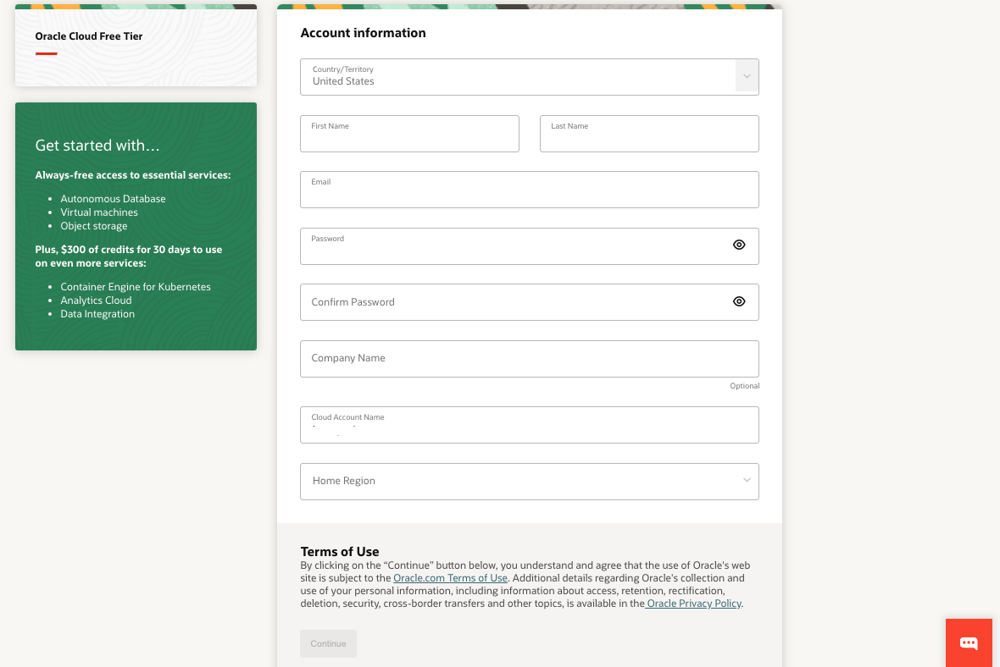

# Get Started

## Introduction

Before you get started, you will need an Oracle Cloud account. This 5-minute lab walks you through the steps of getting an Oracle Cloud Free Tier account and signing in.

시작하기 전에 Oracle Cloud 계정이 필요합니다. 아래 5분 실습에서는 Oracle Cloud Free Tier 계정을 만들고 로그인하는 단계를 안내합니다.

### Cloud 계정이 있는 경우

[Oracle Universal Credits](https://docs.oracle.com/en/cloud/get-started/subscriptions-cloud/csgsg/universal-credits.html)을 사용하는 Oracle Cloud 계정을 포함하여 Oracle Cloud 계정을 이미 가지고 있다면, **Task 2**를 건너뛰고 가지고 있는 클라우드 계정으로 로그인합니다.

### Two Cloud Offers in One

Oracle Cloud Free Tier는 다양한 상시 무료(Always Free) 서비스와 모든 적격 OCI 서비스를 최대 30일 동안 사용할 수 있는 미화 300 달러의 무료 평가판을 사용할 수 있는 Oracle Cloud 계정을 제공합니다. 상시 무료 서비스는 기간 제한 없이 사용할 수 있습니다. 무료 평가판 서비스는 미화 300달러의 무료 크레딧이 소진되거나 30일이 만료될 때까지 사용할 수 있습니다.

### 필요한 것

* 유효한 이메일 주소
* SMS 문자 검증이 가능한 전화번호(이메일이 인식되지 않는 경우에만)

> **참고**: 다음 스크린샷의 인터페이스는 업데이트로 인해 실제 보시는 인터페이스와 다르게 보일 수 있습니다.

## Task 1: 무료 평가판 계정 만들기

Oracle Cloud 계정을 이미 가지고 있다면, **Task 2**를 건너뜁니다.

1. 웹 브라우저를 열어 [oracle.com/cloud/free](https://signup.cloud.oracle.com)에서 Oracle Cloud 계정 등록 양식에 접근합니다.

   등록 페이지가 표시됩니다.
              

2. Oracle Cloud Free Tier 계정을 생성하기 위해 다음 정보를 입력합니다.
    * **국가**를 선택하세요
    * **이름**과 **이메일**을 입력하세요.

3. 유효한 이메일 주소를 입력했으면 **Verify my email** 버튼을 선택합니다.

    버튼을 선택하면 다음과 같은 화면이 나타납니다:
       

4. 이메일로 이동합니다. 받은 편지함에 오라클에서 발송한 계정 확인 이메일이 있을 것입니다. 이메일 내용은 다음과 유사합니다.
       

5. 링크를 클릭하거나(가능한 경우), 링크를 복사하여 브라우저에 붙여넣습니다.

6. Oracle Cloud Free Tier 계정을 생성하기 위해 다음 정보를 입력합니다.

    - **비밀번호** 선택
    - **회사명**을 입력하세요.
    - **클라우드 계정 이름**은 입력한 내용에 따라 자동으로 생성됩니다. 새 값을 입력하여 해당 이름을 변경할 수 있습니다. Cloud 계정 이름은 기억하십시오. 이후에 로그인하려면 이 이름이 필요합니다.
    - **홈 리전**을 선택합니다. 가입후에는 홈 리전을 변경할 수 없습니다. 참고: 워크샵의 현재 디자인과 리소스 가용성을 기반으로 현재 이 워크샵은 런던 리전을 사용하지 않는 것을 권장합니다.
    - **Continue**를 클릭합니다.
        

7.  Enter your Address information.  Click **Continue**.
          

8.  Choose your country and enter a mobile number for verification.   Click the **Text me a code** button.
          

9. Once you receive your code, enter it and click **Verify My Code**.
          

10. Click the **Add payment verification method** button.
            

11. Choose the verification method. In this case, click the **Credit Card** button. Enter your information and payment details. 

    >**Note:** This is a free credit promotion account. You will not be charged unless you elect to upgrade the account.

    

12. Once your payment verification is complete, review and accept the agreement by clicking the check box.  Click the **Start my free trial** button.

    

13. Your account is provisioning and should be available soon! You might want to log out as you wait for your account to be provisioned. You'll receive two emails from Oracle. One email will be the initial notification that provisioning is underway. The other email will be a notification that provisioning is complete. Here is a copy of the final notification:
       

## Task 2: Sign in to Your Account

_Please note that while your tenancy is initially created, you will only see a direct login. Once your tenancy is fully provisioned, you will see the screens as described below._

1. Go to [cloud.oracle.com](https://cloud.oracle.com). Enter your Cloud Account Name and click **Next**. This is the name you chose while creating your account in the previous section. It's NOT your email address. If you've forgotten the name, see the confirmation email.

    

2. Click **Continue** to sign in using the *"oraclecloudidentityservice"*.

   

   When you sign up for an Oracle Cloud account, a user is created for you in Oracle Identity Cloud Service with the username and password you selected at sign up. You can use this single sign-on option to sign in to Oracle Cloud Infrastructure and then navigate to other Oracle Cloud services without re-authenticating. This user has administrator privileges for all the Oracle Cloud services included with your account.

3. Enter your Cloud Account credentials and click **Sign In**. Your user name is your email address. The password is what you chose when you signed up for an account.

     

4. You are now signed in to Oracle Cloud!

    

## **Acknowledgements**

- **Created By/Date** - Tom McGinn, Database Innovations Architect, Database Product Management, March 2020
- **Contributors** - John Peach, Kamryn Vinson, Rene Fontcha
- **Last Updated By** - Kevin Lazarz, October 2021