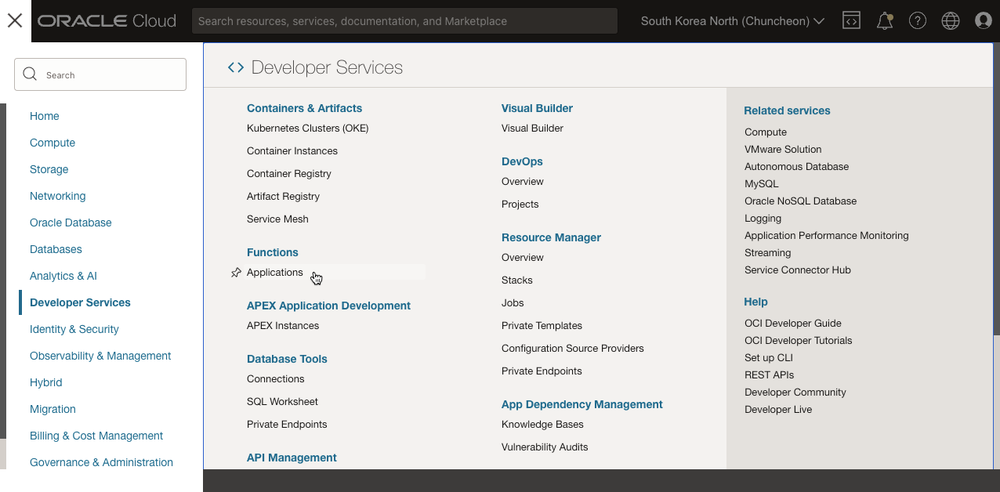
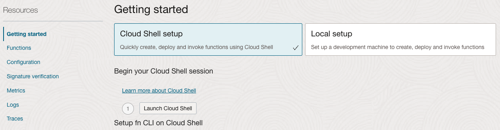
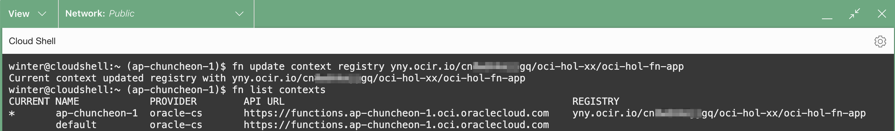

# Deploy Hell World, Functions

## Introduction

Oracle Functions을 실행하는 데에 대한 기본 사항을 알아봅니다. 본 실습에서는 관련 CLI가 이미 구성되어 있는 Cloud Shell에서 Function을 생성하여 배포하는 방법을 수행합니다.

예상 시간: 20분

### 목표

- Functions 개발을 위한 개발 환경 구성하기
- 첫 Function으로 Hello World 배포하기

### 전제 조건

- Oracle Cloud Trial Account 또는 Paid Account
- Lab 1 실습 완료


## Task 1: Function Application 만들기

1. 왼쪽 상단의 **Navigation Menu**를 클릭하고 **Developer Services**으로 이동한 다음 **Functions**하위의 **Applications** 을 선택합니다.

	

2. 사용할 Compartment를 선택합니다.

3. **Create Application**을 클릭하고, 아래 내용을 작성하여 생성합니다.

    - **Name**: oci-hol-fn-app
    - **VCN** : 사용할 VCN이 있는 Compartment
    - **Subnets** : 사용할 Public 서브넷 선택

    

3. 아래로 스크롤하여 **Resources** >> **Getting started**로 이동합니다.

    - Cloud Shell에서 빠르게 Function을 만드는 것과, 별도 개발 환경을 세팅에서 시작하는 방법이 있습니다.
    
        * Cloud Shell: fn CLI가 사전에 설치되어 있고 기본 구성이 자동으로 되어 있습니다.
        * Local setup: 공식 문서에 따라 별도로 fn CLI 및 인증 관련 설정 등을 사전 구성 작업이 요구됩니다.

    

   
## Task 2: Cloud Shell에서 fn CLI 설정

**Getting Started**의 **Cloud Shell setup** > **Setup fn CLI on Cloud Shell** 에 있는 아래 절차대로 실행하면 됩니다. 그림 아래 내용은 각 순서에 대한 추가 설명입니다.


1. **Launch Cloud Shell**을 클릭하여 Cloud Shell을 실행합니다.

2. fn CLI의 컨텍스트를 현재 작업중인 Region으로 설정합니다.

    - Cloud Shell에는 아래 명령 결과에서 보듯이 fn cli가 사전에 설치되어 있고, Cloud Shell 시작시의 Region이 fn CLI에서 사용할 수 있게 context가 자동으로 설정되어 있습니다.

    ```
    <copy>
    fn list context
    fn use context <region-context>
    </copy>
    ```

    

3. fn CLI의 컨텐스트를 작업할 Compartment로 설정합니다.

    ```
    <copy>
    fn update context oracle.compartment-id [compartment-ocid]
    ```

4. Function이 배포되면서 만들어질 컨테이너 이미지를 저장할 Registry 저장소(여기서는 OCI Registry)를 설정합니다. 여기서는 `[repo-name-prefix]`을 {compartment-name}/{function-application-name} 이름으로 합니다. 

    ```
    <copy>
    fn update context registry <region-key>.ocir.io/[tenancy-namespace]/[repo-name-prefix]
    ```

    

5. OCI Registry에 이미지를 저장하기 위해 패스워드로 사용할 Auth Token을 생성합니다.
    - **Generate an Auth Token** 링크를 클릭합니다.
    - **Generate token**을 클릭합니다.
    - Description을 입력(예, auth-token-for-fn)하고 다시 **Generate an Auth Token**을 클릭합니다.
    - 생성된 Auth Token을 복사둡니다. *창을 닫으후 다시 확인이 불가하므로 안전한 곳에 보관합니다.*

    
    
6. Getting Started 화면으로 다시 이동하여, docker cli로 OCI Registry에 로그인합니다. 패스워드는 Auth Token입니다.

    *노트: 사용중인 테넌시가 IDCS를 통해 페더레이션을 하는 경우, username은 oracleidentitycloudservice/[USERNAME] 포맷입니다.*

    ```
    <copy>
    docker login -u '<tenancy-namespace>/<user-name>' <region-key>.ocir.io
    ```

7. fn CLI 설정이 정상적으로 되면, 아래 명령으로 앞서 콘솔에서는 만든 Function Application을 조회할 수 있습니다.

    ```
    <copy>
    fn list apps
    ```

    

## Task 3: Hello World *Java* Function 생성, 배포, 호출하기

**Getting Started**의 **Cloud Shell setup** > **Setup fn CLI on Cloud Shell** 에 있는 아래 절차대로 실행하면 됩니다. 그림 애래 내용은 해당 해당 내용을 설명한 작업 순서는 동일한 내용입니다.


8. Function 템플릿을 통해 Hello World Function을 생성합니다.

    ```
    <copy>
    fn init --runtime java hello-java
    </copy>
    ```
    
    - OCI Functions은 여러가지 언어를 제공합니다. Function 생성시 --runtime 옵션으로 언어를 지정합니다. 현재 지원하는 언어는 다음과 같습니다.
        * [Languages Supported by OCI Functions](https://docs.oracle.com/en-us/iaas/Content/Functions/Tasks/languagessupportedbyfunctions.htm)


            | FDK Language | Default | Supported          | Deprecated |
            | :----------- | :------ | :----------------- | :--------- |
            | Java         | 17      | 17, 11, 8          | n/a        |
            | Python       | 3.9     | 3.9, 3.8, 3.7, 3.6 | n/a        |
            | Ruby         | 2.7     | 2.7                | 2.5        |
            | Go           | 1.15    | 1.15               | 1.11       |
            | Node.js      | 14      | 14                 | 11         |
            | C# (.NET)    | 6.0     | 6.0, 3.1           | n/a        |
            {: title="Languages Supported by OCI Functions"}

9. 생성된 폴더로 이동하고, 기본 생성된 Function을 확인합니다.

    ```
    <copy>
    cd hello-java
    </copy>
    ```

    - java를 사용하는 hello-java는 아래와 같이 구성됩니다.
    ```
    $ tree
    .
    ├── func.yaml
    ├── pom.xml
    └── src
        ├── main
        │   └── java
        │       └── com
        │           └── example
        │               └── fn
        │                   └── HelloFunction.java
        └── test
            └── java
                └── com
                    └── example
                        └── fn
                            └── HelloFunctionTest.java
    ```          
        * src 폴더: 소스로 아래와 같이 사전 약속된 handleRequest() 메서드가 Function 실행시 호출되니, 해당 메서드를 사용하여 구현하면 됩니다.
        ```
        $ cat src/main/java/com/example/fn/HelloFunction.java 
        package com.example.fn;
        
        public class HelloFunction {
        
            public String handleRequest(String input) {
                String name = (input == null || input.isEmpty()) ? "world"  : input;
        
                System.out.println("Inside Java Hello World function"); 
                return "Hello, " + name + "!";
            }
        ```        
        * pom.xml: Function을 컴파일하기 위해 필요한 Dependencies가 정의된 Maven 설정 파일
        * func.yaml: Function 정의 파일입니다. [Changing Default Memory and Timeout Settings](https://docs.oracle.com/en-us/iaas/Content/Functions/Tasks/functionscustomizing.htm)에 따라 기본 메모리(128MB), 타임아웃(30초)을 변경할 수 있습니다. 
        ```
        $ cat func.yaml 
        schema_version: 20180708
        name: hello-java
        version: 0.0.1
        runtime: java
        build_image: fnproject/fn-java-fdk-build:jdk17-1.0.162
        run_image: fnproject/fn-java-fdk:jre17-1.0.162
        ```

10. Function을 배포합니다.

    ```
    <copy>
    fn -v deploy --app <app-name>
    </copy>
    ```


    결과 확인 - *처음 배포하게 되면 Maven Repository에서 라이브러리를 다운받게 되어 배포 시간이 좀 걸립니다.*

    ```
    $ fn -v deploy --app oci-hol-fn-app
    Deploying hello-java to app: oci-hol-fn-app
    ...
    51c82b74fabc: Mounted from xxxxxxxxxxxx/jdoe/hello-java 
    0.0.2: digest: sha256:6a6fb3d214a8fdfac3aa2d4048ad5c338fe4d789c05d113cd290e5817af2925d size: 2001
    Updating function hello-java using image yny.ocir.io/xxxxxxxxxxxx/oci-hol/oci-hol-fn-app/hello-java:0.0.2...
    ```

11. 배포된 Function을 fn CLI로 호출해봅니다.

    > 시간도 함께 체크해 보면 첫 호출은 Cold Start로 내부 프로비저닝이 발생하여 시간이 좀 걸리며, 두번째 호출에서는 빠른 응답을 보입니다.

    ```
    <copy>
    fn invoke <app-name> hello-java
    </copy>
    ```

    호출결과
    ```
    $ time fn invoke oci-hol-fn-app hello-java
    Hello, world!
    
    real    0m34.813s
    user    0m0.501s
    sys     0m0.037s
    $ time fn invoke oci-hol-fn-app hello-java
    Hello, world!
    
    real    0m0.685s
    user    0m0.306s
    sys     0m0.040s
    ```    

## Task 4: Hello World *Python* Function 생성, 배포, 호출하기

Function에서 많이 사용하는 Python으로 동일한 과정을 수행해 봅니다.

8. Function 템플릿을 통해 Hello World Function을 생성합니다.

    ```
    <copy>
    fn init --runtime python hello-python
    ```

2. 생성된 폴더로 이동하고, 기본 생성된 Function을 확인합니다.

    ```
    <copy>
    cd hello-python
    </copy>
    ```

    - hello-python는 아래와 같이 구성됩니다.
    ```
    $ tree
    .
    ├── func.py
    ├── func.yaml
    └── requirements.txt
    ```          
        * func.py: 소스로 아래와 같이 사전 약속된 handle 함수가 Function 실행시 호출됩니다. 해당 함수를 구현하면 됩니다.
        ```
        $ cat func.py 
        import io
        import json
        import logging
        
        from fdk import response
        
        
        def handler(ctx, data: io.BytesIO = None):
            name = "World"
            try:
                body = json.loads(data.getvalue())
                name = body.get("name")
            except (Exception, ValueError) as ex:
                logging.getLogger().info('error parsing json payload: ' + str(ex))
        
            logging.getLogger().info("Inside Python Hello World function")
            return response.Response(
                ctx, response_data=json.dumps(
                    {"message": "Hello {0}".format(name)}),
                headers={"Content-Type": "application/json"}
            )
        ```        
        * requirements.txt: func.py에서 추가적으로 사용되는 패키지 의존성을 여기에 추가합니다.
        ```
        $ cat requirements.txt 
        fdk>=0.1.50
        ```

        * func.yaml: Function 정의 파일입니다. 자바때와 동일한 형식입니다.
        ```
        $ cat func.yaml 
        schema_version: 20180708
        name: hello-python
        version: 0.0.1
        runtime: python
        build_image: fnproject/python:3.9-dev
        run_image: fnproject/python:3.9
        entrypoint: /python/bin/fdk /function/func.py handler
        memory: 256        
        ```

3. Function을 배포합니다.

    ```
    <copy>
    fn -v deploy --app <app-name>
    </copy>
    ```

    결과 확인

    ```
    $ fn -v deploy --app oci-hol-fn-app
    Deploying hello-python to app: oci-hol-fn-app
    ...
    0.0.2: digest: sha256:065d7b2aa4be22fceeca0c3e2ca0f3ea197bc6841c8c0a2ebf1a4b84cc5ed727 size: 1779
    Updating function hello-python using image yny.ocir.io/xxxxxxxxxxxx/oci-hol/oci-hol-fn-app/hello-python:0.0.2...
    Successfully created function: hello-python with yny.ocir.io/xxxxxxxxxxxx/oci-hol/oci-hol-fn-app/hello-python:0.0.2
    ```

4. 배포된 Function을 fn CLI로 호출해봅니다. 첫 호출이라 시간이 약간 걸립니다.

    ```
    <copy>
    fn invoke <app-name> hello-python
    </copy>
    ```

    호출 결과
    ```
    $ fn invoke oci-hol-fn-app hello-python
    {"message": "Hello World"}
    ```    

5. Java Function 때와 기본적으로 동일한 구성 및 절차인 것을 알 수 있습니다. 추가적인 샘플은 [Oracle Functions Samples @GitHub](https://github.com/oracle-samples/oracle-functions-samples)을 참조하세요.

## Task 5. Function 로그 활성화

1. Application 화면 아래로 스크롤하여 **Resources** >> **Logs**로 이동합니다.

2. **Function Invocation Logs**를 활성화하기 위해 슬라이딩 버튼을 클릭 합니다.

3. 창이 뜨면 기본 설정값으로 로그를 활성화합니다.

     

4. 다시 Function Application 화면으로 이동합니다. **Resources** >> **Logs**로 이동하여, 활성화한 로그 이름을 클릭합니다.

    

5. 로그 화면에서 우측 **Actions**에서 **Wrap lines**를 클릭합니다.

6. 아래와 같이 Function이 실행된 로그를 볼 수 있습니다.

    

## -------------------------------------

## Task 6. (Optional) Cloud Shell에서 Local Server로 테스트

1. Cloud Shell을 실행합니다.

2. local 컨텍스트를 만듭니다.

    ```

    fn create context local
    fn use context local
    fn update context api-url http://localhost:8080
    ```
    
    실행결과
    ```
    $ fn create context local
    Successfully created context: local
    $ fn use context local
    Now using context: local 
    $ fn update context api-url http://localhost:8080
    Current context updated api-url with http://localhost:8080
    $ fn list context
    CURRENT NAME            PROVIDER        API URL                                                 REGISTRY
            ap-chuncheon-1  oracle-cs       https://functions.ap-chuncheon-1.oci.oraclecloud.com    yny.ocir.io/cn8______jgq/oci-hol-fn-app
            default         oracle-cs       
    *       local           default         http://localhost:8080
    ```

3. Fn server를 로컬에 기동합니다. 배포될 Function의 디버깅을 위해 디버그 모드로 실행합니다.

    ```
    fn start --log-level DEBUG
    ```

4. 브라우저에서 주소를 복사하여, 새 탭을 열어 Cloud Shell을 하나 더 엽니다.

5. Fn server가 컨테이너로 기동된 것을 확인할 수 있습니다.

    ```
    $ docker ps
    CONTAINER ID        IMAGE                       COMMAND             CREATED             STATUS              PORTS                              NAMES
    10015df97c09        fnproject/fnserver:latest   "./fnserver"        4 minutes ago       Up 4 minutes        2375/tcp, 0.0.0.0:8080->8080/tcp   fnserver
    ```

6. local context에 새 Application을 만듭니다.

    ```
    fn create app local-test-app
    ```

7. 앞서 만든 hello-python Function 소스 폴더로 이동합니다.

8. Function을 로컬 서버에 배포합니다. --local 옵션을 사용하여 Local Docker Registry을 사용합니다.

     ```
     fn deploy --app local-test-app --local
     ```
     
     실행결과
     ```
     $ fn deploy --app local-test-app --local
     Deploying hello-python to app: local-test-app
     Bumped to version 0.0.3
     Using Container engine docker
     Building image hello-python:0.0.3 ......
     Updating function hello-python using image hello-python:0.0.3...
     Successfully created function: hello-python with hello-python:0.0.3

     $ docker images
     REPOSITORY                                             TAG                 IMAGE ID            CREATED             SIZE
     hello-python                                           0.0.3               ab9d10d2255d        14 seconds ago      170MB
     <none>                                                 <none>              4415a9efccec        18 seconds ago      170MB
     ...
     ```

9. 배포 결과를 확인하여, 호출해 봅니다.

     ```
     fn list functions local-test-app
     fn invoke local-test-app hello-python
     ```

10. 로컬 Fn server를 기동한 이전 Cloud Shell이 있는 브라우저 탭으로 이동합니다.

11. Fn server 로그에서 Function용 컨테이너가 기동하여, 실행된 것을 로그로 확인할 수 있습니다. Fn server 로그와 Function 코드에 출력한 로그를 확인할 수 있습니다. OCI Function에 배포하기 전 개발단계에서 빠른 코드 오류 검증을 할 수 있습니다.

    > 여기서 실행되는 Function은 Cloud Shell에 접속된 사용자 인증 정보를 사용합니다. 사용자에 할당된 권한을 사용합니다. OCI Function으로 실행시에는 Function 서비스에 할당된 권한을 사용합니다. 

    ```
    time="2023-01-06T06:54:51Z" level=debug msg="Hot function launcher starting" action="server.handleFnInvokeCall)-fm" app_id=01GP2XEFB5NG8G00GZJ0000001 call_id=01GP2XRSHKNG8G00GZJ0000003 fn_id=01GP2XHJ6DNG8G00GZJ0000002 launcher_timeout=1h0m0s
    ...
    time="2023-01-06T06:54:52Z" level=debug msg="01GP2XRSHKNG8G00GZJ0000003 - root - INFO - error parsing json payload: Expecting value: line 1 column 1 (char 0)\n" action="server.handleFnInvokeCall)-fm" app_id=01GP2XEFB5NG8G00GZJ0000001 call_id=01GP2XRSHKNG8G00GZJ0000003 fn_id=01GP2XHJ6DNG8G00GZJ0000002 image="hello-python:0.0.3" user_log=true
    time="2023-01-06T06:54:52Z" level=debug msg="01GP2XRSHKNG8G00GZJ0000003 - root - INFO - Inside Python Hello World function\n" action="server.handleFnInvokeCall)-fm" app_id=01GP2XEFB5NG8G00GZJ0000001 call_id=01GP2XRSHKNG8G00GZJ0000003 fn_id=01GP2XHJ6DNG8G00GZJ0000002 image="hello-python:0.0.3" user_log=true
    ...
    ```

## Task 7. (Optional) Local Machine에서 fn CLI 설정

Getting Started의 Cloud Shell setup의 동일한 구성이 되도록 Local 환경에 맞게 작업 순서를 정리한 내용입니다.

1. *fn CLI를 실행할 구성을 위해서는 OCI CLI과 fn CLI를 설치하고, OCI CLI를 실행하기 위한 환경이 구성되어야 합니다.*

    - [OCI CLI](https://thekoguryo.github.io/oci/chapter14/1/1/)를 설치 구성합니다.

    - OCI CLI로 namespace가 조회되는 지 테스트합니다.

        ```
        oci os ns get
        {
          "data": "cnr______wgq"
        }
        ```

    - [Docker](https://docs.docker.com/get-docker/)를 설치합니다. Docker 라이센스 유료화로 설치가 어려운 경우 [Rancher Desktop](https://rancherdesktop.io/)으로 대체 설치합니다.

    - docker 명령이 잘 실행되는 지 확인합니다.

        ```
        docker version
        docker run hello-world
        ```

    - Local Machine이 ARM 계열인 경우(Mac M1 포함), 다음 환경 변수를 추가합니다.
    
        *설정하지 않는 경우 arm 형식으로 빌드된 컨테이너 이미지로 인해 Function에서 실행한 경우 실제 호출하면 에러가 발생합니다. 정상 동작하지 않습니다.*

        ```
        export DOCKER_DEFAULT_PLATFORM=linux/amd64
        ```

    - Fn Project CLI를 설치합니다.

        ```
        # Linux or MacOS 기준
        curl -LSs https://raw.githubusercontent.com/fnproject/cli/master/install | sh
        ```

    - Fn Project CLI 설치 여부를 확인합니다.

        ```
        fn version
        ```
    
    - Python Function을 사용하는 경우 다음 패키지를 설치합니다.

        ```
        pip3 install --user fdk
        ```

2. *fn CLI의 컨텍스트를 추가합니다.*

    - Cloud Shell과 동일한 형식으로 추가합니다. 예, <region-context>: 예, ap-chuncheon-1

    ```
    fn list context
    fn create context <region-context> --provider oracle
    fn use context <region-context>
    fn update context api-url https://functions.<region-identifier>.oraclecloud.com
    fn update context <profile-name>
    ```
    
    실행예시

    ```
    fn list context
    fn create context ap-chuncheon-1 --provider oracle
    fn use context ap-chuncheon-1
    fn update context api-url https://functions.ap-chuncheon-1.oraclecloud.com
    fn update context oracle.profile DEFAULT
    ```

> **다음 3~7번까지는 Task 2: Cloud Shell에서 fn CLI 설정** 과 동일한 절차입니다.

3. fn CLI의 컨텐스트를 작업할 Compartment로 설정합니다.

    ```
    fn update context oracle.compartment-id [compartment-ocid]
    ```

4. Function이 배포되면서 만들어질 컨테이너 이미지를 저장할 Registry 저장소(여기서는 OCI Registry)를 설정합니다. 여기서는 `[repo-name-prefix]`을 {compartment-name}/{function-application-name} 이름으로 합니다. 

    ```
    fn update context registry <region-key>.ocir.io/[tenancy-namespace]/[repo-name-prefix]
    ```

    

5. OCI Registry에 이미지를 저장하기 위해 패스워드로 사용할 Auth Token을 생성합니다.
    - **Generate an Auth Token** 링크를 클릭합니다.
    - **Generate token**을 클릭합니다.
    - Description을 입력(예, auth-token-for-fn)하고 다시 **Generate an Auth Token**을 클릭합니다.
    - 생성된 Auth Token을 복사둡니다. *창을 닫으후 다시 확인이 불가하므로 안전한 곳에 보관합니다.*

    
    
6. Getting Started 화면으로 다시 이동하여, docker cli로 OCI Registry에 로그인합니다. 패스워드는 Auth Token입니다.

    *노트: 사용중인 테넌시가 IDCS를 통해 페더레이션을 하는 경우, username은 oracleidentitycloudservice/[USERNAME] 포맷입니다.*

    ```
    docker login -u '<tenancy-namespace>/<user-name>' <region-key>.ocir.io
    ```

7. fn CLI 설정이 정상적으로 되면, 아래 명령으로 앞서 콘솔에서는 만든 Function Application을 조회할 수 있습니다.

    ```
    fn list apps
    ```

    

10. local 컨텍스트를 만듭니다.

    ```
    fn create context local
    fn use context local
    fn update context api-url http://localhost:8080
    ```

11. Fn server를 로컬에 기동합니다. 배포될 Function의 디버깅을 위해 디버그 모드로 실행합니다.

    ```
    fn start --log-level DEBUG
    ```

12. 새 터미널을 엽니다.

13. Fn server가 컨테이너로 기동된 것을 확인할 수 있습니다.

    ```
    $ docker ps
    ```

14. local context에 새 Application을 만듭니다.

    ```
    fn create app local-test-app
    ```

15. Function 템플릿을 통해 Hello World Function을 생성합니다.

    ```
    fn init --runtime python hello-python
    ```

16. 생성된 폴더로 이동하고, 기본 생성된 Function을 확인합니다.

    ```
    cd hello-python
    ```

17. Function을 로컬 서버에 배포합니다. --local 옵션을 사용하여 Local Docker Registry을 사용합니다.

    * 배포시 패키지 에러가 나는 경우 fdk 패키지를 설치합니다. 예, `pip3 install --user fdk`

     ```
     fn deploy --app local-test-app --local
     ```
     


9. 배포 결과를 확인하여, 호출해 봅니다.

     ```
     fn list functions local-test-app
     fn invoke local-test-app hello-python
     ```

10. 로컬 Fn server를 기동한 이전 Cloud Shell이 있는 브라우저 탭으로 이동합니다.

11. Fn server 로그에서 Function용 컨테이너가 기동하여, 실행된 것을 로그로 확인할 수 있습니다. OCI Function에 배포하기 전 개발단계에서 빠른 코드 오류 검증을 할 수 있습니다.    

10. Function을 배포합니다.

    ```
    fn -v deploy --app <app-name>
    ```

    결과 확인

    ```
    $ fn -v deploy --app oci-hol-fn-app
    Deploying hello-python to app: oci-hol-fn-app
    ...
    0.0.2: digest: sha256:065d7b2aa4be22fceeca0c3e2ca0f3ea197bc6841c8c0a2ebf1a4b84cc5ed727 size: 1779
    Updating function hello-python using image yny.ocir.io/xxxxxxxxxxxx/oci-hol/oci-hol-fn-app/hello-python:0.0.2...
    Successfully created function: hello-python with yny.ocir.io/xxxxxxxxxxxx/oci-hol/oci-hol-fn-app/hello-python:0.0.2
    ```

4. 배포된 Function을 fn CLI로 호출해봅니다. 첫 호출이라 시간이 약간 걸립니다.

    ```
    fn invoke <app-name> hello-python
    ```

    호출 결과
    ```
    $ fn invoke oci-hol-fn-app hello-python
    {"message": "Hello World"}
    ```        


이제 **다음 실습을 진행**하시면 됩니다.

## Learn More

* [Oracle Functions Samples @GitHub](https://github.com/oracle-samples/oracle-functions-samples)


## Acknowledgements

* **Author** - DongHee Lee
* **Last Updated By/Date** - DongHee Lee, December 2022


## Task 3: Local Host에서 fn cli 설정

https://docs.oracle.com/en-us/iaas/Content/Functions/Tasks/functionsquickstartlocalhost.htm#functionsquickstartlocalhost

https://fnproject.io/tutorials/install/#StarttheFnServer


1. Install and start docker
- Docker Desktop 설치 또는 Rancher Desktop 설치
- docker version
- Docker run hello-world 로 테스트

2. OCI CLI 설치 및 구성
- [functions-developer-profile] 프로파일로 생성
- oci os ns get --profile functions-developer-profile 로 테스트 

3. fn cli 설치

4. Set up Fn Project CLI context provider --oracle

fn create context ap-chuncheon-1 --provider oracle
fn use context ap-chuncheon-1
fn update context oracle.profile functions-developer-profile