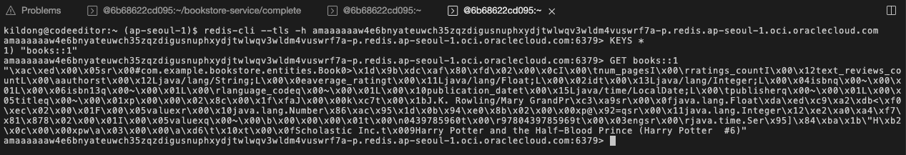

# Develop a Bookstore Microservice

## Introduction

마이크로 서비스 애플리케이션 만들기 위해 자바에서는 Spring Boot를 많이 사용하고 오라클에서 지원하는 오픈소스 프레임워크인 Helidon도 사용되고 있습니다. 여기에서는 Spring Boot를 통해 마이크로 서비스를 만들고 OKE에 배포하는 과정을 통해 마이크로 서비스 개발, 컨테이너 이미지 생성, 쿠버네티스에서 구동하는 일련의 과정을 간단한 앱을 통해서 이해를 돕고자 합니다.

예상 시간: 30분

### 목표

* Spring Boot로 마이크로 서비스 만들기
* Spring Boot + MySQL + Redis 애플리케이션 만들기
* 컨테이너 이미지 만들기
* 컨테이너 이미지 레지스트리인 OCIR 등록하기
* Kubernetes인 OKE에 마이크로 서비스 배포하기

### 전제 조건

아래와 같이 코드 개발을 위한 툴이 필요합니다. 간단한 앱 개발로 여기서는 편의상 사전에 툴들이 설치된 Cloud Shell에서 진행하겠습니다.

* 선호하는 텍스트 편집기 또는 IDE 또는 Code Editor
* JDK 17 or later

## Task 1: Spring Boot 기반 마이크로 서비스 만들기

1. 코드 작성은 Cloud Shell에 있는 VI 에디터를 사용할 수도 있으며, 여기서는 OCI Code Editor 사용하겠습니다. 콘솔 오른쪽 상단에서 Code Editor를 실행합니다.

    

2. MySQL, Redis가 속한 서브넷(oke-nodesubnet-…)에 Private Network으로 연결된 상태로 Network: Ephemeral로 표시되는 지 확인합니다. 아닌 경우, [Lab 2](?lab=setup-required-services#Task3:CloudShellMySQL)를 참고하여, 다시 연결합니다.

    

3. Code Editor 메뉴에서 **Terminal** &gt; **New Terminal**을 클릭하여 Terminal을 실행합니다.

4. Spring Boot 기반 마이크로 서비스를 프로젝트 생성부터 시나리오에 맞게 코드 개발하는 과정이 필요합니다. 본 교육은 코드 개발을 위한 과정이 아니므로, 여기서는 이미 만들어진 소스를 가져와서 시작합니다.

    - Spring Boot 3.x, Spring Data JPA, Caching, Java 17 기반으로 작성되었습니다.
    - 새로 연 Terminal에서 아래 명령을 실행합니다.
    ```
    <copy>
    cd
    git clone https://github.com/TheKoguryo/bookstore-service.git
    </copy>
    ```

5. Code Editor 메뉴에서 **File** &gt; **Open**을 클릭하여 방금 가져온 bookstore-service 폴더를 선택합니다.

6. 대상 시스템 접속 정보 변경을 위해 Code Editor 탐색기에서 complete/src/main/resources/application.properties 파일을 엽니다.

    

7. 사용할 MySQL 접속 정보로 업데이트합니다.

    - 생성한 MySQL DB System의 *Endpoint 주소의 IP로 url 업데이트*
    - 생성시 입력한 관리자 이름 및 *암호 업데이트*
    ```properties
    spring.datasource.url=jdbc:mysql://${MYSQL_HOST:10.0.xx.xxx}:3306/bookstore
    spring.datasource.username=admin
    spring.datasource.password=xxxxxxxx
    ```

8. 사용할 Redis 클러스터 접속 정보로 업데이트합니다.

    - 생성된 Redis Cluster 상세정보에서 *Primary endpoint, Replicas endpoint로 업데이트*
    ```properties
    spring.redis.primary-endpoint=xxxxxxxxxx-p.redis.ap-seoul-1.oci.oraclecloud.com
    spring.redis.replicas-endpoint=xxxxxxxxxx-r.redis.ap-seoul-1.oci.oraclecloud.com
    spring.redis.port=6379
    spring.redis.ssl=true
    ```

9. Terminal에서 현재 JDK 버전을 확인합니다.

    ````
    $ java -version
    java version "11.0.22" 2024-01-16 LTS
    Java(TM) SE Runtime Environment 18.9 (build 11.0.22+9-LTS-219)
    Java HotSpot(TM) 64-Bit Server VM 18.9 (build 11.0.22+9-LTS-219, mixed mode)

    $ <copy>csruntimectl java list</copy>
       graalvmjdk-17                               /usr/lib64/graalvm/graalvm-java17
       oraclejdk-1.8                                 /usr/lib/jvm/jdk-1.8-oracle-x64
     * oraclejdk-11                                   /usr/lib/jvm/jdk-11-oracle-x64       
    ````

10. csruntimectl을 통해 생성한 Spring Boot 설정에 맞게 JDK 17로 변경합니다.

    ````text
    $ <copy>csruntimectl java set graalvmjdk-17</copy>
    The current managed java version is set to graalvmjdk-17.
    
    $ java -version
    java version "17.0.10" 2024-01-16 LTS
    Java(TM) SE Runtime Environment Oracle GraalVM 17.0.10+11.1 (build 17.0.10+11-LTS-jvmci-23.0-b27)
    Java HotSpot(TM) 64-Bit Server VM Oracle GraalVM 17.0.10+11.1 (build 17.0.10+11-LTS-jvmci-23.0-b27, mixed mode, sharing)
    ````

11. Terminal에서 **bookstore-service/complete** 폴더로 이동합니다.

    ```text
    <copy>
    cd ~/bookstore-service/complete/
    </copy>
    ```

12. Terminal에서 실행을 위해 코드를 빌드합니다.

    ````text
    <copy>
    ./mvnw clean package
    </copy>
    ````

13. Terminal에서 빌드된 JAR 파일을 실행합니다.

    ````text
    <copy>
    java -jar target/bookstore-0.0.1-SNAPSHOT.jar
    </copy>
    ````

    아래와 같이 서비스가 빠르게 실행되고, 내장 Tomcat을 통해 8080 포트로 실행되는 것을 빠르게 실행되는 것을 알 수 있습니다.

    ````    
    $ java -jar target/bookstore-0.0.1-SNAPSHOT.jar
    
      .   ____          _            __ _ _
     /\\ / ___'_ __ _ _(_)_ __  __ _ \ \ \ \
    ( ( )\___ | '_ | '_| | '_ \/ _` | \ \ \ \
     \\/  ___)| |_)| | | | | || (_| |  ) ) ) )
      '  |____| .__|_| |_|_| |_\__, | / / / /
     =========|_|==============|___/=/_/_/_/
     :: Spring Boot ::                (v3.2.4)
    
    2024-04-17T02:36:37.699Z  INFO 9509 --- [bookstore] [           main] c.e.bookstore.BookstoreApplication       : Starting 

    ...

    2024-04-17T02:36:44.934Z  INFO 9509 --- [bookstore] [           main] o.s.b.w.embedded.tomcat.TomcatWebServer  : Tomcat started on port 8080 (http) with context path ''
    2024-04-17T02:36:44.952Z  INFO 9509 --- [bookstore] [           main] c.e.bookstore.BookstoreApplication       : Started BookstoreApplication in 7.845 seconds (process running for 8.556)    
    ````

14. Code Editor 메뉴에서 **Terminal** &gt; **New Terminal**을 클릭하여 Terminal을 하나 더 실행합니다.

15. 두 번째 Terminal에서 서비스를 테스트합니다.

    ````text
    <copy>
    curl -s http://localhost:8080/api/books/1 | jq
    </copy>    
    ````

    ````json
    {
      "id": 1,
      "title": "Harry Potter and the Half-Blood Prince (Harry Potter  #6)",
      "authors": "J.K. Rowling/Mary GrandPré",
      "average_rating": 4.57,
      "isbn": "0439785960",
      "isbn13": "9780439785969",
      "language_code": "eng",
      "num_pages": 652,
      "ratings_count": 2095690,
      "text_reviews_count": 27591,
      "publication_date": "2006-09-16",
      "publisher": "Scholastic Inc."
    }
    ````

    

16. Code Editor 메뉴에서 **Terminal** &gt; **New Terminal**을 클릭하여 세 번째 Terminal을 하나 더 실행합니다.    

17. 세 번째 Terminal에서 redis-cli로 Redis 클러스터에 접속합니다.

    ```
    redis-cli --tls -h <Primary-Endpoint>
    ```

18. 앞선 REST API 호출로 캐쉬에 저장된 것이 있는 지 redis-cli에서 아래 명령어로 확인합니다.

    ```
    # 모든 키 조회하기
    KEYS *

    # 해당 키 값 조회하기
    GET books::1

    # 모든 값 삭제하고 초기화히기
    flushall
    ```

    

    - 참고: *브라우저 창 크기를 변경한 경우, Code Editor의 Terminal의 최대 폭 인지 버그로 인해 창 끝까지 타이핑되지 않는 경우 Terminal의 높이를 변경하여 문제를 우회합니다.*

         
         
    
19. 첫 번째 Terminal에서 애플리케이션 로그를 확인합니다. 

    `No cache entry for key '1' in cache(s) [books]`와 같이 캐쉬에 해당 키가 없어서, 캐쉬 엔트리를 생성하는 로그를 확인할 수 있습니다. 또한 jpa 로그 상으로 DB에 select 구문이 실행되었습니다. 

        

20. 두 번째 Terminal에서 동일한 명령으로 다시 한번 호출합니다.

    ````text
    <copy>
    curl -s http://localhost:8080/api/books/1 | jq
    </copy>    
    ````

21. 첫 번째 Terminal에서 애플리케이션 로그를 확인합니다. 

    `Cache entry for key '1' found in cache(s) [books]`와 같이 캐쉬에 해당 키가 있어, DB 조회없이, 찾은 캐쉬 엔트리를 사용하는 것을 볼 수 있습니다.

          

22. 첫 번째 Terminal에서 실행되는 앱을 Control+C를 눌러 중지합니다.


## Task 2: Container Image 만들기

쿠버네티스에서 실행하기 위해서는 구동할 서비스 애플리케이션을 컨테이너화 하여야 합니다. Docker 클라이언트를 통해 컨테이너 이미지를 만듭니다.

1. [Getting Started | Spring Boot Docker](https://spring.io/guides/topicals/spring-boot-docker) 예시에서 보면 Dockerfile 베이스 이미지로 Docker Hub에 있는 eclipse-temurin:17-jdk-alpine 이미지를 사용합니다.

    ```text
    # Dockerfile
    FROM eclipse-temurin:17-jdk-alpine
    VOLUME /tmp
    ARG JAR_FILE=target/*.jar
    COPY ${JAR_FILE} app.jar
    ENTRYPOINT ["java","-jar","/app.jar"]
    ```

2. OCI에서는 Java를 무료로 사용할 수 있습니다. 그에 따라 [Oracle Container Registry (OCR)](https://container-registry.oracle.com/)에서 제공하는 Java, GraalVM에 대한 Container Image도 무료로 사용할 수 있으며, 해당 이미지는 지속적으로 업데이트됩니다.

    - [High-performance Java on OCI at no additional cost](https://www.oracle.com/cloud/java/#:~:text=High%2Dperformance%20Java%20on%20OCI,interoperability%20with%20no%20performance%20penalty.)
    - [Oracle Java SE Subscription](https://www.oracle.com/a/tech/docs/javase-subscription-datasheet.pdf)

    
    

3. 그래서 여기서는 [Oracle Container Registry (OCR)](https://container-registry.oracle.com/) 에서 제공하는 Oracle GraalVM Container Image을 베이스 이미지로 사용합니다.

    프로젝트 폴더(여기서는 *complete 폴더 아래*)에 파일이름을 Dockerfile으로 하여 파일을 만들고 아래 내용으로 붙여 넣습니다. 

    ````text
    <copy>
    FROM container-registry.oracle.com/graalvm/jdk:17
    WORKDIR /app
    ARG JAR_FILE=target/*.jar
    COPY ${JAR_FILE} app.jar
    ENTRYPOINT ["java","-jar","/app/app.jar"]    
    </copy>
    ````

    

4. Terminal에서 이미지를 빌드합니다. 생성한 Dockerfile이 위치한 곳에서 실행합니다.

    ````text
    <copy>
    docker build -t bookstore-service:1.0 .
    </copy>
    ````

    ````shell
    $ pwd
    /home/kildong/bookstore-service/complete

    $ ls
    Dockerfile  mvnw  mvnw.cmd  pom.xml  src  target

    $ docker build -t bookstore-service:1.0 .
    Sending build context to Docker daemon   64.4MB
    Step 1/5 : FROM container-registry.oracle.com/graalvm/jdk:17
    Trying to pull repository container-registry.oracle.com/graalvm/jdk ... 
    17: Pulling from container-registry.oracle.com/graalvm/jdk
    9433b749884e: Pull complete 
    001868954c69: Pull complete 
    7566c6c9aaed: Pull complete 
    Digest: sha256:c1bee00dd90575e62fb22056e7de401913f4b89b5b1c7a3fec60ba00b59a10c0
    Status: Downloaded newer image for container-registry.oracle.com/graalvm/jdk:17
     ---> 73c859405e6f
    Step 2/5 : WORKDIR /app
     ---> Running in 4e9e910105bc
    Removing intermediate container 4e9e910105bc
     ---> bb02c60428ab
    Step 3/5 : ARG JAR_FILE=target/*.jar
     ---> Running in ff0620d75a0c
    Removing intermediate container ff0620d75a0c
     ---> af6806df3a8b
    Step 4/5 : COPY ${JAR_FILE} app.jar
     ---> 04726addc7a4
    Step 5/5 : ENTRYPOINT ["java","-jar","/app/app.jar"]
     ---> Running in c2114e68867b
    Removing intermediate container c2114e68867b
     ---> 965b497956bc
    Successfully built 965b497956bc
    Successfully tagged bookstore-service:1.0
    ````    

5. 생성된 이미지를 포함하여 현재 로컬에 있는 이미지를 조회합니다.

    ````    
    $ <copy>docker images</copy>
    REPOSITORY                                 TAG  IMAGE ID      CREATED             SIZE
    bookstore-service                          1.0  965b497956bc  About a minute ago  710MB
    container-registry.oracle.com/graalvm/jdk  17   73c859405e6f  2 days ago          646MB    
    ````    

## Task 3: OCIR에 이미지 등록하기

### OCIR Repository 생성

OCIR에 이미지를 등록하기 전에 먼저 Repository를 생성해야 합니다.

1. OCI 콘솔에서 왼쪽 상단의 **Navigation Menu**를 클릭하고 **Developer Services**로 이동한 다음 **Container Registry**를 선택 합니다.

2. Create repository를 클릭합니다.

3. Repository name은 Cloud Account내에서 *고유하게 사용하는 저장소 이름*입니다. 다른 유저와 충돌되지 않게 다음 형식으로 이름을 입력합니다.

    - 예시) oci-hol-*xx*/bookstore-service

      

4. 생성된 Repository를 확인합니다. 아직 이미지가 없는 빈 Repository가 생성되었습니다.

    - 생성된 Repository 정보에서 *Namespace*를 확인합니다. 이후 이미지 등록시 필요한 정보이니 기록해 둡니다.

     


### Docker CLI로 OCIR에 로그인

1. OCIR에 이미지를 Push 하기 위해서는 Docker CLI로 OCIR에 로그인이 필요합니다. Username 및 Password는 다음과 같습니다.
    - Docker CLI 로그인용 Username: `<TENANCY_NAMESPACE>/<USER_NAME>` 형식
        * `<TENANCY_NAMESPACE>`: 생성한 OCI Repository 정보에서 확인한 *Namespace*, 예, axjowrxaexxx
        * `<USER_NAME>`: OCI 서비스 콘솔에서 유저 Profile에서 보이는 Identity Domain 이름을 포함한 유저명
        
            * 예, default/kildong@example.com

               

    - Docker CLI 로그인용 Password: 사용자의 Auth Token을 사용
    
        * **My Profile** 클릭후 **Auth tokens** > **Generate token** 을 클릭합니다.

             
             
             

        * *Auth Token은 생성시점에만 확인이 가능하므로 생성된 Auth Token을 복사해서 기록해 둡니다. 다음 실습에서도 Auth Token이 필요합니다.*

             

    - 아래와 같이 Docker CLI로 로그인합니다.    

        ````
        docker login <OCI_REGION>.ocir.io -u <TENANCY_NAMESPACE>/<USER_NAME>
        ````

        - 실행예시
    
            ````
            # Profile 유저명이 Default/kildong@example.com인 경우

            $ docker login ap-seoul-1.ocir.io -u axjowrxaexxx/default/kildong@example.com
            Password: 
            WARNING! Your password will be stored unencrypted in /home/kildong/.docker/config.json.
            Configure a credential helper to remove this warning. See
            https://docs.docker.com/engine/reference/commandline/login/#credentials-store
            
            Login Succeeded            
            ````    

### OCIR에 이미지를 Push

1. OCIR에 컨테이너 이미지를 푸시하기 위해서는 다음과 같은 이미지 태그 네이밍 규칙을 따라야 합니다. 규칙은 아래와 같습니다.

    > ````<OCI_REGION>.ocir.io/<TENANCY_NAMESPACE>/<REPO_NAME>:<TAG>````

    - `<OCI_REGION>`: 여기서 서울은 ap-seoul-1, 춘천은 ap-chuncheon-1을 쓰면 됩니다.
        * 전체 리전별 주소정보는 [OCIR Available Endpoints](https://docs.oracle.com/en-us/iaas/Content/Registry/Concepts/registryprerequisites.htm#regional-availability)에서 확인하세요.
    - `<TENANCY_NAMESPACE>`: 생성한 OCI Repository 정보에서 확인한 *Namespace*, 예, axjowrxaexxx        
    - `<REPO_NAME>`: OCIR에서 Cloud Account내에서 고유하게 사용하는 저장소 이름입니다. 앞서 생성한 OCI Repository 정보

        * 예시) oci-hol-*xx*/bookstore-service

    - `<TAG>`: 예시) 1.0

    - 작성 태그 예시

        ```
        # 네이밍 규칙
        <OCI_REGION>.ocir.io/<TENANCY_NAMESPACE>/<REPO_NAME>:<TAG>

        # 작성 예시
        # 각자 환경에 맞게 수정 필요
        ap-seoul-1.ocir.io/axjowrxaexxx/oci-hol-xx/bookstore-service:1.0
        ```    

2. 앞서 생성한 이미지에 다음과 같이 태그를 추가합니다.

    ````  
    $ docker tag bookstore-service:1.0 ap-seoul-1.ocir.io/axjowrxaexxx/oci-hol-xx/bookstore-service:1.0

    $ docker images
    REPOSITORY                                                         TAG   IMAGE ID       CREATED          SIZE
    ap-seoul-1.ocir.io/axjowrxaexxx/oci-hol-xx/bookstore-service       1.0   965b497956bc   30 minutes ago   710MB
    bookstore-service                                                  1.0   965b497956bc   30 minutes ago   710MB
    container-registry.oracle.com/graalvm/jdk                          17    73c859405e6f   2 days ago       646MB   
    ````    

3. 앞서 추가한 태그의 이미지를 확인합니다.

    ````  
    $ docker images
    REPOSITORY                                                         TAG   IMAGE ID       CREATED          SIZE
    ap-seoul-1.ocir.io/axjowrxaexxx/oci-hol-xx/bookstore-service       1.0   965b497956bc   30 minutes ago   710MB
    ...
    ````    

4. OCIR를 위해 단 이미지 태그를 사용하여 이미지를 Push합니다.

    - 실행예시

    ````text
    docker push ap-seoul-1.ocir.io/axjowrxaexxx/oci-hol-xx/bookstore-service:1.0
    ````

5. OCI 콘솔에서 왼쪽 상단의 **Navigation Menu**를 클릭하고 **Developer Services**로 이동한 다음 **Container Registry**를 선택 합니다.

6. Push한 이미지가 등록된 것을 볼 수 있습니다.

    > 특정 Compartment에 이미지를 Push 하기 위해서는 Push 되기 전에 OCIR에 Repository가 만들어져 있어야 합니다. 없는 경우 Root Compartment에 생성되도록 기본 설정되어 있습니다.

     

## Task 4: OKE에 마이크로 서비스 배포하기

1. OKE에서 OCIR *Private* Repository상의 이미지를 가져오기 위해서는 OCIR 이미지에 접근하는 권한이 필요합니다. 이를 위한 Kubernetes secret을 생성합니다. 

    이미 Cloud Shell에서 Docker CLI로 OCIR에 이미 로그인 했으므로 해당 정보를 이용하여 생성합니다.

    ```shell
    <copy>
    kubectl create secret generic ocir-secret \
    --from-file=.dockerconfigjson=$HOME/.docker/config.json \
    --type=kubernetes.io/dockerconfigjson    
    </copy>
    ````

    - 생성결과 확인

        ```shell
        $ <copy>kubectl get secret</copy>
        NAME          TYPE                             DATA   AGE
        ocir-secret   kubernetes.io/dockerconfigjson   1       1m
        ```    

2. 다음 YAML 파일을 이용해 OKE에 배포합니다. Load Balancer 사용도 함께 진행하기 위해 Service 자원도 함께 배포합니다.

    - 배포 파일 생성합니다. 예, 파일명: bookstore-service.yaml
    
    ````yaml
    <copy>
    apiVersion: apps/v1
    kind: Deployment
    metadata:
      labels:
        app: bookstore-service
      name: bookstore-service-deployment
    spec:
      replicas: 1
      selector:
        matchLabels:
          app: bookstore-service
      template:
        metadata:
          labels:
            app: bookstore-service
        spec:
          containers:
          - name: bookstore-service
            image: <YOUR_IMAGE_REGISTRY_PATH>
          imagePullSecrets:
          - name: ocir-secret
    ---
    apiVersion: v1
    kind: Service
    metadata:
      name: bookstore-service-lb
      annotations:
        oci.oraclecloud.com/load-balancer-type: "lb"
        service.beta.kubernetes.io/oci-load-balancer-shape: "flexible"
        service.beta.kubernetes.io/oci-load-balancer-shape-flex-min: "10"
        service.beta.kubernetes.io/oci-load-balancer-shape-flex-max: "10"
        service.beta.kubernetes.io/oci-load-balancer-backend-protocol: "HTTP"        
    spec:
      selector:
        app: bookstore-service
      ports:
        - protocol: TCP
          port: 80
          targetPort: 8080
      type: LoadBalancer
    </copy>
    ````

3. 작성한 yaml 파일에서 *앞서 OCIR에 Push한 이미지의 주소*를 사용하도록 다음 항목을 변경합니다.

     - *`<YOUR_IMAGE_REGISTRY_PATH>`*: 예시에서는 `ap-seoul-1.ocir.io/axjowrxaexxx/oci-hol-xx/bookstore-service:1.0`

4. 작성한 yaml 파일을 통해 개발한 Spring Boot 앱을 배포합니다.

    ````shell
    <copy>
    kubectl apply -f bookstore-service.yaml
    </copy>
    ````


5. kubectl get all 명령으로 배포된 자원을 확인합니다.

    ````shell
    $ <copy>kubectl get all</copy>
    NAME                                                READY   STATUS    RESTARTS   AGE
    pod/bookstore-service-deployment-6dd584fb96-hk7q9   1/1     Running   0          3m24s
    
    NAME                                TYPE           CLUSTER-IP     EXTERNAL-IP       PORT(S)             AGE
    service/bookstore-service-lb        LoadBalancer   10.96.59.197   130.xxx.xxx.xxx   80:30392/TCP        3m24s
    service/kubernetes                  ClusterIP      10.96.0.1      <none>            443/TCP,12250/TCP   4d22h
    
    NAME                                           READY   UP-TO-DATE   AVAILABLE   AGE
    deployment.apps/bookstore-service-deployment   1/1     1            1           3m24s
    
    NAME                                                      DESIRED   CURRENT   READY   AGE
    replicaset.apps/bookstore-service-deployment-6dd584fb96   1         1         1       3m24s
    ````

6. Pod가 Running 상태인지 확인합니다. 

    ```shell
    $ <copy>kubectl get pod</copy>
    NAME                                                READY   STATUS    RESTARTS   AGE
    pod/bookstore-service-deployment-6dd584fb96-hk7q9   1/1     Running   0          3m24s
    ```

7. 서비스의 EXTERNAL-IP가 할당될 때까지 기다랍니다. EXTERNAL-IP가 `<pending>` 상태인 경우 LoadBalancer가 생성완료될때 까지 잠시 기다립니다.

    ````shell
    $ <copy>kubectl get svc</copy>
    NAME                      TYPE         CLUSTER-IP   EXTERNAL-IP     PORT(S)           AGE
    bookstore-service-lb      LoadBalancer 10.96.59.197 130.xxx.xxx.xxx 80:30392/TCP      3m24s
    kubernetes                ClusterIP    10.96.0.1    &lt;none&gt;          443/TCP,12250/TCP 4d22h    
    ````

8. EXTERNAL-IP 할당 이후, OCI 콘솔에서 Networking > Load balancers > Load balancer으로 이동해서 보면, Kubernetes 자원과 함께 만들어진 Load Balancer를 확인할 수 있습니다. 

    

9. Terminal로 돌아가 LoadBalancer의 EXTERNAL-IP를 통해 서비스를 요청합니다.

    ```shell
    <copy>
    EXTERNAL_IP=`kubectl get svc bookstore-service-lb -o jsonpath='{.status..ip}'`
    echo ${EXTERNAL_IP}
    
    curl -s http://${EXTERNAL_IP}/api/books/1 | jq
    </copy>

    ```

    ````
    $ EXTERNAL_IP=`kubectl get svc bookstore-service-lb -o jsonpath='{.status..ip}'`
    $ echo ${EXTERNAL_IP}
    130.xxx.xxx.xxx
    
    $ curl -s http://${EXTERNAL_IP}/api/books/1 | jq
    {
      "id": 1,
      "title": "Harry Potter and the Half-Blood Prince (Harry Potter  #6)",
      "authors": "J.K. Rowling/Mary GrandPré",
      "average_rating": 4.57,
      "isbn": "0439785960",
      "isbn13": "9780439785969",
      "language_code": "eng",
      "num_pages": 652,
      "ratings_count": 2095690,
      "text_reviews_count": 27591,
      "publication_date": "2006-09-16",
      "publisher": "Scholastic Inc."
    }
    ````

10. 호출된 터미널에서 로그를 조회합니다. Code Editor에서 개발시 테스트 했던과 동일하게 Cache Miss로 인해 DB를 조회하고, 캐쉬 엔트리 생성로그가 뜨는 것을 볼 수 있습니다.

    ```text
    $ <copy>kubectl logs -f -l app=bookstore-service</copy>
    ...
    2024-04-17T07:09:03.356Z TRACE 1 --- [bookstore] [nio-8080-exec-5] o.s.cache.interceptor.CacheInterceptor   : Computed cache key '1' for operation Builder[public com.example.bookstore.entities.Book com.example.bookstore.services.BookService.getBookById(java.lang.Integer)] caches=[books] | key='#bookId' | keyGenerator='' | cacheManager='' | cacheResolver='' | condition='' | unless='' | sync='false'
    2024-04-17T07:09:04.110Z TRACE 1 --- [bookstore] [nio-8080-exec-5] o.s.cache.interceptor.CacheInterceptor   : No cache entry for key '1' in cache(s) [books]
    Hibernate: select b1_0.id,b1_0.authors,b1_0.average_rating,b1_0.isbn,b1_0.isbn13,b1_0.language_code,b1_0.num_pages,b1_0.publication_date,b1_0.publisher,b1_0.ratings_count,b1_0.text_reviews_count,b1_0.title from books b1_0 where b1_0.id=?
    2024-04-17T07:09:04.211Z TRACE 1 --- [bookstore] [nio-8080-exec-5] o.s.cache.interceptor.CacheInterceptor   : Creating cache entry for key '1' in cache(s) [books]
    2024-04-17T07:09:04.235Z TRACE 1 --- [bookstore] [nio-8080-exec-5] c.e.bookstore.logging.LoggingAspect      : ResponseEntity com.example.bookstore.controller.BookController.getBookById(Integer) executed in 884ms    
    ```

11. 다른 API를 통해 추가 생성, 조회, 삭제 등 테스트를 원하는 경우, 함께 배포된 Swagger UI로 테스트합니다.

    - http://{EXTERNAL-IP}/swagger-ui/index.html#/

        

12. 테스트가 끝나면 자원을 정리합니다.

    ````text
    <copy>
    kubectl delete -f bookstore-service.yaml 
    </copy>
    ````

이제 **다음 실습을 진행**하시면 됩니다.

## Learn More

* [Building a RESTful Web Service](https://spring.io/guides/gs/rest-service/)
* [Spring Boot with Docker](https://spring.io/guides/gs/spring-boot-docker/)

## Acknowledgements

- **Author** - DongHee Lee
- **Last Updated By/Date** - DongHee Lee, May 2024
