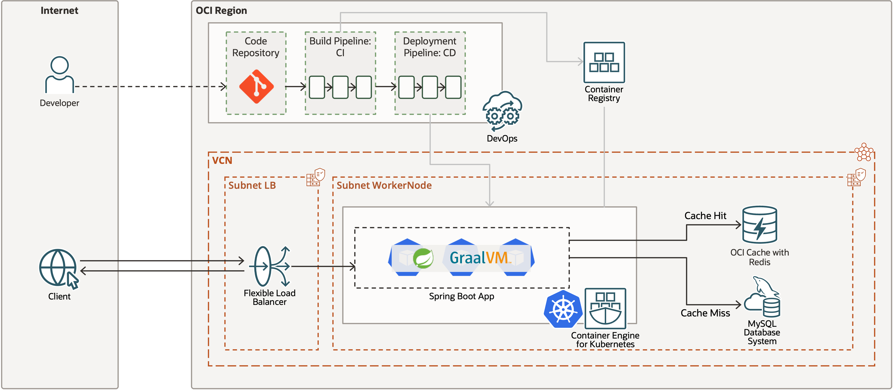

# Introduction

OCI에서 제공하는 데이터베이스(OCI MySQL Database) 서비스, 캐시 서비스(OCI Cache with Redis) 및 GraalVM 등을 사용하여 애플리케이션을 개발하고, 관리형 쿠버네티스 서비스인 Oracle Container Engine for Kubernetes(OKE)와 Oracle Cloud Infrastructure 구성 요소를 활용하여 애플리케이션을 배포합니다. 또한 CI/CD(OCI DevOps 서비스)로 배포 자동화를 구성합니다. 이를 통해 오라클 클라우드기반 컨테이너 개발, 배포 과정을 학습합니다. 

예상 시간: 6시간

### 목표

이 실습에서는 다음을 수행합니다:

* OKE에서 쿠버네티스 클러스터 만들기
* MDS(MySQL Data Service)로 MySQL 서버 만들기
* Redis 클러스터 만들기
* 쿠버네티스 클러스터 및 배포된 앱 모니터링
* CI/CD를 통해 소스 코드 변경 작업에 대한 자동 배포
* 모든 실습이 끝나고 사용한 자원 정리

### 전제 조건

1. Oracle Free Tier(Trial), Paid or LiveLabs Cloud Account
2. [Oracle Cloud Infrastructure 콘솔 익히기](https://docs.us-phoenix-1.oraclecloud.com/Content/GSG/Concepts/console.htm)
3. [Networking 소개](https://docs.us-phoenix-1.oraclecloud.com/Content/Network/Concepts/overview.htm)
4. [Compartments 익히기](https://docs.us-phoenix-1.oraclecloud.com/Content/GSG/Concepts/concepts.htm)
5. 컨테이너 및 [Kubernetes](https://kubernetes.io/) 에 대한 기본 개념 지식

이제 **다음 실습을 진행**하시면 됩니다.

## Learn More

* [참조 아키텍처: Kubernetes에서 마이크로서비스 기반 애플리케이션 배포](https://docs.oracle.com/en/solutions/cloud-native-ecommerce/index.html#GUID-CB180453-1F32-4465-8F27-EA7300ECF771)

## Acknowledgements

* **Author** - DongHee Lee, January 2024
* **Last Updated By/Date** - DongHee Lee, April 2024
