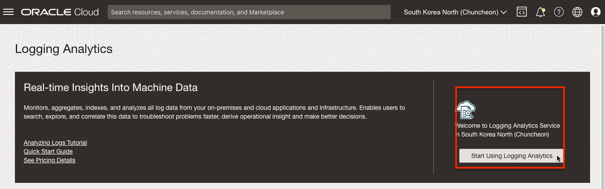
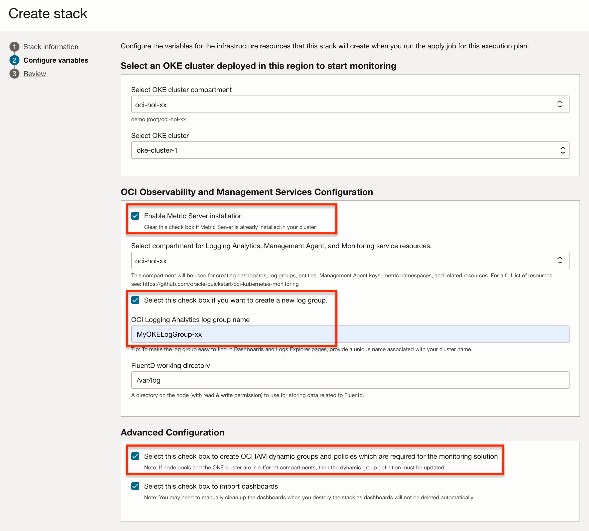
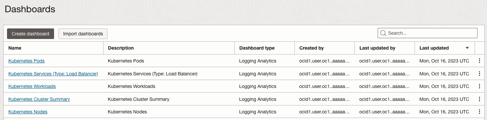
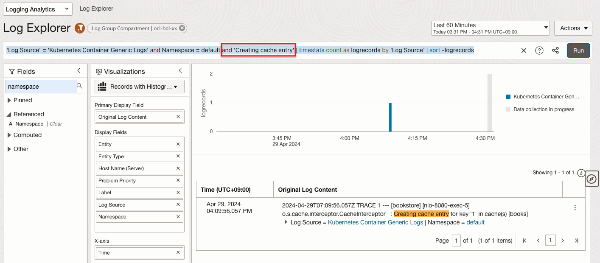
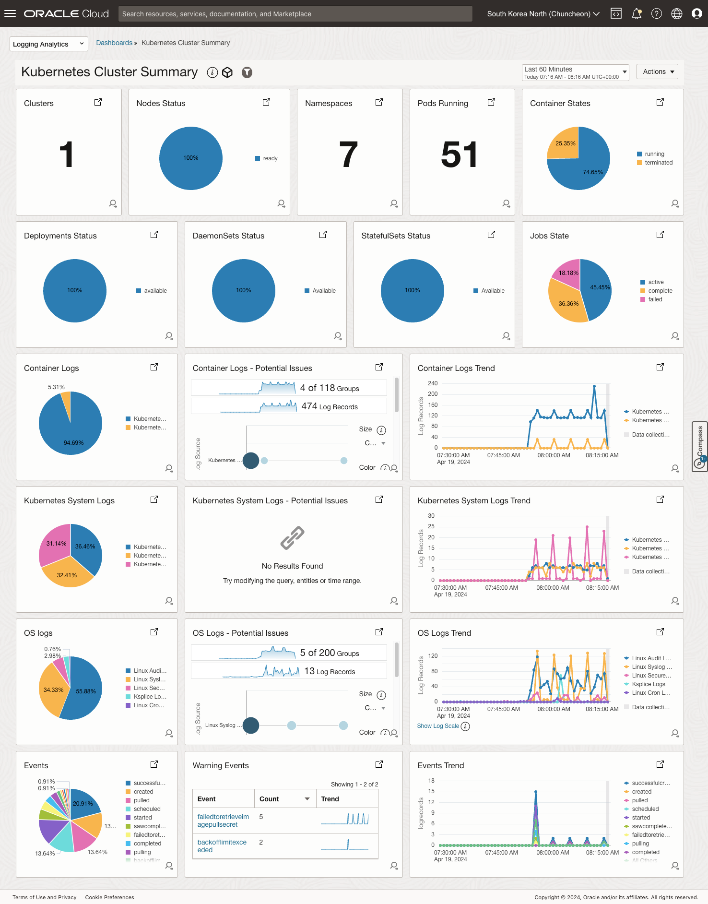
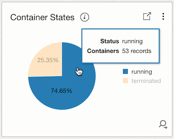
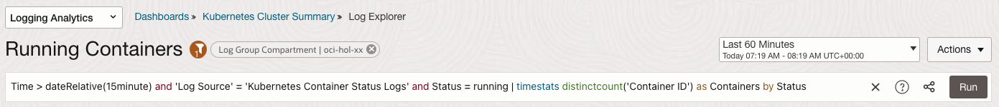

# Monitor the Log

## Introduction

Observability는 로그와 매트릭, 트레이스(추적)를 조합하여 현재 시스템의 상태를 이해하고 설명하는 데 도움을 줍니다. 시스템에 대한 가시성을 높이는데 도움을 줍니다.

예상 시간: Task 1 기준 - 30 분

### 목표

* OCI Logging Analytics로 OKE 로그 모니터링 하는 법 익히기

### OKE 로그

쿠버네티스에서 발생하는 로그는 크게 두 가지로 볼 수 있습니다. 쿠버네티스 프로세스에서 발생하는 로그와 컨테이너 애플리케이션에서 발생하는 로그입니다.

- **OKE(Container Engine for Kubernetes) 쿠버네티스 프로세스 로그**

    * Control Plane 영역에 있는 로그로, 2023년 9월부터 OCI 서비스 로그를 OKE에 대해서도 지원하기 시작하여, OKE 쿠버네티스 프로세스(kube-scheduler, kube-controller-manager, cloud-controller-manager, and kube-apiserver)의 로그를 *OCI Logging* 서비스의 *Service Log* 형식으로 OCI Logging 서비스에서 수집할 수 있습니다.
    * 타 로그모니터링 시스템에 전달이 필요한 경우, OCI Logging 수집된 로그를 Service Connector를 통해 타 시스템으로 전달합니다.

- **OKE 상의 컨테이너 애플리케이션 로그**: 컨테이너 애플리케이션의 로그를 수집을 위해서는 일반적으로 Agent를 설치하여 로그를 수집하며, 사용을 원하는 각 로그 모니터링 시스템에서 요구하는 방식으로 설치 구성합니다.

    * OCI Logging 서비스: Custom Log 형식을 지원하여, Worker Node에 Agent 설치하고, OCI Logging 서비스에서 수집하는 기능을 제공합니다.
    * OCI Logging Analytics: 전문 로그 분석 서비스로 로그 수집, 분석하능 기능을 제공합니다.
    * ElasticSearch/Kibana: 컨테이너 로그 모니터링으로 많이 사용하는 솔루션으로, Fluent Bit 또는 FluentD를 통해 로그 수집하고 모니터링합니다. 
    * OCI OpenSearch 서비스: ElasticSearch의 라이선스 문제로 분기된 OpenSearch를 OCI 제공하는 서비스입니다. ElasticSearch와 동일한 방식으로 Fluent Bit 또는 FluentD를 통해 로그 수집하고 모니터링합니다. 

## Task 1: OCI Logging Analytics

### OCI Kubernetes Monitoring Solution

OCI Logging Analytics에서 지원하는 방법에 맞춰 컨테이너 로그도 입수(ingest) 할 수 있지만 관련 구성 및 설정이 필요합니다. OCI Kubernetes Monitoring Solution는 OCI Logging Analytics, OCI Monitoring, OCI Management Agent 와 FluentD를 통해 Kubernetes를 모니터링을 한 번의 설치로 자동화하는 솔루션으로 오픈소스 형태로 제공하고 있습니다. 

- [GitHub - OCI Kubernetes Monitoring Solution](https://github.com/oracle-quickstart/oci-kubernetes-monitoring)

[Monitor Kubernetes and OKE clusters with OCI Logging Analytics](https://docs.oracle.com/ko/solutions/kubernetes-oke-logging-analytics/index.html) 문서에서 아키텍처를 보면, 로그 수집을 위해 컴포넌트로 FluentD Collector와 Logging Analytics FluentD Plugin이 설치되어 쿠버네티스 상의 로그를 수집합니다.


### OCI Logging Analytics가 활성화

*설치전에 대상 Region에 OCI Logging Analytics가 활성화되어 있어야 합니다. 내비게이션 메뉴에서 **Observability & Management** > **Logging Analytics** 화면으로 이동하여, 활성화되었는지 확인합니다. 활성화되지 않은 경우 먼저 활성화합니다.*



### OCI Kubernetes Monitoring Solution 설치

OCI 마켓플레이스를 통해 설치하거나, GitHub 리파지토리 소스를 통해 Resource Manager, Terraform, Helm 등으로 설치할 수 있습니다. 여기서는 Resource Manager을 통해 설치합니다.

1. [GitHub - OCI Kubernetes Monitoring Solution](https://github.com/oracle-quickstart/oci-kubernetes-monitoring) 으로 이동합니다.

2. 설명 중 [OCI Resource Manager](https://github.com/oracle-quickstart/oci-kubernetes-monitoring?tab=readme-ov-file#oci-resource-manager) 아래 *Deploy to Oracle Cloud*를 클릭하면 최신 소스를 Resource Manager로 설치할 수 있습니다.

    

3. 클릭하면 Resource Manager의 Stack 생성화면으로 이동됩니다.

4. 작성일 기준으로 V3.4.0 버전을 사용하였습니다.

5. 약관에 동의하고, 설치 기본 정보를 입력합니다.

     - Create in compartment: Resource Manager Stack이 설치될 위치입니다.

     

6. 변수값을 입력합니다.

     - OKE Cluster: OKE Cluster가 위치한 Compartment와 대상 클러스터를 선택합니다.
     - OCI Observability & Management Service Configuration: Logging Analytics 대쉬보드와 LogGroup의 위치하는 Compartment를 선택하고, 만들 Logging Analytics LogGroup을 이름을 입력합니다.
         * Enable Metric Server Installation: mushop-utilities에서 이미 metric-server를 OKE에 설치한 상태이므로 여기서는 *체크하지 않습니다.*
         * OCI Logging Analytics Log Group Name: MyOKELogGroup-*xx*
     - OCI IAM Policies and Dynamic Groups: 모니터링할 OKE 클러스터에 대한 접근을 위해 자동으로 Dynamic Group과 Policy가 만들어집니다. 자동설치가 싫거나, 권한이 없는 경우, 사전에 별도로 권한에 설정합니다.

     

7. Next를 클릭합니다.

8. 결과를 리뷰하고, **Create**를 클릭하여, 설치 및 적용합니다.

9. 설치가 완료할 때 까지 기다립니다. 실패한 경우, Logs를 확인하여 문제를 해결하고 재시도합니다.

10. 아래 Dynamic Group 및 Policy이 만들어집니다. Log & Object Collection Pods가 있는 Worker Nodes 그룹에게 OCI Logging Analytics에 로그를 업로드할 권한을 부여합니다.

     - Dynamic Group: oci-kubernetes-monitoring-xxx...

         ```shell
         Match any rules defined below
         
         # Rule 1
         ALL {instance.compartment.id = 'ocid1.compartment.oc1..aaaaa_____32sa'}
         
         # Rule 2
         ALL {resource.type='managementagent', resource.compartment.id='ocid1.compartment.oc1..aaaaa_____32sa'}
         ```

     - Policy: oci-kubernetes-monitoring-yyy...

         - OCI Logging Anaytics Comparment로 선택한 Compartment에 생성됨
    
         ```shell
         Allow dynamic-group oci-kubernetes-monitoring-xxx... to {LOG_ANALYTICS_LOG_GROUP_UPLOAD_LOGS} in compartment id ocid1.compartment.oc1..aaaaa_____32sa
         Allow dynamic-group oci-kubernetes-monitoring-xxx... to use METRICS in compartment id ocid1.compartment.oc1..aaaaa_____32sa WHERE target.metrics.namespace = 'mgmtagent_kubernetes_metrics'
         Allow dynamic-group oci-kubernetes-monitoring-xxx... to {LOG_ANALYTICS_DISCOVERY_UPLOAD} in tenancy         
         ```

11. 왼쪽 위 내비게이션 메뉴에서 **Observability & Management** > **Logging Analytics** > **Administration**으로 이동합니다.

12. Resources > Log Groups에 보면 설치시 생성된 LogGroup를 확인할 수 있습니다.

     

13. Dashboard 메뉴를 클릭하면, Kubernetes 대쉬보드가 추가된 것을 확인할 수 있습니다.

     

14. 대상으로 지정된 OKE 클러스터 설치된 자원을 확인합니다.

    - helm chart로 설치된 것을 확인할 수 있습니다.

      ```shell
      $ <copy>helm list -n default -o yaml</copy>
      - app_version: 3.0.0
        chart: oci-onm-3.4.0
        name: oci-kubernetes-monitoring
        namespace: default
        revision: "1"
        status: deployed
        updated: 2024-04-19 07:42:25.95497648 +0000 UTC
      ```

    - oci-onm 네임스페이스에 관련 Pod가 설치되었습니다.

      ```shell
      $ <copy>kubectl get pod -n oci-onm</copy>
      NAME                                   READY   STATUS      RESTARTS   AGE
      pod/oci-onm-discovery-28558565-8jz98   0/1     Completed   0          24m
      pod/oci-onm-logan-7x8l9                1/1     Running     0          24m
      pod/oci-onm-logan-bgg2s                1/1     Running     0          24m
      pod/oci-onm-logan-n7vrs                1/1     Running     0          24m
      pod/oci-onm-mgmt-agent-0               1/1     Running     0          24m      
      ```
      

### Logging Analytics - 로그 모니터링

1. OCI 콘솔로 이동합니다.

2. 왼쪽 위 내비게이션 메뉴에서 **Observability & Management** > **Logging Analytics** > **Log Explorer**으로 이동합니다.

3. 필터에서 Log Group Compartment를 원하는 대상으로 선택합니다.

     

4. 기본값으로 파이 차트 형식으로 보여 줍니다. 대상 클러스터에서 수집된 여러가지 소스에서 수집된 로그를 보여줍니다.

     

5. Worker Node 로그 및 사전 정의한 Kubernetes 로그이외에 애플리케이션 로그를 확인하기 위해 Kubernetes Container Generic Logs를 드릴 다운합니다.

     

6. 클러스터상의 수집된 컨테이너 로그들을 볼수 있습니다.

     

7. 필터링을 위해 *Search Fields*에 namespace로 검색합니다. 검색 결과 중에서 Namespace를 클릭하면 현재 검색된 로그들을 Namespace 단위로 카운트가 보입니다. 여기서 default namespace를 선택하고 적용합니다.

     

8. 검색 쿼리가 아래와 같이 변경되었습니다. 아래와 같이 직접 `and Namespace = mushop`를 입력하여도 됩니다.

     ```shell
     'Log Source' = 'Kubernetes Container Generic Logs' and Namespace = default | timestats count as logrecords by 'Log Source' | sort -logrecords
     ```

9. 앱 접속을 위해 Load Balancer IP를 다시 확인합니다.

    ````
    <copy>    
    kubectl get svc bookstore-service-service
    </copy>    
    ````

    결과 예시
    ````
    NAME                        TYPE           CLUSTER-IP     EXTERNAL-IP    PORT(S)        AGE
    bookstore-service-service   LoadBalancer   10.96.185.81   130.xxx.xx.xx  80:30225/TCP   125m
    ````

10. bookstore-service Pod의 로그를 조회합니다. app: bookstore-service 레이블을 기준으로 로그를 조회합니다.

    ````
    <copy>
    kubectl logs -f -l app=bookstore-service
    </copy>
    ````

11. Terminal에서 LoadBalancer의 EXTERNAL-IP를 통해 서비스를 요청합니다.

    ```
    $ curl -s http://130.xxx.xxx.xxx/api/books/1 | jq
    ```

12. 발생한 POD 로그는 다음과 같습니다.

    ````
    $ kubectl logs -f -l app=bookstore-service
    2024-04-29T07:09:55.171Z TRACE 1 --- [bookstore] [nio-8080-exec-5] o.s.cache.interceptor.CacheInterceptor   : Computed cache key '1' for operation Builder[public com.example.bookstore.entities.Book com.example.bookstore.services.BookService.getBookById(java.lang.Integer)] caches=[books] | key='#bookId' | keyGenerator='' | cacheManager='' | cacheResolver='' | condition='' | unless='' | sync='false'
    2024-04-29T07:09:55.899Z TRACE 1 --- [bookstore] [nio-8080-exec-5] o.s.cache.interceptor.CacheInterceptor   : No cache entry for key '1' in cache(s) [books]
    Hibernate: select b1_0.id,b1_0.authors,b1_0.average_rating,b1_0.isbn,b1_0.isbn13,b1_0.language_code,b1_0.num_pages,b1_0.publication_date,b1_0.publisher,b1_0.ratings_count,b1_0.text_reviews_count,b1_0.title from books b1_0 where b1_0.id=?
    2024-04-29T07:09:56.057Z TRACE 1 --- [bookstore] [nio-8080-exec-5] o.s.cache.interceptor.CacheInterceptor   : Creating cache entry for key '1' in cache(s) [books]
    2024-04-29T07:09:56.135Z TRACE 1 --- [bookstore] [nio-8080-exec-5] c.e.bookstore.logging.LoggingAspect      : ResponseEntity com.example.bookstore.controller.BookController.getBookById(Integer) executed in 972ms
    ````

14. Log Explorer에서 결과가 많으면, 쿼리에 검색조건을 추가하여 다시 검색합니다.

    ```
    <copy>
    'Log Source' = 'Kubernetes Container Generic Logs' and Namespace = default and 'Creating cache entry' | timestats count as logrecords by 'Log Source' | sort -logrecords
    </copy>
    ```

     


### Logging Analytics - Dashboard

1. **Logging Analytics** > **Dashboard**로 이동합니다.

2. Kubernetes 대쉬보드가 추가된 것을 확인할 수 있습니다.

     

3. Kubernetes Cluster Summary를 클릭합니다.

     

4. 배치된 위젯을 클릭하면, 해당 조건에 따라 로그를 쿼리하는 화면으로 이동합니다.

     
     
 
5. 다른 대쉬보드들로 비슷한 형식으로 제공합니다.


### Management Agent 및 메트릭 확인

OCI Kubernetes Monitoring Solution 버전이 올라가면서 OCI Kubernetes Monitoring Solution 설치시 OCI Management Agent도 함께 설치되어, OCI Monitoring상에 추가적으로 대상 쿠버네티스 클러스터에서 수집된 메트릭을 제공합니다.

1. 쿠버네티스 클러스스터에 설치된 자원을 다시 조회해 보면, mgmt-agent가 설치된 것을 알 수 있습니다.

     ```shell
     $ <copy>kubectl get pod -n oci-onm</copy>
     NAME                                   READY   STATUS      RESTARTS   AGE
     pod/oci-onm-discovery-28558565-8jz98   0/1     Completed   0          24m
     pod/oci-onm-logan-7x8l9                1/1     Running     0          24m
     pod/oci-onm-logan-bgg2s                1/1     Running     0          24m
     pod/oci-onm-logan-n7vrs                1/1     Running     0          24m
     pod/oci-onm-mgmt-agent-0               1/1     Running     0          24m   
     ```

2. OCI 콘솔에 로그인합니다.

3. 왼쪽 위 내비게이션 메뉴에서  **Observability & Management** > **Management Agents** > **Agent**로 이동합니다.

4. Agent가 등록된 것을 확인합니다.

     

5. 등록된 Agent를 클릭하면, 설치된 Agent의 현재 상태를 확인할 수 있습니다. 필요하면, 왼쪽 Time range에서 조회 시간을 1시간으로 변경합니다.

     

6. 내비게이션 메뉴에서  **Observability & Management** > **Monitoring** > **Metrics Explorer**로 이동합니다.

7. 화면 아래 Query 부분으로 이동합니다. Management Agent 설치로 인해 Metric namespace에 `mgmtagent_kubernetes_metrics`가 추가되었습니다. 선택하면 Metric name에서 제공하는 메트릭들을 볼 수 있습니다.

     

7. OKE에 설치된 Agent Pod를 통해 수집된 메트릭을 OCI Monitoring상의 메트릭으로 제공하는 것을 확인했습니다. 이를 사용해 OCI에서 제공하는 메트릭 모니터링, 알람 설정 등을 하거나, Logging Analytics 상의 대쉬보드로 구성하는 등 추가적인 모니터링 관련 설정을 할 수 있습니다.

이제 **다음 실습을 진행**하시면 됩니다.


## Learn More

## Acknowledgements

- **Author** - DongHee Lee
- **Last Updated By/Date** - DongHee Lee, April 2024
