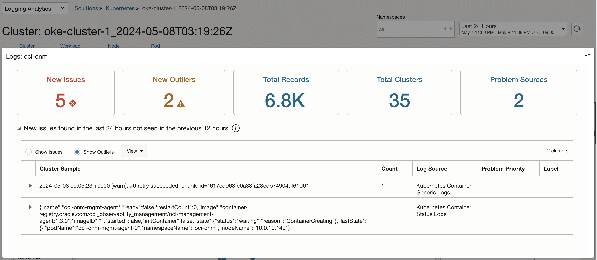

# Monitor the Log

## Introduction

Observability는 로그와 매트릭, 트레이스(추적)를 조합하여 현재 시스템의 상태를 이해하고 설명하는 데 도움을 줍니다. 시스템에 대한 가시성을 높이는데 도움을 줍니다.

예상 시간: Task 1 기준 - 30 분

### 목표

* OCI Logging Analytics로 OKE 로그 모니터링 하는 법 익히기

### OKE 로그

쿠버네티스에서 발생하는 로그는 크게 두 가지로 볼 수 있습니다. 쿠버네티스 프로세스에서 발생하는 로그와 컨테이너 애플리케이션에서 발생하는 로그입니다.

- **OKE(Container Engine for Kubernetes) 쿠버네티스 프로세스 로그**

    * Control Plane 영역에 있는 로그로, 2023년 9월부터 OCI 서비스 로그를 OKE에 대해서도 지원하기 시작하여, OKE 쿠버네티스 프로세스(kube-scheduler, kube-controller-manager, cloud-controller-manager, and kube-apiserver)의 로그를 *OCI Logging* 서비스의 *Service Log* 형식으로 OCI Logging 서비스에서 수집할 수 있습니다.
    * 타 로그모니터링 시스템에 전달이 필요한 경우, OCI Logging 수집된 로그를 Service Connector를 통해 타 시스템으로 전달합니다.

- **OKE 상의 컨테이너 애플리케이션 로그**: 컨테이너 애플리케이션의 로그를 수집을 위해서는 일반적으로 Agent를 설치하여 로그를 수집하며, 사용을 원하는 각 로그 모니터링 시스템에서 요구하는 방식으로 설치 구성합니다.

    * OCI Logging 서비스: Custom Log 형식을 지원하여, Worker Node에 Agent 설치하고, OCI Logging 서비스에서 수집하는 기능을 제공합니다.
    * OCI Logging Analytics: 전문 로그 분석 서비스로 로그 수집, 분석하능 기능을 제공합니다.
    * ElasticSearch/Kibana: 컨테이너 로그 모니터링으로 많이 사용하는 솔루션으로, Fluent Bit 또는 FluentD를 통해 로그 수집하고 모니터링합니다. 
    * OCI OpenSearch 서비스: ElasticSearch의 라이선스 문제로 분기된 OpenSearch를 OCI 제공하는 서비스입니다. ElasticSearch와 동일한 방식으로 Fluent Bit 또는 FluentD를 통해 로그 수집하고 모니터링합니다. 

## Task 1: OCI Logging Analytics

### OCI Kubernetes Monitoring Solution

OCI Logging Analytics에서 지원하는 방법에 맞춰 컨테이너 로그도 입수(ingest) 할 수 있지만 관련 구성 및 설정이 필요합니다. OCI Kubernetes Monitoring Solution는 OCI Logging Analytics, OCI Monitoring, OCI Management Agent 와 FluentD를 통해 Kubernetes를 모니터링을 한 번의 설치로 자동화하는 솔루션으로 오픈소스 형태로 제공하고 있습니다. 

- [GitHub - OCI Kubernetes Monitoring Solution](https://github.com/oracle-quickstart/oci-kubernetes-monitoring)

[Monitor Kubernetes and OKE clusters with OCI Logging Analytics](https://docs.oracle.com/ko/solutions/kubernetes-oke-logging-analytics/index.html) 문서에서 아키텍처를 보면, 로그 수집을 위해 컴포넌트로 FluentD Collector와 Logging Analytics FluentD Plugin이 설치되어 쿠버네티스 상의 로그를 수집합니다.


### OCI Logging Analytics가 활성화

*설치전에 대상 Region에 OCI Logging Analytics가 활성화되어 있어야 합니다. 내비게이션 메뉴에서 **Observability & Management** > **Logging Analytics** 화면으로 이동하여, 활성화되었는지 확인합니다. 활성화되지 않은 경우 먼저 활성화합니다.*


### OCI Kubernetes Monitoring Solution 설치

OCI 마켓플레이스를 통해 설치하거나, GitHub 리파지토리 소스를 통해 Resource Manager, Terraform, Helm 등으로 설치할 수 있습니다. 여기서는 OCI Logging Analytics에 통합되어 솔루션으로 제공하는 기능을 사용하겠습니다.

1. OCI 콘솔로 이동합니다.

2. 왼쪽 위 내비게이션 메뉴에서 **Observability & Management** > **Logging Analytics** > **Solutions**로 이동합니다.

3. **Kubernetes**를 클릭합니다.

    

4. 연결을 위해 **Connect cluster**를 클릭합니다.

    

5. Add Data에서 Monitor Kubernetes 아래 Oracle OKE를 클릭합니다.

    

6. 현재 Region에 있는 OKE 클러스터 목록이 보입니다. 이 중에서 모니터링하려는 클러스터를 클릭하고 Next를 클릭합니다.

    

7. 설치 사항을 선택합니다.

    - **Select a compartment for telemetry data and related monitoring resources**: 수집된 데이터와 자원을 위한 Compartment를 선택
    - **Policies**: Agent 설치 및 수집된 정보를 Logging Analytics로 업로드할 수 있도록 여기서는 동적 그룹 및 Policy를 자동으로 생성하도록 선택
    - **Metric server**:  대상 클러스터에 이미 metric-server를 설치된 상태가 아닌 경우, 자동으로 설치되도록 체크합니다.
    - **Solution deployment options**: 자동 설치하는 옵션을 선택합니다.

    

    - 아래 **Show More**를 클릭하면, 설치되는 사항을 확인할 수 있습니다.

         ```shell
         # 설치되는 자원 목록:
         - IAM Policy and Dynamic Groups
         - Logging Analytics Log Groups and Entities
         - Agent key
         - Metric namespace
         - Management Agent configuration
         - Fluentd configuration
         - Kubernetes manifests and helm chart         

         # 클러스터 모니터링을 위해 만들어지는 Dynamic Group과 Policy
         ALL {instance.compartment.id = '<OKE_COMPARTMENT_OCID>'}
         ALL {resource.type='managementagent', resource.compartment.id='<TELEMETRY_COMPARTMENT_OCID>'}
         
         allow dynamic-group <dynamic_group_name> to {LOG_ANALYTICS_LOG_GROUP_UPLOAD_LOGS} in compartment id <TELEMETRY_COMPARTMENT_OCID>
         allow dynamic-group <dynamic_group_name> to use METRICS in compartment id <TELEMETRY_COMPARTMENT_OCID> WHERE target.metrics.namespace = 'mgmtagent_kubernetes_metrics'
         allow dynamic-group <dynamic_group_name> to {LOG_ANALYTICS_DISCOVERY_UPLOAD} in tenancy
         ```

8. 설치가 완료되었습니다.

    - Entity, Log Group, ORM Stack은 모두 설정시 선택한 Compartment에 생성됩니다.
    - Policy는 Tenancy 레벨 설정이 있기 때문에 모두 Root Compartment에 생성됩니다.

    

9. 아래 **Take me to Kubernetes**를 클릭합니다.

10. 연결된 클러스터 목록이 보입니다. 

    - 대상 클러스터에 실제 Agent Pod가 설치되어, 연결되면, CPU, Memory, Pods 정보가 보입니다.

    

11. 연결된 클러스터를 클릭합니다.

12. 연결된 클러스터에 대해 Cluster, Workload, Node, Pod 기준으로 대쉬보드를 제공합니다. 대상 시간을 지난 24시간으로 선택합니다.

    

13. 선택된 단위에 우클릭하여, 팝업에서 단위로 필터링 하거나, 로그를 확인할 수 있습니다. View Logs를 클릭합니다.

14. 선택된 단위에 대해 지난 24시간 동안 발생한 로그 중, 특이한 로그를 보여줍니다.

    

15. 대상으로 지정된 OKE 클러스터 설치된 자원을 확인합니다.

    - helm chart로 설치된 것을 확인할 수 있습니다.

      ```shell
      $ <copy>helm list -n default -o yaml</copy>
      - app_version: 3.0.0
        chart: oci-onm-3.4.1
        name: oci-kubernetes-monitoring
        namespace: default
        revision: "1"
        status: deployed
        updated: 2024-05-08 07:23:53.62520904 +0000 UTC        
      ```

    - oci-onm 네임스페이스에 관련 Pod가 설치되었습니다. Worker Node 마다 로그를 전송하는 oci-onm-logan Pod와 metric을 전송하는 management agent Pod 등을 볼 수 있습니다.

      ```shell
      $ <copy>kubectl get pod -n oci-onm</copy>
      NAME                               READY   STATUS      RESTARTS   AGE
      oci-onm-discovery-28586260-mhmb2   0/1     Completed   0          10m
      oci-onm-discovery-28586265-t268x   0/1     Completed   0          5m58s
      oci-onm-discovery-28586270-j2wr4   0/1     Completed   0          58s
      oci-onm-logan-sw9pd                1/1     Running     0          1h27m
      oci-onm-logan-tpdlz                1/1     Running     0          1h27m
      oci-onm-logan-wjc7m                1/1     Running     0          1h27m
      oci-onm-mgmt-agent-0               1/1     Running     0          1h27m        
      ```
      

### Logging Analytics - 로그 모니터링

1. OCI 콘솔로 이동합니다.

2. 왼쪽 위 내비게이션 메뉴에서 **Observability & Management** > **Logging Analytics** > **Log Explorer**으로 이동합니다.

3. 필터에서 Log Group Compartment를 원하는 대상으로 선택합니다.

     

4. 기본값으로 파이 차트 형식으로 보여 줍니다. 대상 클러스터에서 수집된 여러가지 소스에서 수집된 로그를 보여줍니다.

     

5. Worker Node 로그 및 사전 정의한 Kubernetes 로그이외에 애플리케이션 로그를 확인하기 위해 Kubernetes Container Generic Logs를 드릴 다운합니다.

     

6. 클러스터상의 수집된 컨테이너 로그들을 볼수 있습니다.

     

7. 필터링을 위해 *Search Fields*에 namespace로 검색합니다. 검색 결과 중에서 Namespace를 클릭하면 현재 검색된 로그들을 Namespace 단위로 카운트가 보입니다. 여기서 default namespace를 선택하고 적용합니다.

     

8. 검색 쿼리가 아래와 같이 변경되었습니다. 아래와 같이 직접 `and Namespace = mushop`를 입력하여도 됩니다.

     ```shell
     'Log Source' = 'Kubernetes Container Generic Logs' and Namespace = default | timestats count as logrecords by 'Log Source' | sort -logrecords
     ```

9. 앱 접속을 위해 Load Balancer IP를 다시 확인합니다.

    ````
    <copy>    
    kubectl get svc bookstore-service-lb
    </copy>    
    ````

    결과 예시
    ````
    NAME                        TYPE           CLUSTER-IP     EXTERNAL-IP    PORT(S)        AGE
    bookstore-service-lb        LoadBalancer   10.96.185.81   130.xxx.xx.xx  80:30225/TCP   125m
    ````

10. bookstore-service Pod의 로그를 조회합니다. app: bookstore-service 레이블을 기준으로 로그를 조회합니다.

    ````
    <copy>
    kubectl logs -f -l app=bookstore-service
    </copy>
    ````

11. Terminal에서 LoadBalancer의 EXTERNAL-IP를 통해 서비스를 요청합니다.

    ```
    $ curl -s http://130.xxx.xxx.xxx/api/books/1 | jq
    ```

12. 발생한 POD 로그는 다음과 같습니다.

    ````shell
    $ kubectl logs -f -l app=bookstore-service
    2024-04-29T07:09:55.171Z TRACE 1 --- [bookstore] [nio-8080-exec-5] o.s.cache.interceptor.CacheInterceptor   : Computed cache key '1' for operation Builder[public com.example.bookstore.entities.Book com.example.bookstore.services.BookService.getBookById(java.lang.Integer)] caches=[books] | key='#bookId' | keyGenerator='' | cacheManager='' | cacheResolver='' | condition='' | unless='' | sync='false'
    2024-04-29T07:09:55.899Z TRACE 1 --- [bookstore] [nio-8080-exec-5] o.s.cache.interceptor.CacheInterceptor   : No cache entry for key '1' in cache(s) [books]
    Hibernate: select b1_0.id,b1_0.authors,b1_0.average_rating,b1_0.isbn,b1_0.isbn13,b1_0.language_code,b1_0.num_pages,b1_0.publication_date,b1_0.publisher,b1_0.ratings_count,b1_0.text_reviews_count,b1_0.title from books b1_0 where b1_0.id=?
    2024-04-29T07:09:56.057Z TRACE 1 --- [bookstore] [nio-8080-exec-5] o.s.cache.interceptor.CacheInterceptor   : Creating cache entry for key '1' in cache(s) [books]
    2024-04-29T07:09:56.135Z TRACE 1 --- [bookstore] [nio-8080-exec-5] c.e.bookstore.logging.LoggingAspect      : ResponseEntity com.example.bookstore.controller.BookController.getBookById(Integer) executed in 972ms
    ````

13. Log Explorer에서 결과가 많으면, 쿼리에 검색조건(`and 'Creating cache entry'`)을 추가하여 다시 검색합니다.

    ```shell
    <copy>
    'Log Source' = 'Kubernetes Container Generic Logs' and Namespace = default and 'Creating cache entry' | timestats count as logrecords by 'Log Source' | sort -logrecords
    </copy>
    ```

     


이제 **다음 실습을 진행**하시면 됩니다.


## Learn More

- [Logging Analytics Solutions > Kubernetes Solution](https://docs.public.oneportal.content.oci.oraclecloud.com/en-us/iaas/logging-analytics/doc/kubernetes-solution.html)

## Acknowledgements

- **Author** - DongHee Lee
- **Last Updated By/Date** - DongHee Lee, May 2024
