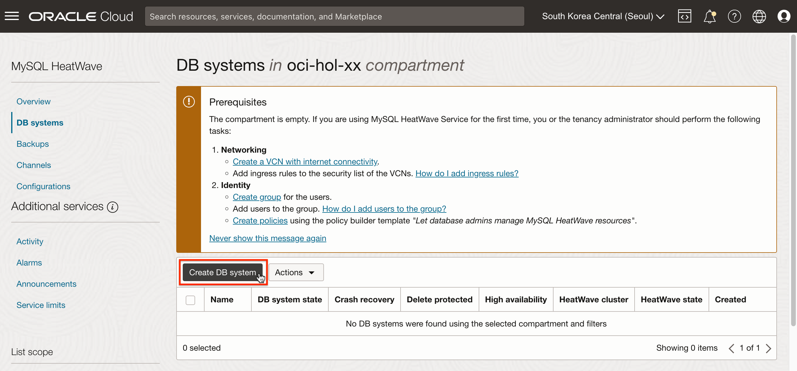
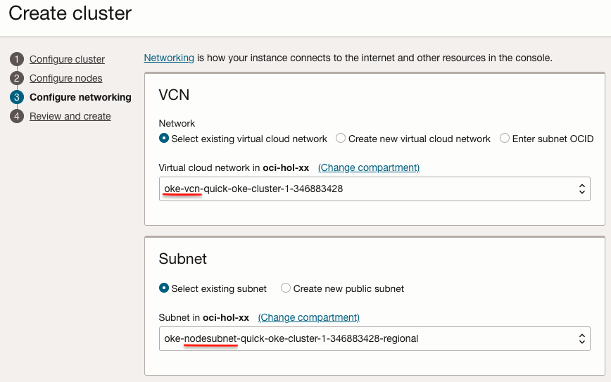

# Setup Required Services

## Introduction

실습할 마이크로서비스 애플리케이션을 배포하는 데 사용할 Oracle 클라우드 환경을 만듭니다. MySQL Data Service로 MySQL 서버, Redis 클러스터를 만든 후 연결 테스트를 진행합니다.

예상 시간: 20분

### 목표

- MySQL 서버 만들기
- Cloud Shell에서 MySQL 서버 연결하기
- Redis 클러스터 만들기
- Cloud Shell에서 Redis 클러스터 연결하기

**필요한 모든 자격 증명을 기록하는 메모 페이지를 만드는 것을 권장합니다.**

### 전제 조건

- Oracle Cloud Trial Account 또는 Paid Account


## Task 1: 실습을 위한 Policy 생성 (X)

*서비스를 사용하기 위한 권한을 설정합니다. 테넌시 기준의 Policy를 포함하고 있기 때문에 관리자로 로그인하여 수행하여야 합니다.*

> Policy 구문은 유저가 아닌 그룹에 대해 적용할 수 있습니다. 원하는 사용자가 속한 그룹이 없는 경우 [Create a group](https://docs.cloud.oracle.com/en-us/iaas/Content/Identity/Tasks/managinggroups.htm#To)을 참조하여 먼저 그룹을 만들어 유저를 할당합니다.

1. 왼쪽 상단의 **Navigation Menu**를 클릭하고 **Identity & Security**으로 이동한 다음 **Identity** > **Policies** 을 선택합니다.

2. 이후 실습을 위해 다음 Policy를 추가합니다. 앞서 만든 Policy(예, oke-lab-policy*-xx*)에 다음 규칙을 추가합니다.

     - Policy:

         * `<group-name>`: Policy를 적용할 사용자 그룹을 선택합니다. 예, 'Default'/'oci-group'
         * `<compartment-name>`: Policy가 적용될 Compartment를 앞서 만든 Compartment로 선택합니다. 예) oci-hol-*xx*

     ```
     # MySQL
     Allow group {group name} to {COMPARTMENT_INSPECT, VCN_READ, SUBNET_READ, SUBNET_ATTACH, SUBNET_DETACH, NETWORK_SECURITY_GROUP_UPDATE_MEMBERS, VNIC_CREATE, VNIC_UPDATE,VNIC_DELETE, VNIC_ASSOCIATE_NETWORK_SECURITY_GROUP} in compartment <compartment-name>
     Allow group {group name} to manage mysql-family in compartment <compartment-name>
     Allow group {group name} to manage dbmgmt-mysql-family in compartment <compartment-name>
     Allow group {group name} to use tag-namespaces in tenancy

     # Redis
     Allow group {group name} to manage redis-family in compartment <compartment-name>
     Allow group {group name} to manage virtual-network-family in compartment <compartment-name>
     ```


## Task 2: MySQL 서버 만들기

1. 왼쪽 상단의 **Navigation Menu**를 클릭하고 **Databases**로 이동한 다음 **MySQL HeatWave** 하위 **DB systems**를 선택 합니다.

    

2. 생성을 위해 **Create DB system**을 클릭합니다.

    

3. **Development or testing** 유형을 선택합니다.

    

4. Provide DB system information:

    - Create in compartment: 사용하는 **oci-hol**-*xx* Compartment
    - Name: 이름을 입력합니다. 예) mysql-*xx*

5. Create Administrator credentials: 관리자 이름과 암호를 입력합니다.

    - Username: admin
    - Password: 예) `ThePassword1!`

        * Administrator password must be between 8 and 32 characters, and contain at least 1 uppercase, 1 lowercase, 1 numeric, and 1 special characters.

6. DB system 타입: **Standalone**을 선택합니다.

7. Configure networking: OKE 클러스터의 Worker Node가 속한 서브넷을 선택합니다.

    

8. Configure placement: 기본값을 선택

9. Configure hardware:

    - Enable HeatWave: *체크 해제*
    - Shape Details: 기본 선택된 MySQL.2을 사용합니다.

10. Configure backup plan

    - Enable automatic backups: *체크 해제*

11. Create 버튼을 클릭하여, DB를 생성합니다.    

12. 일단 시작되면 MySQL DB가 프로비저닝됩니다. 위 설정기준으로 Active 상태로 되기까지, 약 10~15분 정도 걸립니다.


## Task 3: Cloud Shell에서 생성한 MySQL 접근하기

1. 생성된 MySQL의 DB System 상세정보를 확인합니다.

2. 왼쪽 아래 Resources > Endpoints를 클릭하여, Endpoint 주소와 Port를 확인합니다. 

    *Endpoint 주소는 생성시 지정한 서브넷상의 Private IP임을 유의합니다.*

    

3. Cloud Shell을 실행합니다.

4.  Cloud Shell은 기본적으로는 유저 테넌시 환경의 프라이빗 네트워크에 접속이 안됩니다. 현재는 Home Region 상에 있는 자원에 대해서는 Private Network 설정을 통해 프라이빗 네트워크에 접속됩니다.

    Cloud Shell의 왼쪽 위 Network 항목에서 **Ephemeral private network setup**을 클릭합니다.

    

5. Cloud Shell에 연결할 서브넷으로 MySQL이 속한 서브넷을 지정합니다.

    

6. 연결이 완료되면, *Network: Ephemeral*로 표시됩니다.

    - 연결 중
    

    - 연결 완료
    

7. 실행할 SQL 파일을 다운로드하고 파일 경로를 확인합니다.

    ```
    <copy>
    wget https://raw.githubusercontent.com/TheKoguryo/bookstore-service/main/mysql-books.sql
    realpath mysql-books.sql
    </copy>
    ```

    

8. MySQL Shell(mysqlsh)을 사용하여, MySQL DB에 로그인합니다.

    - Administrator Username / Password로 로그인

    ```
    <copy>
    mysqlsh <Username>@<MYSQL-ENDPOINT-ADDRESS>
    </copy>
    ```
    
    

9. 생성된 MySQL에 접속되는 것을 확인했습니다.

10. SQL 실행모드로 변경후, 다운받은 SQL 파일을 실행합니다.

    ```
    <copy>
    \sql
    source /home/kildong/mysql-books.sql
    </copy>
    ```

    
    

11. MySQL Shell(mysqlsh) 종료는 `\quit`를 실행하면 됩니다.

## Task 4: Redis 클러스터 만들기

1. 왼쪽 상단의 **Navigation Menu**를 클릭하고 **Databases**로 이동한 다음 **Redis** 하위 **Clusters로**를 선택합니다.

2. 생성을 위해 Create cluster을 클릭합니다.

3. 기본 정보를 입력합니다.

    - Name: 클러스터 이름 입력, 예, my-redis-cluster-*xx*
    - Create in compartment: 위치할 컴파트먼트 선택
    - Redis software version: 현재는 7.0.5만 지원

4. 다음으로 노드를 구성합니다.

    - Memory (GB) per node:

        * 노드당 할당할 메모리를 입력합니다. 2GB ~ 500GB를 지원하며, *여기서는 최소값인 2GB를 선택합니다.*
        * 설정한 메모리에 따라 Bandwidth (GBps)도 함께 변경됩니다.

    - Node count:
        * 노드 수를 입력합니다. 1개 ~ 5개가 가능하며, *여기서는 최소노드인 1개를 선택합니다.*
        * Primary (읽기/쓰기 가능) 하나에, 나머지는 Replica (읽기만 가능)로 생성됩니다.

            

5. 다음으로 네트워크를 구성합니다.

    - 사용할 VCN과 서브넷을 선택합니다. OKE 클러스터의 Worker Node가 속한 서브넷을 선택합니다.
    - *생성된 Redis 클러스터는 Private Endpoint만 제공하여, Public Subnet을 선택하셔도 인터넷에서 접속은 불가합니다.*

    

6. 입력 정보를 리뷰한 후 클러스터를 생성합니다.

7. 참고로, 입력한 정보를 기준으로 클러스터 생성은 7분 정도 걸렸습니다. 환경에 따라 달라 질 수 있습니다.

8. 동적 변경을 확인하기 위해, 생성된 클러스터 정보에서 **Resize nodes**를 클릭하여, 2개로 변경합니다.

    

9. 여기서는 변경완료를 기다리지말고 다음으로 넘어갑니다.

## Task 5: Cloud Shell에서 생성한 Redis 클러스터 접근하기

1. 생성된 Redis Cluster 상세정보를 확인합니다. 접속시 Primary endpoint를 사용할 예정입니다.

    - Primary endpoint: 항상 클러스터의 Primary Node에 연결하는 Endpoint입니다. 인터넷에서 직접 접속은 불가합니다. 기본적으로는 같은 VCN 내에서만 접속이 가능합니다.
    - Replicas endpoint: 클러스터의 Replica 노드 중 하나로 연결하는 Endpoint입니다. Replica가 둘 이상인 경우, 연결시 이전과 다른 노드로 연결될 수 있습니다.
    - Node endpoints: 각 노드로 직접 연결하는 Endpoint입니다. 각 노드로 연결이 잘 되는지 확인용으로 사용할 수 있습니다.

    


2. Cloud Shell을 실행합니다.

3. *Network: Ephemeral* 상태로 OKE Worker Node 서브넷에 Private Network으로 설정되었는 지 확인합니다. 

    *Network: Public인 경우 MySQL 연결시 한 것처럼 Private Network Setup을 다시 진행합니다.*

    

4. redis-cli를 다음 명령으로 설치합니다.

    ```
    <copy>
    #!/usr/bin/bash
    cd /tmp
    wget http://download.redis.io/redis-stable.tar.gz
    tar xvzf redis-stable.tar.gz
    cd redis-stable
    make distclean
    make redis-cli BUILD_TLS=yes
    cp src/redis-cli ~/.local/bin
    chmod 755 ~/.local/bin/redis-cli

    echo 'PATH=$PATH:$HOME/.local/bin:$HOME/bin' >>~/.bashrc
    echo 'export PATH' >>~/.bashrc    

    source ~/.bashrc
    </copy>
    ```

5. 다음 명령으로 설치 확인합니다.

    ```
    $ <copy>redis-cli --version</copy>
    redis-cli 7.2.4
    ```

6. redis-cli로 Redis 클러스터에 접속합니다.

    - –tls: OCI Cache with Redis로 만들어진 Redis 클러스터는 –tls 옵션은 반드시 사용합니다.
    - -h: 대상 Endpoint를 입력합니다. 여기서는 Primary Endpoint로 입력합니다.

    ```
    redis-cli --tls -h <Primary-Endpoint>
    ```

7. 연결이 되면,  접속후 ping 명령을 수행하면, 응답이 오는 것을 확인할 수 있습니다. 또한 키와 값을 설정, 조회해 봅니다.

    ```
    > ping
    PONG
    > SET hkey "Hello World!"
    OK
    > GET hkey
    "Hello World!"
    ```

    

8. redis-cli로 OCI Cache with Redis 서비스로 생성한 Redis 클러스터에 연결을 확인하였습니다.    


이제 **다음 실습을 진행**하시면 됩니다.

## Acknowledgements

- **Author** - DongHee Lee
- **Last Updated By/Date** - DongHee Lee, April 2024
