# Budget & Cost Analysis

## Introduction

Budget: 예산을 사용하여 OCI 비용 지출에 대한 소프트 한도를 설정할 수 있으며, 예산에 대한 알림도 설정하여 예산을 초과할 수 있는 시기를 알려줄 수도 있습니다. OCI 콘솔의 한 곳에서 모든 예산과 현재 지출을 확인할 수 있습니다.

Cost Analysis: OCI 콘솔에서 액세스할 수 있는 비용 분석 시각화 옵션으로, 사용 패턴을 즉시 감지하는 데 도움이 되는 유용한 추세선, OCI의 다양한 서비스에 대해 살펴볼 수 있는 패턴을 제공합니다. 필터링, 그룹화를 제공하여, Tenancy/Cloud Account, OCI 서비스, Compartment 단위 등 여러 측면에서 관심 있는 관정으로 비용 데이터를 분석할 수 있습니다. 비용 분석을 사용하려면 관리자 그룹의 구성원이어야 합니다.

예상 시간: 30분

### 전제조건

- Oracle Cloud Trial Account 또는 Paid Account

## Task 1: Budget 생성하기

1. 왼쪽 상단의 **Navigation Menu**를 클릭하고 **Billing & Cost Management**으로 이동한 다음 **Cost Management** 하위의 **Budgets**을 선택합니다.

2. Budget을 생성하기 위해 **Create Budget**을 클릭합니다.

3. Budget 이름을 입력하고, Scope을 지정합니다. Compartment 또는 Tag를 기준으로 할 수 있습니다. 여기에서는 Compartment로 선택합니다.

    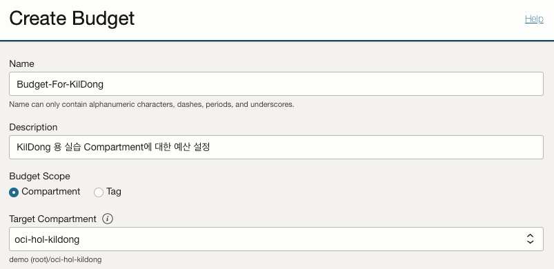

4. 예산을 계산할 주기를 지정합니다. 여기서는 한달에 사용할 예산으로 지정합니다.

    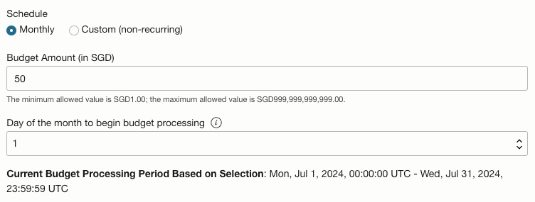

5. 선택사항으로 예산 사용량에 대한 Alert Rule을 지정합니다.

    - Threshold Metric: 실 사용량 또는 현 추세로 예측되는 사용량 기준으로 할 지 선택합니다.
    - Threshold % 또는 Threshold Amount: 예산 대비 백분율 또는 절대적인 사용값으로 할 지 선택하고, 선택한 유형에 따른 값을 입력합니다.
    - Alert 할 지 여부는 매 24 시간마다 주기적으로 평가합니다.
        - 참조 - [Oracle Cloud Infrastructure Documentation > Billing and Cost Management > Budget Concepts](https://docs.oracle.com/en-us/iaas/Content/Billing/Concepts/budgetsoverview.htm#Budgets_Overview__budgets-concepts)
        - ALERT: You can define email alerts that get sent out for your budget. You can send a customized email message body with these alerts. *Alerts are evaluated periodically every 24 hours*, and can be triggered when your actual or forecasted spending hits either a percentage of your budget or a specified set amount.
    - Budget 생성화면에서 직접 이메일 형식을 입력할 수 있으며, 또는 Rule만 지정하고, Rule이 트리거된 이벤트를 기반으로 Functions 또는 OCI Notification Service에 연계해서 원하는 다른 방식으로 통지할 수 있습니다.
    - Budget 생성이후 Budget 상세화면에서 Alert 규칙을 더 추가 할 수 있습니다.

    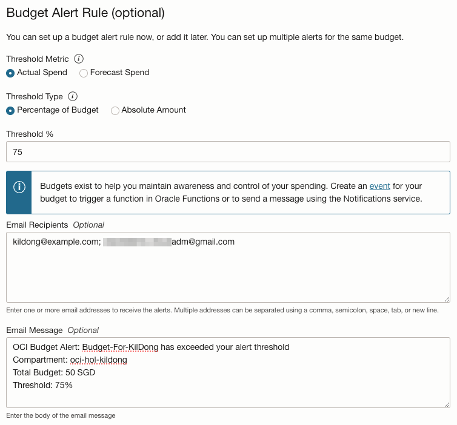

6. 생성된 Budget을 클릭합니다.

7. Budget 상세화면에서, **Create Budget Alert Rule**을 클릭하여, 하나의 예산에 대해서 다른 Threshold 기준으로 Alert Rule을 추가 생성할 수 있습니다.

    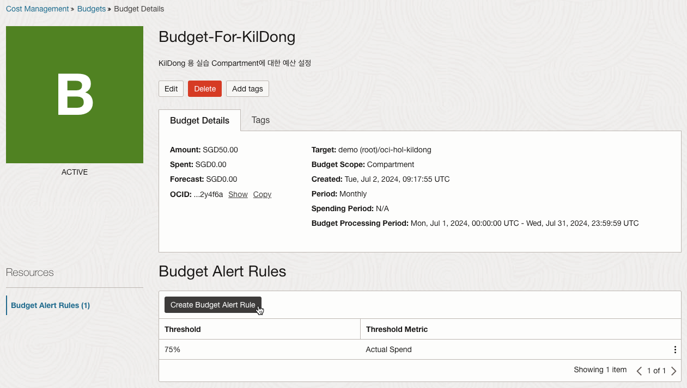

    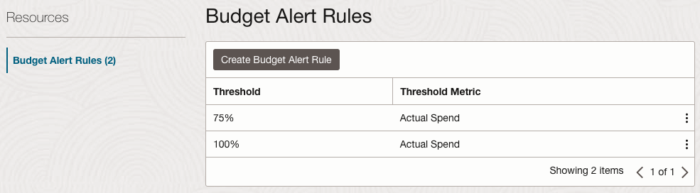


## Task 2: Cost Analysis 

1. 왼쪽 상단의 **Navigation Menu**를 클릭하고 **Billing & Cost Management**으로 이동한 다음 **Cost Management** 하위의 **Cost analysis**을 선택합니다.

2. 기간, 필터, 그룹화 조건을 설정하여 원하는 기준으로 사용한 비용 및 예측 비용을 확인할 수 있습니다.

    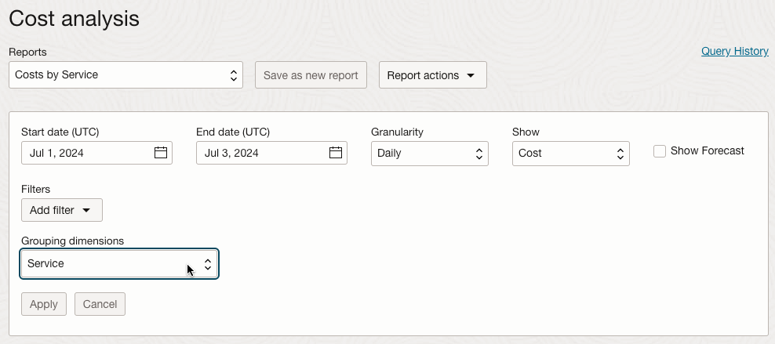

3. 예시로, 서비스 및 상세 항목을 기준으로 그룹화하기 위해 Service and Production Description을 선택합니다.    

    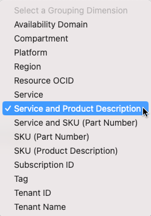

4. 적용하면, 설정된 조건에 따라 조회할 수 있습니다.

    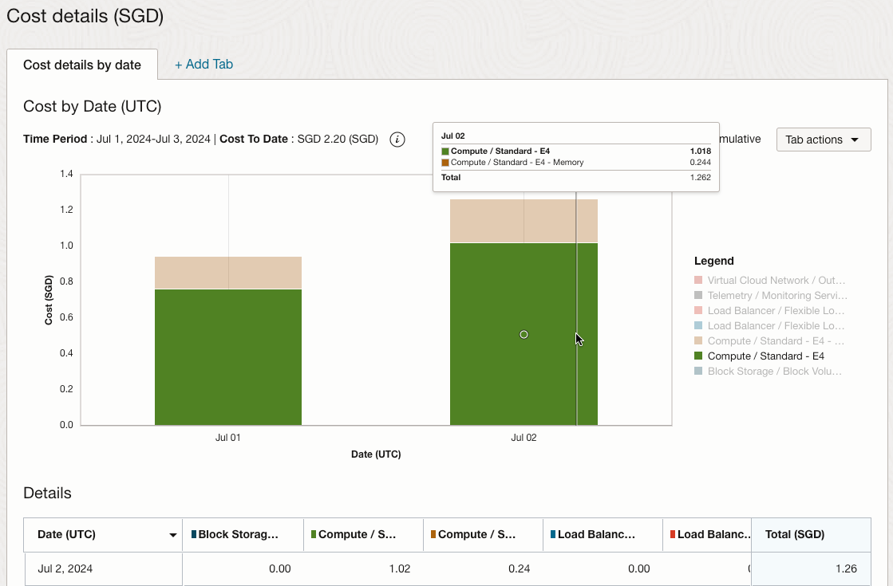

5. 기본 일, 월 기준으로 조회할 수 있으며, 시작/종료일 같은 경우, Hourly로도 조회할 수 있습니다.

    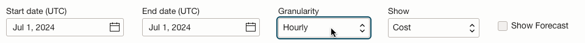

    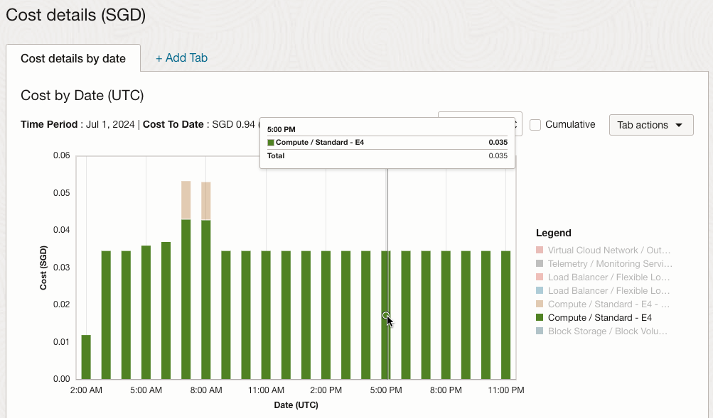

6. 프로젝트별, 부서별 자원 관리를 위해 Compartment를 할당하고 관리하는 경우, Compartment로 그룹화해서 조회하면, 프로젝트별, 부서별 비용관리하기 편리합니다.

    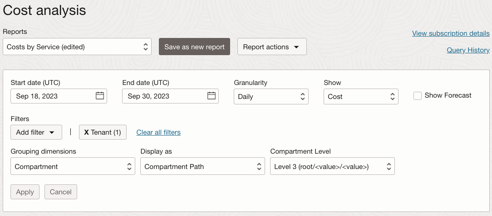

    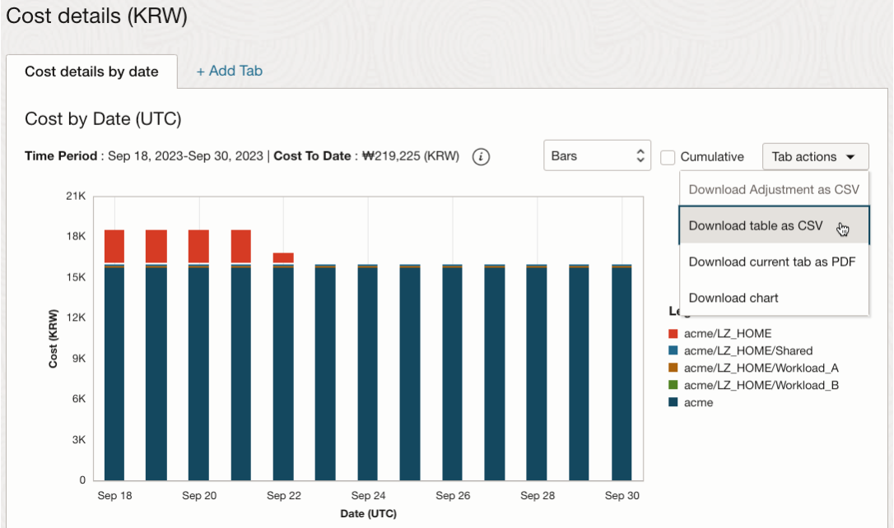


이제 **다음 실습을 진행**하시면 됩니다.

## 참고 IAM Policy

1. 왼쪽 상단의 Navigation Menu를 클릭하고 Identity & Security으로 이동한 다음 Policies 을 선택합니다.

2. 아래 항목을 참고하여 필요한 Policy를 설정합니다.

    ```text
    # Cost and Usage Reports
    define tenancy usage-report as ocid1.tenancy.oc1..aaaaaaaaned4fkpkisbwjlr56u7cj63lf3wffbilvqknstgtvzub7vhqkggq
    endorse group <identity_domain_name>/<group_name> to read objects in tenancy usage-report
    
    # Cost and Usage Reports
    # Cost analysis
    # Scheduled reports
    Allow group <identity_domain_name>/<group_name> to read usage-report in tenancy
    
    # Budgets
    Allow group <identity_domain_name>/<group_name> to manage usage-budgets in tenancy
    
    # Oracle FinOps Hub
    ## Active Subscription
    Allow group <identity_domain_name>/<group_name> to read subscription in tenancy
    Allow group <identity_domain_name>/<group_name> to read computed-usage in tenancy
    
    ## Optimize
    Allow group <identity_domain_name>/<group_name> to read optimizer-api-family in tenancy
    
    # Billing > Subscriptions > Rate card
    Allow group <identity_domain_name>/<group_name> to read rate-cards in tenancy
    ```

## Learn More

- [Oracle Cloud Infrastructure Documentation > Billing and Cost Management > Budgets](https://docs.cloud.oracle.com/en-us/iaas/Content/Billing/Concepts/budgetsoverview.htm)
- [Launch of FinOps Hub: Simplified cost management experience](https://blogs.oracle.com/cloud-infrastructure/post/ocis-launches-its-finops-hub)

## Acknowledgements

- **Authors** - DongHee Lee
- **Last Updated By/Date** - DongHee Lee, July 2024