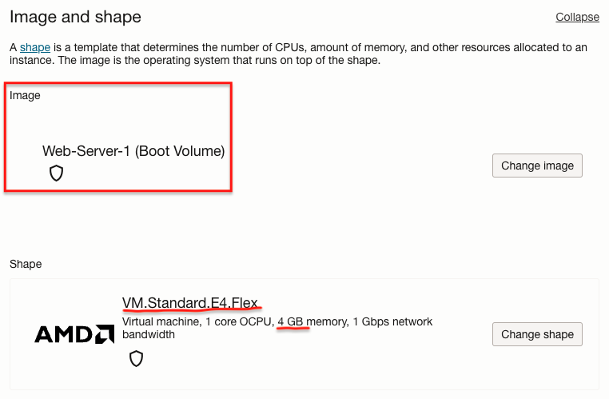
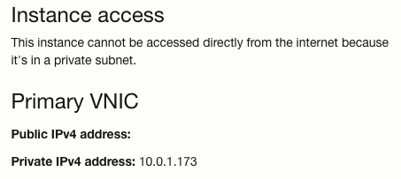
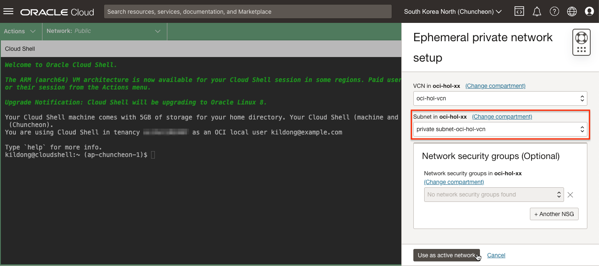
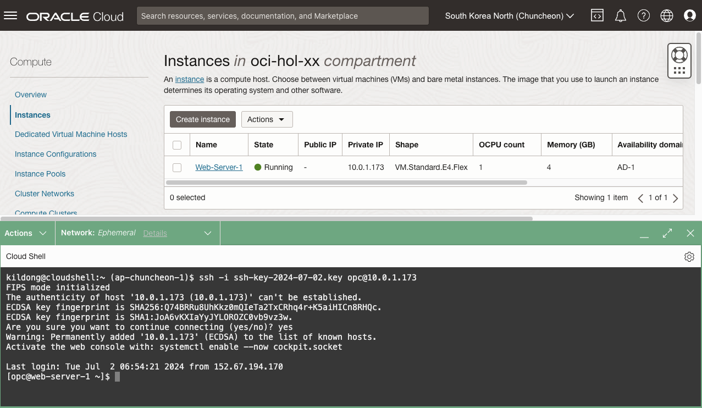
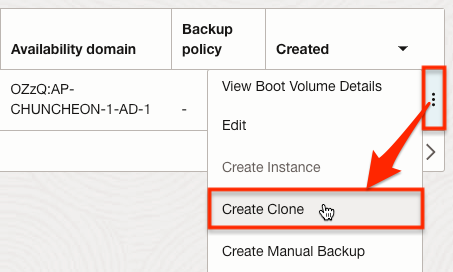
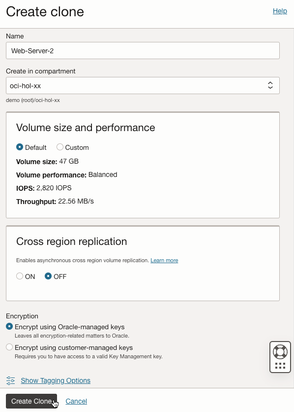
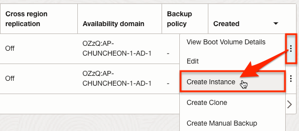
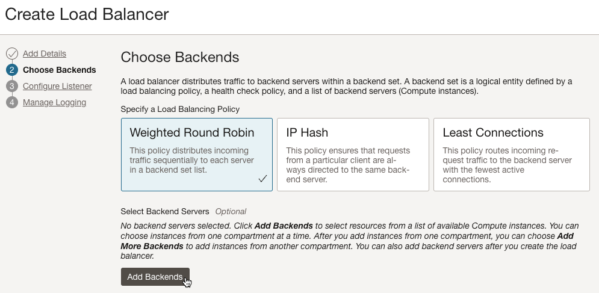
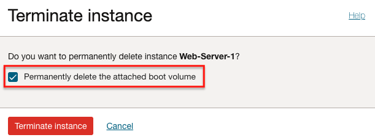
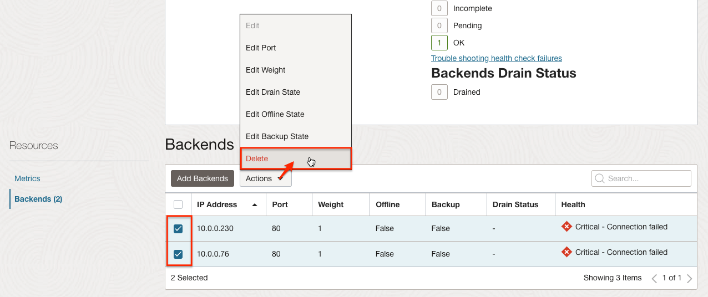

# Deploy HA Application using Load Balancers

## Introduction

이 실습에서는 두 컴퓨트 인스턴스에 배포된 웹 서버를 로드 밸런서를 사용하여 고가용성 모드로 구성해 보겠습니다.

Load Balancer을 이해하기 위해 [Load Balancer 개요](https://docs.oracle.com/en-us/iaas/Content/Balance/Concepts/balanceoverview.htm) 문서를 읽어보거나, 다음 비디오를 보기 바랍니다.

[Oracle Cloud Infrastructure Load Balancing: Overview](youtube:HaCzcFrTF)

예상 시간: 50분

### About OCI Load Balancing Service

로드 밸런싱 서비스는 VCN(Virtual Cloud Network) 내의 하나의 진입점에서 여러 서버로 자동화된 트래픽 분산을 제공합니다. 로드 밸런서 서비스는 IP 주소, 프로비저닝된 대역폭 및 고가용성이 있는 로드 밸런서를 제공합니다.

### 목표

이 실습에서는 다음을 수행합니다:

- Compute 인스턴스 생성
- Virtual Cloud Network (VCN) 변경 - 서브넷 추가, Security List 업데이트
- Load Balancer 생성

### 전제조건
- Oracle Cloud Trial Account 또는 Paid Account
- [Lab 3: Create a Compute Service](../workshops/tenancy/index.html?lab=compute-service) 완료

## Task 1: Web-Server-1 - Private Subnet으로 이동

Public Subnet에서는 Public Load Balancer가 위치하고 Web Server는 Private Subnet에 위치하는 구조로 변경하고자 합니다.

1. 왼쪽 상단의 **Navigation Menu**를 클릭하고 **Compute**으로 이동한 다음 **Instances** 을 선택합니다.

2. 앞서 만든 Web-Server-1 인스턴스를 클릭합니다.

3. 인스턴스를 종료하기 위해 **Terminate**를 클릭합니다. 

    *기본적으로는 부트 볼륨은 삭제되지 않고 보존됩니다. 실제 소유한 Cloud Account에서 작업시에도 이를 유의하여 사용합니다.*

    

4. 왼쪽 상단의 **Navigation Menu**를 클릭하고 **Storage**으로 이동한 다음 **Block Storage**를 선택합니다.

5. 왼쪽 메뉴에서 Boot Volumes을 선택합니다.

6. **Web-Server-1 (Boot Volume)** 부트 볼륨이 보입니다. 오른쪽 액션 메뉴에서 복제본 생성을 위해 **Create Instance** 버튼을 클릭합니다.

      

7. 이름을 **Web-Server-1**로 입력합니다.

8. Image and shape - 사용할 이미지와 Shape(CPU, Memory 크기)를 선택합니다.

    - Image: 부트 볼륨인 Web-Server-1이 자동으로 선택됨.
    - Shape: AMD 타입에서, VM.Standard.E4.Flex - 1 OCPU, _4 GB memory_ 로 설정

    


9. Primary VNIC information

    - 앞선 실습에서 만든 VCN내에 *Private* Subnet을 선택합니다.

    


10. Add SSH Keys - 부트 볼륨에 이미 등록되어 있기 때문에 여기서는 **No SSH keys**를 선택합니다.

11. Create를 클릭하여 인스턴스를 생성합니다.

12. 인스턴스의 상태가 *RUNNING*이 되면, 인스턴스의 IP를 확인합니다. Public IP 없이 Private IP만 있는 것을 볼 수 있습니다.

    

13. 상세화면에서 속한 서브넷 *private subnet-oci-hol-vcn*을 클릭하여, 해당 서브넷으로 이동합니다.

14. 해당 서브넷에 하나 있는 Security List를 클릭합니다. 예, security list for private subnet-oci-hol-vcn

15. 80 포트에 대한 개방이 필요합니다. **Add Ingress Rules**을 클릭한 후 같은 VCN내에서 접속할 수 있게 아래 값으로 인그레스 규칙을 추가합니다.

    - **Source Type:** CIDR
    - **Source CIDR**: 10.0.0.0/16
    - **IP Protocol:** TCP
    - **Source Port Range:** All
    - **Destination Port Range:** 80
    - 아래 **Add Ingress Rules** 클릭

    

## Task 2: Compute 인스턴스 SSH로 접속하기

> Private IP만 있는 자원에 SSH 접속을 위해서는 VPN 등을 통해 연결되거나 또는 Bastion/Jumpbox 서버 등을 거쳐 접속해야 합니다. 여기서는 편의상 Cloud Shell의 Private Network을 통해 접속하겠습니다.

1. Cloud Shell을 실행합니다.

2. Cloud Shell은 기본적으로는 유저 테넌시 환경의 프라이빗 네트워크에 접속이 안됩니다. 현재는 Home Region 상에 있는 자원에 대해서는 Private Network 설정을 통해 프라이빗 네트워크에 접속됩니다.

    Cloud Shell의 왼쪽 위 Network 항목에서 **Ephemeral private network setup**을 클릭합니다.

    

3. Cloud Shell에 연결할 Private 서브넷으로 Web-Server-1이 속한 서브넷(*private subnet-oci-hol-vcn*)을 지정합니다.

    

4. 연결이 완료되면, *Network: Ephemeral*로 표시됩니다.

    - 연결 중
    

    - 연결 완료
    

5. 접속한 터미널에서 curl 명령으로 Web-Server-1의 Private IP로 접속해 봅니다. Cloud Shell에서 접속되는 것을 알 수 있습니다.

    ```
    $ curl http://10.0.1.173
    Hello Apache on Web-Server-1
    ```

6. Web-Server-1 인스턴스에 접속하기 위해, 다음 명령을 실행합니다.

    ```
    ssh -i <private_ssh_key> opc@<private_ip_address>
    ```

    


## Task 3: Web-Server-2 - Compute 인스턴스 생성

[Lab 3: Create a Compute Service](../workshops/tenancy/index.html?lab=compute-service#Task1:Compute)에서 Compute 인스턴스 - Web-Server-1을 생성하고 웹서버를 설치하였습니다. 동일한 방식으로 두 번째 인스턴스를 생성후 HTTP Server 설치해도 됩니다. 여기서는 생성된 Web-Server-1의 부트 볼륨의 복제본을 통해 2번째 서버를 생성하는 방법을 실습합니다.

1. 왼쪽 상단의 **Navigation Menu**를 클릭하고 **Storage**으로 이동한 다음 **Block Storage**를 선택합니다.

2. 왼쪽 메뉴에서 Boot Volumes을 선택합니다.

3. **Web-Server-1 (Boot Volume)** 부트 볼륨이 보입니다. 오른쪽 액션 메뉴에서 복제본 생성을 위해 **Create Clone** 버튼을 클릭합니다.

    

4. 이름을 **Web-Server-2**로 입력하여 부트 볼륨을 복제합니다.

     

5. 복제된 부트 볼륨의 오른쪽 액션 메뉴에서 컴퓨트 인스턴스 생성을 위해 **Create Instance** 버튼을 클릭합니다.

      

6. 이름을 **Web-Server-2**로 입력합니다.

    

7. Image and shape - 사용할 이미지와 Shape(CPU, Memory 크기)를 선택합니다.

    - Image: 복제된 부트 볼륨인 Web-Server-2이 자동으로 선택됨.
    - Shape: AMD 타입에서, VM.Standard.E4.Flex - 1 OCPU, _4 GB memory_ 로 설정

    

8. Primary VNIC information

    - Web-Server-1과 동일하게 앞선 실습에서 만든 VCN내에 *Private* Subnet을 선택합니다.

9. Add SSH Keys - 복제된 부트 볼륨에 이미 등록되어 있기 때문에 여기서는 **No SSH keys**를 선택합니다.

10. 화면 제일 아래에 있는 **Show advanced options**를 클릭합니다.

11. **Management** 탭에서 **cloud-init** 스크립트로 다음을 추가합니다.

    VM 생성시 설치되어야 하는 툴들은 cloud-init를 통해 실행할 수 있습니다. HTTP Server는 이미 설치된 상태이므로, 추가로 변경이 필요한 부분만 아래와 같이 추가합니다. 웹서버의 인덱스 파일만 변경합니다.

    ```
    <copy>
    #!/bin/bash
    sudo bash -c 'echo Hello Apache on Web-Server-2 >/var/www/html/index.html'
    </copy>
    ```

        

12. Create를 클릭하여 인스턴스를 생성합니다.

13. 인스턴스의 상태가 *RUNNING*이 되면, 인스턴스의 Private IP를 확인합니다.

    

## Task 4: Web-Server-2 - 웹서버 접속하기

1. Cloud Shell을 실행합니다.

2. Cloud Shell은 앞서 연결한 Private 서브넷인 Web-Server-1, 2가 속한 서브넷(*private subnet-oci-hol-vcn*)으로 그대로 연결된 상태인지 확인합니다.

3. 접속한 터미널에서 curl 명령으로 Web-Server-2의 Private IP로 접속해 봅니다.

    ```
    $ curl http://10.0.1.119
    Hello Apache on Web-Server-2
    ```    


## Task 5: Load Balancer 생성

1. 왼쪽 상단의 **Navigation Menu**를 클릭하고 **Networking**으로 이동한 다음 **Load Balancers** 를 선택합니다.

	

2. OCI Load Balancer와 OCI Network Load Balancer 두가지 유형이 있습니다. 여기서는 OCI Load Balancer 사용하겠습니다. **Create Load Balancer**을 클릭합니다.

3. Create Load Balancer 생성화면에서 다음을 입력합니다:

    **Add Details**

    - **Load Balancer Name:** 예, public-lb-for-webserver
    - **Choose visibility type:** Public
	- **Assign a public IP address:** Ephemeral IP, Reserved IP 모두 사용 가능합니다.
    
        앞선 실습에서 Reserved Public IP를 생성한 경우, 해당 IP를 선택합니다. Ephemeral IP를 사용하는 경우에도 Load Balancer가 종료(Terminate) 되지 않으면, 변경되지 않습니다.

        

    - **Flexible Shapes**으로 최소, 최대 밴드위스를 원하는 값으로 지정할 수 있습니다. 기본값인 10Mbps를 선택합니다. 용량 변경이 필요하면 생성이후 다시 변경할 수 있습니다.

        

    - **Virtual Cloud Network:** 사용중인 VCN
    - **Subnet:** Public Subnet 선택

  	    

	- **Next**를 클릭합니다.
    
4. **Choose Backends** 화면에서 다음을 입력합니다:

    - **Load Balancing Policy:** 기본 값인 **Weighted Round Robin** 선택
    - **Add Backend**를 클릭하여 분배 대상이 되는 Web-Server-1,2가 있는 컴퓨트 인스턴스를 선택합니다.

        

        

    - **Health Check Policy**는 백엔드 웹서버의 서비스 프로토콜, 포트에 맞게 아래와 같이 설정합니다..

        * **Protocol:** HTTP
        * **Port:** 80
        * **URL PATH (URI):** /
    	* 나머지는 기본값 사용

        

    - **Advanced Options**

        * Security List 탭을 보면, LB 서브넷과 백엔드 컴퓨트 인스턴스가 사용하는 서브넷간의 80포트로 통신이 가능하도록 자동으로 규칙이 추가되는 것으로 기본 선택임을 볼 수 있습니다. 

        

	- **Next**를 클릭합니다.
    
    
5. **Configure Listener** 화면에서 다음을 입력합니다:

    생성할 Load Balancer가 서비스할 요청 프로토콜과 포트를 설정합니다.

    - **Listener Name:** 예, public-lb-for-webserver-listener
    - **Specify the type of traffic your listener handles:** HTTP
    - **Specify the port your listener monitors for ingress traffic:** 80
	- 나머지는 기본값 사용

        

	- **Next**를 클릭합니다.

6. **Manage Logging** 화면에서 다음을 입력합니다:

    - Error와 Access 로그를 활성화하여 OCI Logging으로 수집할 수 있습니다. 여기서는 둘다 비활성화합니다.

	

7. **Submit**을 클릭하여 Load Balancer를 생성합니다.

8. 생성이 완료되고, 잠시후 백엔드 서버에 대한 헬스체크가 성공한 것을 확인합니다. Load Balancer의 Public IP는 이후 테스트를 위해 확인해 둡니다.

    

9. 현재 페이지에서 Load Balancer가 속한 Subnet을 클릭합니다. 예, public subnet-oci-hol-vcn

10. Subnet 상세 페이지에서 Resources 하위의 **Security Lists**을 선택한 후, 하나 있는 Security List를 클릭합니다. 예, Default Security List for oci-hol-vcn

11. [Lab 3: Create a Compute Service](../workshops/tenancy/index.html?lab=compute-service#Task1:Compute)에서 이미 80 포트를 개방하지 않는 경우에 아래와 같이 규칙을 추가합니다.

    - Ingress 규칙에서 **Add Ingress Rule**를 클릭합니다.

    - 인터넷상에서 Load Balancer로 80 포트로 접속할 수 있게 아래와 같이 인그레스 규칙을 추가합니다.

        

12. Load Balancer -> Web-Server-1,2간의 80 포트 통신을 위한 인그레스, 이그레스 규칙은 Load Balancer 생성시 설정이 추가되었습니다.

## Task 6: 웹 서버 가용성 테스트

여기서는 Load Balancer의 공용 IP 주소를 사용하여 이전에 구성된 두 웹 서버에 접근이 되고, 선택한 라운드 로빈 기반 정책에 따라 트래픽을 라우팅하는 것을 확인합니다. 웹 서버 중 하나가 장애시 웹 콘텐츠는 나머지 서버를 통해 서비스되어 가용성을 보장합니다.

1. Load Balancer의 Public IP를 테스트를 위해 확인합니다.

    

2. 웹 브라우저를 열고 Load Balancer의 Public IP 주소를 입력합니다. 두 웹서버 중 하나로 접속이 됩니다.

	

    - 또는 접속한 터미널에서 curl 명령으로 접속해 봅니다.

        ```shell
        curl http://150.230.xx.xxx
        ```


3. 브라우저를 여러번 리프레쉬합니다. 두 웹서버를 번갈아가며 라우팅 되는 것을 확인할 수 있습니다.

	

	    

    - 또는 접속한 터미널에서 curl 명령으로 접속해 봅니다.

        ```shell
        kildong@cloudshell:~ (ap-chuncheon-1)$ curl http://150.230.xx.xxx
        Hello Apache on Web-Server-2
        kildong@cloudshell:~ (ap-chuncheon-1)$ curl http://150.230.xx.xxx
        Hello Apache on Web-Server-1
        ```


4. 클라우드 콘솔로 돌아가 두 웹서버 인스턴스 중 하나를 Stop 시킵니다.

    

5. 테스트 브라우저에서 여러번 리프레쉬합니다. 에러 없이 나머지 서버로만 라우팅 되는 것을 확인할 수 있습니다.

	

    - 또는 접속한 터미널에서 curl 명령으로 접속해 봅니다.

        ```shell
        kildong@cloudshell:~ (ap-chuncheon-1)$ curl http://150.230.xx.xxx
        Hello Apache on Web-Server-2
        ```    

6. 클라우드 콘솔로 돌아가 Stop된 웹서버를 Start 시킵니다. RUNNING 상태가 되고 테스트 브라우저에서 다시 확인해 보면, 다시 두 웹서버를 번갈아가며 라우팅 되는 것을 확인할 수 있습니다.

## Task 7: 인스턴스 정리

다음 실습을 위해 자원을 정리합니다.

1. 왼쪽 상단의 **Navigation Menu**를 클릭하고 **Compute**으로 이동한 다음 **Instances** 을 선택합니다.

2. Web-Server-1 인스턴스를 종료(Terminate) 시킵니다.

    _Boot Volume도 함께 삭제하기 위해 옵션도 체크합니다._

    

3. Web-Server-2 인스턴스도 같은 방법으로 종료 시킵니다.

4. 왼쪽 상단의 **Navigation Menu**를 클릭하고 **Networking**으로 이동한 다음 **Load Balancers** 아래 **Load Balancer**를 선택합니다.

5. 만든 Load Balancer를 클릭합니다.

6. **Resources** 하위의 **Backend Sets**에서 만든 Backend Sets을 클릭합니다.

7. **Resources** 하위의 **Backend**에 등록된 인스턴스를 모두 삭제합니다. (종료한 Web-Server-1, Web-Server-2를 백엔드에서 제거하는 과정입니다.)

    

이제 **다음 실습을 진행**하시면 됩니다.

## Learn More

- [OCI Load Balancers 비교](https://www.ateam-oracle.com/post/comparing-oci-load-balancers)

## Acknowledgements

- **Authors** - Flavio Pereira, Larry Beausoleil, DongHee Lee
- **Adapted by** -  Yaisah Granillo, Cloud Solution Engineer
- **Contributors** - Anoosha Pilli, Product Manager, Oracle Database
- **Korean Translator & Contributors** - DongHee Lee, March 2023
- **Last Updated By/Date** - DongHee Lee, July 2024
