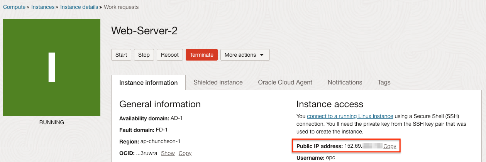
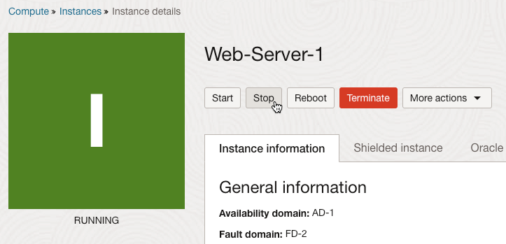

# Deploy HA Application using Load Balancers

## Introduction

이 실습에서는 두 컴퓨트 인스턴스에 배포된 웹 서버를 로드 밸런서를 사용하여 고가용성 모드로 구성해 보겠습니다.

Load Balancer을 이해하기 위해 [Load Balancer 개요](https://docs.oracle.com/en-us/iaas/Content/Balance/Concepts/balanceoverview.htm) 문서를 읽어보거나, 다음 비디오를 보기 바랍니다.

[Oracle Cloud Infrastructure Load Balancing: Overview](youtube:HaCzcFrTF)

예상 시간: 50분

### About OCI Load Balancing Service

로드 밸런싱 서비스는 VCN(Virtual Cloud Network) 내의 하나의 진입점에서 여러 서버로 자동화된 트래픽 분산을 제공합니다. 로드 밸런서 서비스는 IP 주소, 프로비저닝된 대역폭 및 고가용성이 있는 로드 밸런서를 제공합니다.

### 목표

이 실습에서는 다음을 수행합니다:

- Compute 인스턴스 생성
- Virtual Cloud Network (VCN) 변경 - 서브넷 추가, Security List 업데이트
- Load Balancer 생성

### 전제조건
- Oracle Cloud Trial Account 또는 Paid Account
- [Lab 3: Create a Compute Service](../workshops/tenancy/index.html?lab=compute-service) 완료

## Task 1: Web-Server-2 - Compute 인스턴스 생성 

[Lab 3: Create a Compute Service](../workshops/tenancy/index.html?lab=compute-service#Task1:Compute)에서 Compute 인스턴스 - Web-Server-1을 생성하고 웹서버를 설치하였습니다. 동일한 방식으로 두 번째 인스턴스를 생성합니다.

1. 왼쪽 상단의 **Navigation Menu**를 클릭하고 **Compute**으로 이동한 다음 **Instances** 을 선택합니다.

2. 새 Compute Instance를 생성합니다.

    이름을 **Web-Server-2**로 입력합니다

    

3. Image & Shape - 사용할 이미지와 Shape(CPU, Memory 크기)를 선택합니다.

    - Image: Oracle Linux 8
    - Shape: VM.Standard.E4.Flex - 1 OCPU, _4 GB memory_

4. Networking

    - 앞선 실습에서 만든 VCN내에 Public Subnet을 선택합니다.
    - 생성될 인스턴스에 대한 접속을 위해 **Assign a public IPv4 address**을 선택하여 Public IP를 할당합니다.

5. Add SSH Keys - SSH 접속을 위한 키를 등록하는 부분입니다.

    - 동일한 키를 그대로 사용하기 위해 이번에는 **Paste public keys**를 선택하고, Web-Server-1 생성시 자동 생성한 public key 내용을 복사합니다.

         ```
         $ cat ssh-key-2023-03-03.key.pub 
         ssh-rsa AAAAB3NzaC__________MVD1uN4kuv ssh-key-2023-03-03
         ```

     

6. Create를 클릭하여 인스턴스를 생성합니다.

7. 인스턴스의 상태가 *RUNNING*이 되면, 인스턴스의 Public IP를 확인합니다.

    

## Task 2: Web-Server-2 - Compute 인스턴스 접속 및 웹서버 설치하기

[Lab 3: Create a Compute Service](../workshops/tenancy/index.html?lab=compute-service#Task2:Compute)에서 Compute 인스턴스 - Web-Server-1을 생성하고 웹서버를를 설치하였습니다. 동일한 방식으로 웹서버를 설치합니다.


1. Cloud Shell에서 Web-Server-2 인스턴스에 접속합니다.

    >**노트:** Oracle Linux VM에서 기본 유저명은 **opc**입니다.

    ```
    <copy>ssh -i <private_ssh_key> opc@<public_ip_address></copy>
    ```

    

2. 컴퓨트 인스턴스에 아파치 HTTP 웹서버를 설치합니다.

    - Apache HTTP 서버 설치

        ```
        <copy>
        # Apache HTTP 서버 설치
        sudo yum install httpd -y
        # Apache 서버를 시작
        sudo apachectl start
        sudo systemctl enable httpd
        # Apache 설정이 정상인지 체크
        sudo apachectl configtest
        # 리눅스 OS 레벨 방화벽을 개방
        sudo firewall-cmd --permanent --zone=public --add-service=http
        sudo firewall-cmd --reload
        </copy>
        ```

    - 웹서버의 인덱스 파일을 생성합니다. _Web-Server-2_로 표시합니다.

        ```
        <copy>sudo bash -c 'echo Hello Apache on Web-Server-2 >/var/www/html/index.html'</copy>
        ```

3. 브라우저를 열고 `http://<public_ip_address>` (Linux VM의 Public IP)로 접속해 봅니다. 아래와 같이 index.html 페이지 접속된 결과가 보일 것입니다.

    >**노트:** Web-Server-1과 같은 서브넷을 사용하기 때문에 이미 Security Lists에 80 포트를 개방했으므로, 추가 작업이 필요하지 않습니다.

4. 브라우저에서 다시 `http://<public_ip_address>` (Linux VM의 Public IP)로 접속해 봅니다. 아래와 같이 index.html 페이지 접속된 결과가 보일 것입니다.

    

    - 또는 접속한 터미널에서 curl 명령으로 접속해 봅니다.

        ```
        curl http://152.69.xx.xxx
        ```    

## Task 3: Load Balancer를 위한 별도 서브넷 추가

여기서는 Load Balancer를 위한 별도 서브넷을 새로 만들겠습니다. 새 서브넷은 자기만의 규칙을 적용 위해 새 Security List와 Route Table을 먼저 만든 후에 서브넷을 만듭니다.

1. 왼쪽 상단의 **Navigation Menu**를 클릭하고 **Networking**으로 이동한 다음 **Virtual Cloud Networks** 을 선택합니다.

2. 사용하고 있는 VCN을 클릭합니다. 예, oci-hol-xx

3. VCN 상세 페이지에서 Resources 하위의 **Security Lists**을 선택한 후, **Create Security List**을 클릭합니다.

	

4. Create Security List 생성화면에서 다음을 입력합니다:

    - **Name:** 예) LB Security List
	- **Create In Compartment:** 사용중인 Compartment
    - 지금은 따로 인그레스, 이그레스 규칙을 만들지 않습니다.

	

5.  **Create Security List**을 클릭하여 Security List를 만듭니다.

6. Resources 하위의 **Route Tables**을 선택한 후, **Create Route Table**을 클릭합니다.

	

7. Create Route Table 생성화면에서 다음을 입력합니다:

    Public IP로 서비스가 가능하도록 Internet Gateway를 통한 라우팅을 설정합니다.

    - **Name:** 예, LB Route Table
    - **Create In Compartment:** 사용중인 Compartment
	- **+ Another Route Rules** 클릭

	    

    - **Target Type:** 드랍다운 메뉴에서 **Internet Gateway** 선택
    - **Destination CIDR Block:** 0.0.0.0/0
    - **Compartment:** 사용중인 Compartment
    - **Target Internet Gateway:** 드랍다운 메뉴에서 현재 VCN에서 생성된 Internet Gateway 선택

        

8. **Create**을 클릭하여 Route Table을 만듭니다.

9. Resources 하위의 **Subnets**을 선택한 후, **Create Subnets**을 클릭합니다.

    

10. Create Subnet 생성화면에서 다음을 입력합니다:

    - **Name:** 예, LB-Subnet
	- **Create In Compartment:** 사용중인 Compartment
    - **Subnet Type:** Regional 선택

        

    - **CIDR Block:** 10.0.2.0/24 - VCN CIDR 내에서 사용하지 않는 대역 중에 선택합니다.
    - **Route Table:** 드랍다운 메뉴에서 앞서 만든 LB Route Table을 선택
    - **Subnet Access**: Public Subnet 선택
    - **Dhcp Options Compartment:** 드랍다운 메뉴에서 **Default DHCP Options for oci-hox-xx** 선택
    - **Security List Complartment:** 드랍다운 메뉴에서 앞서 만든 LB Security List을 선택.

        

11. 나머지 항목은 기본값으로 두고 **Create Subnet**을 클릭합니다.

12. Load Balancer에서 사용한 서브넷을 만들었습니다.

	

## Task 4: Load Balancer 생성

1. 왼쪽 상단의 **Navigation Menu**를 클릭하고 **Networking**으로 이동한 다음 **Load Balancers** 를 선택합니다.

	

2. OCI Load Balancer와 OCI Network Load Balancer 두가지 유형이 있습니다. 여기서는 OCI Load Balancer 사용하겠습니다. **Create Load Balancer**을 클릭합니다.

3. Create Load Balancer 생성화면에서 다음을 입력합니다:

    **Add Details**

    - **Load Balancer Name:** 예, public-lb-for-webserver
    - **Choose visibility type:** Public
	- **Assign a public IP address:** Ephemeral IP, Reserved IP 모두 사용 가능합니다.
    
        앞선 실습에서 Reserved Public IP를 생성한 경우, 해당 IP를 선택합니다. Ephemeral IP를 사용하는 경우에도 Load Balancer가 종료(Terminate) 되지 않으면, 변경되지 않습니다.

        

    - **Flexible Shapes**으로 최소, 최대 밴드위스를 원하는 값으로 지정할 수 있습니다. 기본값인 10Mbps를 선택합니다. 용량 변경이 필요하면 생성이후 다시 변경할 수 있습니다.

        

    - **Virtual Cloud Network:** 사용중인 VCN
    - **Subnet:** 앞서 만든 LB-Subnet 선택

  	    

	- **Next**를 클릭합니다.
    
5. **Choose Backends** 화면에서 다음을 입력합니다:

    - **Load Balancing Policy:** 기본 값인 **Weighted Round Robin** 선택
    - **Add Backend**를 클릭하여 분배 대상이 되는 Web-Server-1,2가 있는 컴퓨트 인스턴스를 선택합니다.

        

        

    - **Health Check Policy**는 백엔드 웹서버의 서비스 프로토콜, 포트에 맞게 아래와 같이 설정합니다..

        * **Protocol:** HTTP
        * **Port:** 80
        * **URL PATH (URI):** /
    	* 나머지는 기본값 사용

        

    - **Advanced Options**

        * Security List 탭을 보면, LB 서브넷과 백엔드 컴퓨트 인스턴스가 사용하는 서브넷간의 80포트로 통신이 가능하도록 자동으로 규칙이 추가되는 것으로 기본 선택임을 볼 수 있습니다. 

        

	- **Next**를 클릭합니다.
    
    
6. **Configure Listener** 화면에서 다음을 입력합니다:

    생성할 Load Balancer가 서비스할 요청 프로토콜과 포트를 설정합니다.

    - **Listener Name:** 예, public-lb-for-webserver-listener
    - **Specify the type of traffic your listener handles:** HTTP
    - **Specify the port your listener monitors for ingress traffic:** 80
	- 나머지는 기본값 사용

        

	- **Next**를 클릭합니다.

7. **Manage Logging** 화면에서 다음을 입력합니다:

    - Error와 Access 로그를 활성화하여 OCI Logging으로 수집할 수 있습니다. 여기서는 둘다 비활성화합니다.

	

8. **Submit**을 클릭하여 Load Balancer를 생성합니다.

9. 생성이 완료되고, 잠시후 백엔드 서버에 대한 헬스체크가 성공한 것을 확인합니다. Load Balancer의 Public IP는 이후 테스트를 위해 확인해 둡니다.

    

10. 왼쪽 상단의 **Navigation Menu**를 클릭하고 **Networking**으로 이동한 다음 **Virtual Cloud Networks** 을 선택합니다.

11. 사용하고 있는 VCN을 클릭합니다. 예, oci-hol-xx

12. VCN 상세 페이지에서 Resources 하위의 **Security Lists**을 선택한 후, LB Security List를 클릭합니다.

13. Ingress 규칙에서 **Add Ingress Rule**를 클릭합니다.

    

14. 인터넷상에서 Load Balancer로 80 포트로 접속할 수 있게 아래와 같이 인그레스 규칙을 추가합니다.

    

15. Load Balancer -> Web-Server-1,2간의 80 포트 통신을 위한 인그레스, 이그레스 규칙은 Load Balancer 생성시 설정이 추가되었습니다.

## Task 5: 웹 서버 가용성 테스트

여기서는 Load Balancer의 공용 IP 주소를 사용하여 이전에 구성된 두 웹 서버에 접근이 되고, 선택한 라운드 로빈 기반 정책에 따라 트래픽을 라우팅하는 것을 확인합니다. 웹 서버 중 하나가 장애시 웹 콘텐츠는 나머지 서버를 통해 서비스되어 가용성을 보장합니다.

1. Load Balancer의 Public IP를 테스트를 위해 확인합니다.

    

2. 웹 브라우저를 열고 Load Balancer의 Public IP 주소를 입력합니다. 두 웹서버 중 하나로 접속이 됩니다.

	

    - 또는 접속한 터미널에서 curl 명령으로 접속해 봅니다.

        ```
        curl http://150.230.xx.xxx
        ```


3. 브라우저를 여러번 리프레쉬합니다. 두 웹서버를 번갈아가며 라우팅 되는 것을 확인할 수 있습니다.

	

	    

    - 또는 접속한 터미널에서 curl 명령으로 접속해 봅니다.

        ```
        kildong@cloudshell:~ (ap-chuncheon-1)$ curl http://150.230.xx.xxx
        Hello Apache on Web-Server-2
        kildong@cloudshell:~ (ap-chuncheon-1)$ curl http://150.230.xx.xxx
        Hello Apache on Web-Server-1
        ```


4. 클라우드 콘솔로 돌아가 두 웹서버 인스턴스 중 하나를 Stop 시킵니다.

    

5. 테스트 브라우저에서 여러번 리프레쉬합니다. 에러 없이 나머지 서버로만 라우팅 되는 것을 확인할 수 있습니다.

	

    - 또는 접속한 터미널에서 curl 명령으로 접속해 봅니다.

        ```
        kildong@cloudshell:~ (ap-chuncheon-1)$ curl http://150.230.xx.xxx
        Hello Apache on Web-Server-2
        ```    

6. 클라우드 콘솔로 돌아가 Stop된 웹서버를 Start 시킵니다. RUNNING 상태가 되고 테스트 브라우저에서 다시 확인해 보면, 다시 두 웹서버를 번갈아가며 라우팅 되는 것을 확인할 수 있습니다.

## Task 6: 인스턴스 정리

다음 실습을 위해 자원을 정리합니다.

1. 왼쪽 상단의 **Navigation Menu**를 클릭하고 **Compute**으로 이동한 다음 **Instances** 을 선택합니다.

2. Web-Server-1 인스턴스를 종료(Terminate) 시킵니다.

    _Boot Volume도 함께 삭제하기 위해 옵션도 체크합니다._

    

3. Web-Server-2 인스턴스도 같은 방법으로 종료 시킵니다.

4. 왼쪽 상단의 **Navigation Menu**를 클릭하고 **Networking**으로 이동한 다음 **Load Balancers** 아래 **Load Balancer**를 선택합니다.

5. 만든 Load Balancer를 클릭합니다.

6. **Resources** 하위의 **Backend Sets**에서 만든 Backend Sets을 클릭합니다.

7. **Resources** 하위의 **Backend**에 등록된 인스턴스를 모두 삭제합니다. (종료한 Web-Server-1, Web-Server-2를 백엔드에서 제거하는 과정입니다.)

    

이제 **다음 실습을 진행**하시면 됩니다.

## Learn More

- [OCI Load Balancers 비교](https://www.ateam-oracle.com/post/comparing-oci-load-balancers)

## Acknowledgements

- **Authors** - Flavio Pereira, Larry Beausoleil, DongHee Lee
- **Adapted by** -  Yaisah Granillo, Cloud Solution Engineer
- **Contributors** - Anoosha Pilli, Product Manager, Oracle Database
- **Korean Translator & Contributors** - DongHee Lee, March 2023
- **Last Updated By/Date** - DongHee Lee, November 2023
