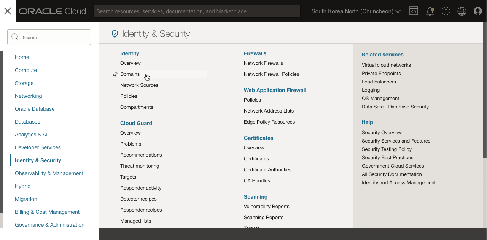
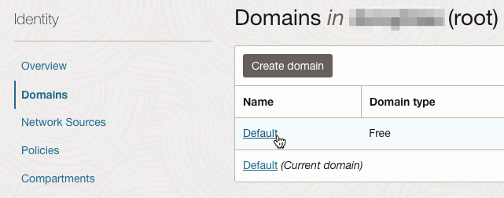
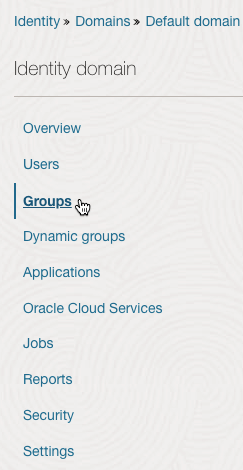
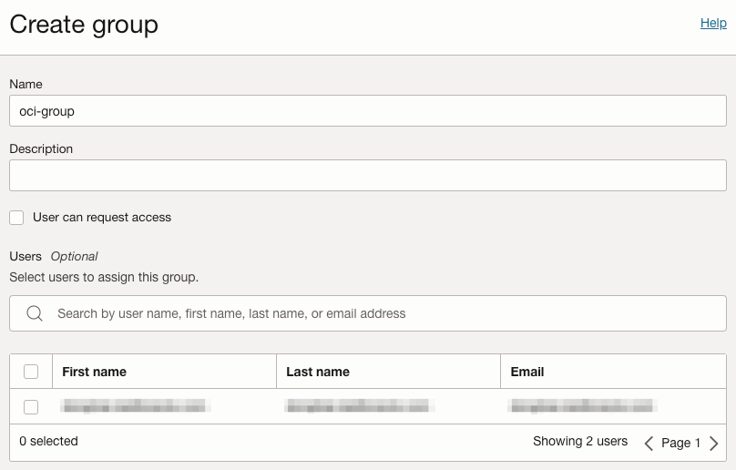
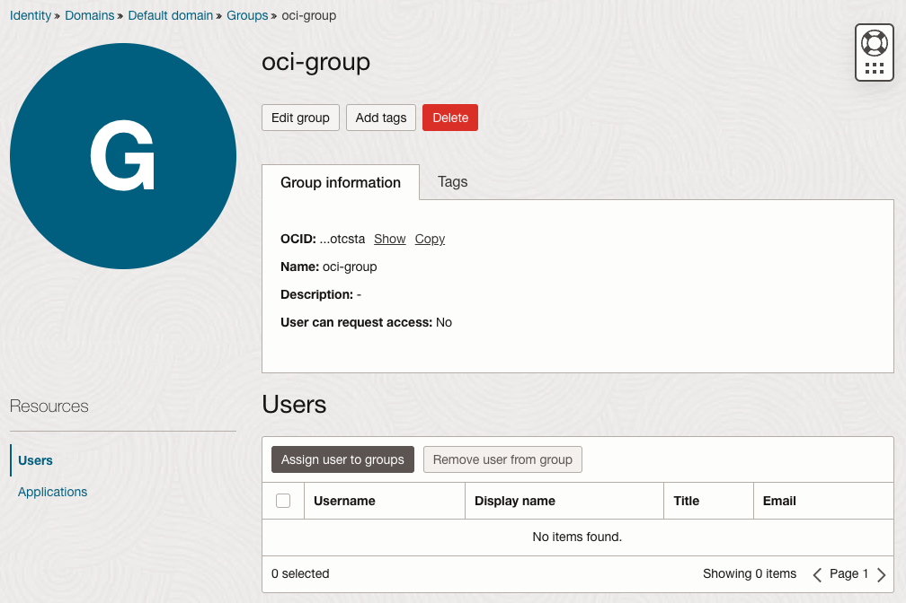
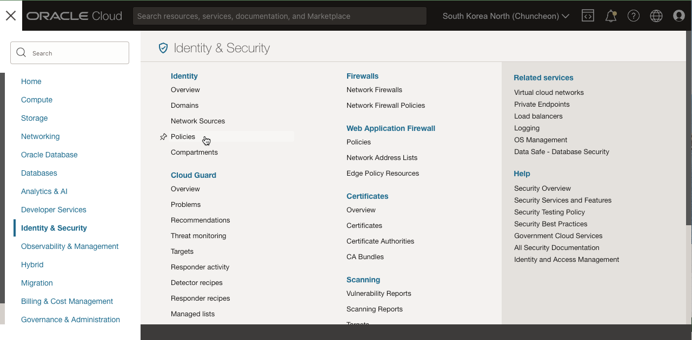
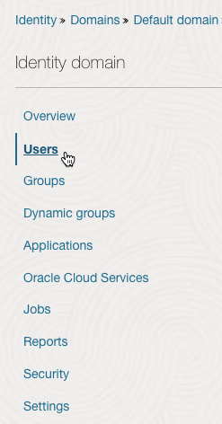
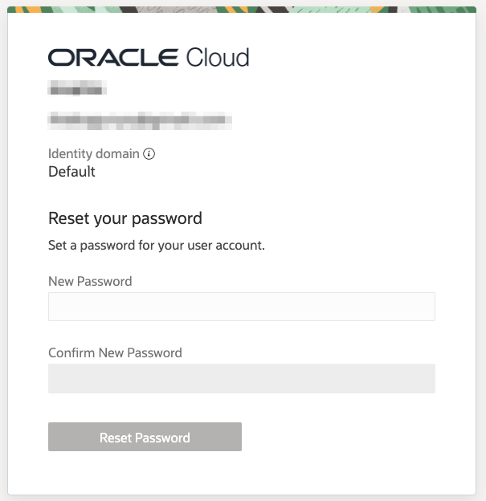
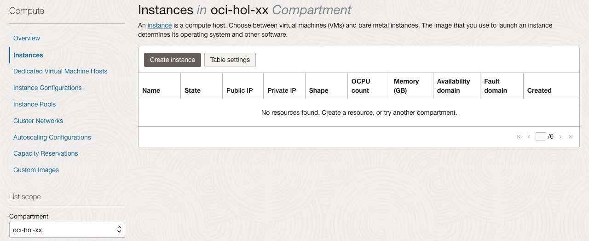

# Identity and Access Management

## Introduction

Oracle Cloud Infrastructure (OCI) Identity and Access Management (IAM) 서비스를 사용하면 클라우드 자원에 대한 사용자 접근을 제어할 수 있습니다. 유저를 생성하고, 유저가 속한 그룹이 갖는 접근 유형과 특정 자원에 대한 접근 권한을 제어합니다. 본 실습은 2021년 11월에 출시한 Identity Domain 기반 IAM을 사용합니다.

본 실습의 목적은 실습 예제를 통해 IAM 서비스의 구성 요소의 개요와 동작방식을 이해하는 것입니다.

[Oracle Cloud Infrastructure Identity and Access Management: Overview](youtube:Op5TLTBBABI)

예상 시간: 30분

### 목표

이 실습에서는 다음을 수행합니다:

- Compartment 생성
- 유저 생성
- 그룹 생성
- 그룹에 대한 권한 정책(Policy) 생성
- 그룹에 유저 추가

### 전제조건
- Oracle Cloud Trial Account 또는 Paid Account
- *관리자 권한 필요 - Compartment를 생성하고, Task 2에서 Policy를 설정합니다. 테넌시 기준의 Policy를 포함하고 있기 때문에 관리자로 로그인하여 수행하여야 합니다.*

## Task 1: Compartment 생성

Compartment는 컴퓨트 인스턴스, 로드밸런서, 데이터베이스 등과 같은 클라우드 자산이 속한 영역입니다. 기본적으로 Root Compartment는 클라우드 어카운트, 즉 테넌시를 생성할때 만들어집니다. Root Compartment에서 모든 것을 생성할 수도 있지만, 오라클에서는 자원을 보다 효율적으로 관리할 수 있도록 하위 Compartment를 생성할 것을 권장합니다.

1. 왼쪽 상단의 **Navigation Menu**를 클릭하고 **Identity & Security**으로 이동한 다음 **Compartments** 을 선택합니다.

  

2. 이 화면에서 compartments 목록이 표시되면 **Create Compartment**를 클릭합니다.

  

3. 다음을 입력:

    - Name: **oci-hol***-xx* 입력합니다.
    - Description: 설명을 입력합니다(예: oci-hol for user *xx*)
    - Parent Compartment: 이 Compartment가 속할 상위 Compartment를 선택합니다. 기본값은 루트 Compartment
    - **Create Compartment** 클릭 합니다.

      

4. 실습에서 사용할 Compartment를 생성했습니다.

## Task 2: 접근 제어를 위한 유저, 그룹, 정책 만들기

OCI 서비스에 대한 유저의 권한은 유저가 속한 _그룹_에 따라 정해집니다. 그룹에 대한 권한은 정책(Policy)에 의해 정의됩니다. 정책은 그룹 구성원들이 수행할 수 있는 작업들과 대상 Compartment를 정의합니다. 유저는 본인이 속한 그룹에 설정된 정책에 기반하여 서비스에 대한 접근하고 작업할 수 있습니다.

위 개념을 이해하기 위해 유저, 그룹, 정책을 만들어 보겠습니다.

### 그룹 만들기

1. 왼쪽 상단의 **Navigation Menu**를 클릭하고 **Identity & Security**으로 이동한 다음 **Domains** 을 선택합니다.

    - IAM with Identity Domains에서는 유저와 그룹 메뉴는 Domain 하위의 Default Domain 밑에 있습니다.

   

2. Default 도메인을 선택합니다.

   

3. **Groups** 클릭

   

4. **Create Group**을 클릭합니다.

   **Create Group** 다이얼로그에서, 다음을 입력하여 그룹을 생성합니다.

     - **Name:** 사용할 그룹명을 입력합니다. 예) **oci-group**
     - **Description:** 설명을 입력합니다. 예) 실습용 일반 OCI 유저 그룹

   

5. 새 그룹이 생성되었습니다.

   

### 정책 설정하기

이제 생성한 Compartment에 대해서 그룹에 권한을 부여하는 정책을 만들겠습니다. 여기에서는 **oci-hol-xx** Compartment에 대해서 **oci-group** 그룹 유저에게 Compartment 내 자원에 대한 권한을 주는 예시입니다.

- 정책 문장 기본 포맷

    * Compartment(`<compartment_name>`) 레벨 또는 테넌시(`tenancy`) 레벨로 유저 그룹(`<group_name>`)에 대해서 특정자원유형(`<resource-type>`)에 대해 작업권한(`<verb>`)를 주는 기본 포맷입니다.

       ```
       Allow group <group_name> to <verb> <resource-type> in compartment <compartment_name>
       ```
       ```
       Allow group <group_name> to <verb> <resource-type> in tenancy
       ```

1. 왼쪽 상단의 **Navigation Menu**를 클릭하고 **Identity & Security**으로 이동한 다음 **Policies** 을 선택합니다.

    

2. **Create Policy** 클릭

    **Create Policy** 다이얼로그에서, 다음을 입력하여 정책을 생성합니다.

    - **Name**: 이름을 입력합니다. 예, policy-for-oci-group
    - **Description**: 설명을 입력합니다. 예, Policy for OCI Group
    - **Compartment**: _Root_ 선택

3. Policy Builder 방법 #1

    - **Policy user cases**: 사용 케이스를 제공합니다, 여기서는 Compartment 관리 선택
    - **Common policy templates**: 선택한 케이스 중에서 상세 정책 템플릿을 선택합니다, 여기서는 하나 있는 Compartment 관리자 권한을 선택합니다.
    - 대상 Group: 앞서 만든 그룹이 있는 Default Domain의 oci-group 선택
    - 대상 Compartment: 사용한 Compartment 선택, 예, oci-hol-xx
    - 아래에 실제 적용될 Policy Statements를 확인할 수 있습니다.

    

    **Create**를 클릭하여 정책을 생성합니다.

4. Policy Builder 방법 #2 - manual editor

    - 직접 입력하기 위해 **Show manual editor**를 클릭하고, 아래 규칙을 직접 입력합니다.
    - 유저 그룹 또는 Compartment 이름이 다른 경우 사용할 값으로 변경합니다.

    ```
    <copy>
    allow group default/oci-group to manage all-resources in compartment oci-hol-xx
    </copy>
    ```

    

   **노트**: _그룹이름_ 앞에 _Identity Domain Name_ 이름이 없는 경우 Default Domain으로 적용됩니다.

    **Create**를 클릭하여 정책을 생성합니다.

5. 작성한 Policy에서 Edit Policy Statements를 클릭합니다.

6. 이후 실습에서 사용할 Cloud Shell에 대한 권한을 추가합니다.

    ```
    <copy>
    allow group default/oci-group to use cloud-shell in tenancy
    </copy>
    ```

    

### 유저 만들기

1. 브레드 크럼에서 **Default Domain**을 선택합니다.

    또는, 왼쪽 상단의 **Navigation Menu**를 클릭하고 **Identity & Security**으로 이동한 다음 **Domains** 하위의 **Users**을 선택합니다.

   

2. **Users** 선택

   

3. **Create User** 선택

   **Create User** 다이얼로그에서, 다음을 입력하여 그룹을 생성합니다.
   
    - **First Name**: - 이름
    - **Last NameName**: - 성
    - **Username/Email**: 유저명으로 사용할 이메일 주소를 입력합니다.
    - **Use the email address as the username**: 기본은 이메일을 유저이름으로 사용하는 것입니다. 예외시 체크해제합니다. 이미 해당 이메일 유저명으로 사용하는 경우 체크합니다.
    - **Assign cloud account administrator role**: 체크 해제
    - 앞서 만든 **oci-group** 그룹으로 지정

      

4. 생성시 입력한 이메일 주소로 활성화 링크가 발송됩니다. 이메일을 수신하지 못한 경우, 유저 상세페이지에서 Reset password 버튼을 클릭하여 패스워드 초기화 링크를 보냅니다.

    

5. 관리자 권한인 현재 사용자는 Oracle Cloud Console에서 로그아웃합니다.


### 신규 유저로 로그인 및 권한 검증하기

1. 신규 유저가 수신한 메일에서 활성화 링크  **Activate Your Account**를 클릭합니다.

    

2. 패스워드 초기화 화면이 뜨면 새 패스워드를 입력합니다.

    

3. 왼쪽 상단의 **Navigation Menu**를 클릭하고 **Compute**으로 이동한 다음 **Instances** 을 선택합니다.

    

4. 왼쪽 아래 Compartment에서 Root Compartment를 선택합니다.

    - Compute 인스턴스 목록화면에서 권한이 없다는 경고 문구를 볼 수 있습니다. **_You don’t have permission to view these resources_**

    

5. 왼쪽 아래 Compartment에서 정책을 부여한 oci-hol-xx Compartment를 선택합니다.

    - Compute 인스턴스 목록화면에 경고 문구가 사라졌습니다. 아직 생성한 자원이 없어서 리스트는 보이지 않는 상태입니다.

        

이제 **다음 실습을 진행**하시면 됩니다.

## Learn More

- [OCI 문서 - Common Policies](https://docs.oracle.com/en-us/iaas/Content/Identity/Concepts/commonpolicies.htm)에서 다양한 IAM 정책의 예시를 볼 수 있습니다.

## Acknowledgements

- **Author** - Orlando Gentil, DongHee Lee
- **Korean Translator & Contributors** - DongHee Lee, March 2023
- **Last Updated By/Date** - DongHee Lee, March 2023
