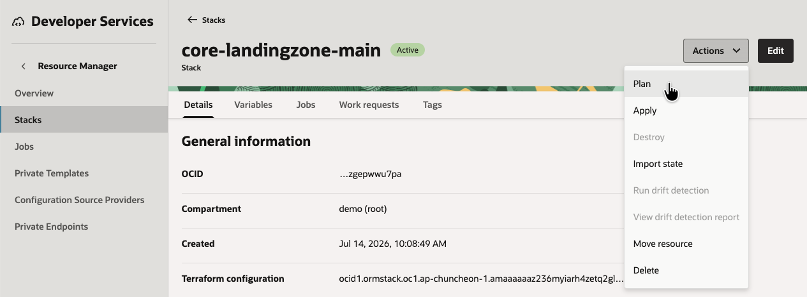
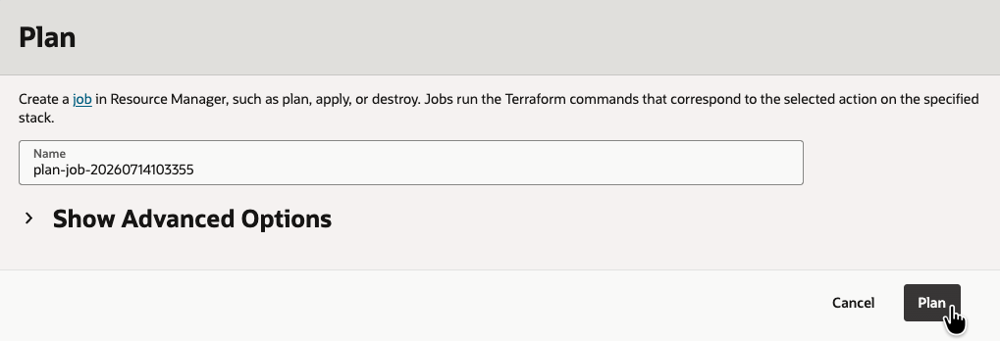
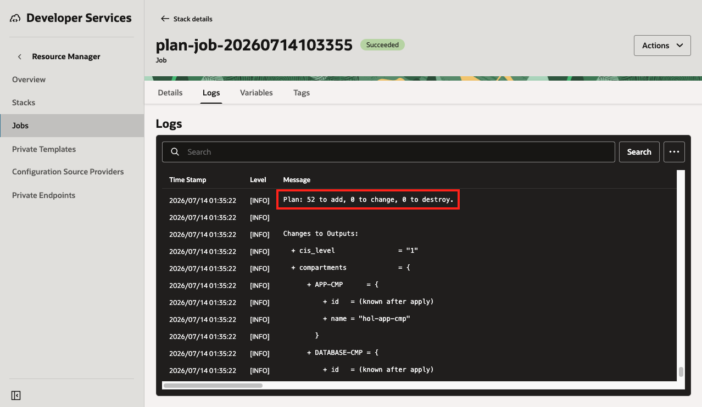
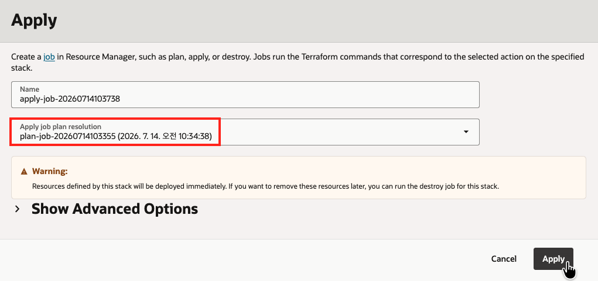
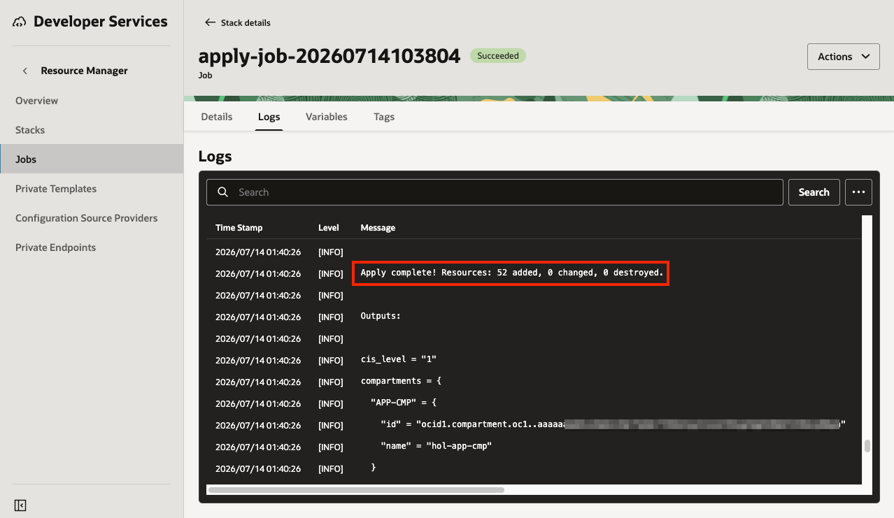
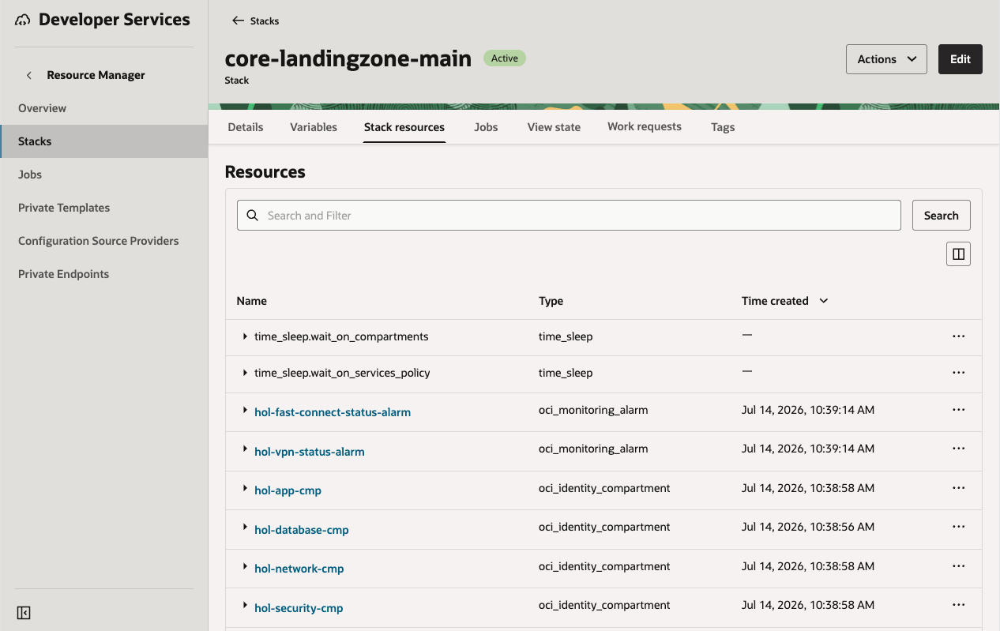
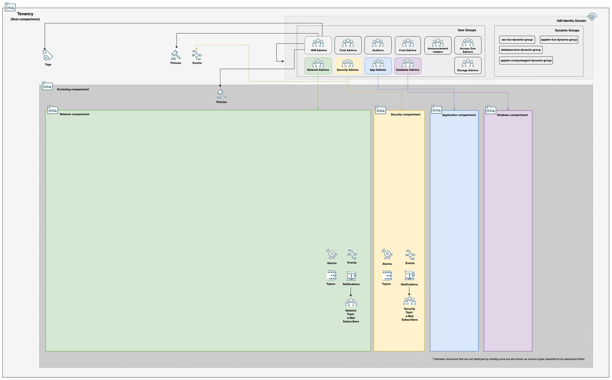

# 리소스 적용 및 검사

## 소개

Terraform은 plan과 apply 두 단계로 사용해야 합니다. 이 실습에서는 적용 전에 plan을 생성하고 확인합니다. plan을 검토한 뒤 apply 프로세스에서 해당 plan을 사용하여 Landing Zone을 생성합니다.

예상 실습 시간: 30분

### Plan과 Apply 소개

#### Plan

Plan은 Terraform이 무엇을 수행하려고 하는지 알려 줍니다. 가능한 범위 내에서 최종 상태와 생성될 리소스에 대한 정보를 최대한 생성합니다. 이를 통해 Terraform이 의도한 작업을 수행하는지 검토하고 확인할 수 있습니다. 또한 다음 단계에서 리소스를 생성하는 데 사용할 수 있는 plan 파일을 생성합니다. plan 없이 apply를 실행하면 임시로 plan을 생성해야 하므로 의도하지 않은 변경 사항을 검토할 기회가 줄어듭니다.

#### Apply

Apply 단계는 plan을 실제로 실행하는 작업을 수행합니다. apply는 plan 파일을 입력으로 받을 수 있으며, 일반적으로 그렇게 하는 것이 좋습니다. plan을 실행하면 수행된 작업에 대한 전체 로그가 생성됩니다. plan은 [Oracle Cloud ID(OCID)](https://docs.oracle.com/en-us/iaas/Content/General/Concepts/identifiers.htm#Oracle) 리소스에 어떤 값이 부여될지와 같이 직접 제어할 수 없는 항목은 일부 추론하거나 apply 단계로 넘겨야 합니다. apply 로그에는 배포와 관련된 모든 정보가 포함됩니다.

### 목표

이 실습의 목표는 다음과 같습니다.

- OCI Resource Manager를 사용하여 Terraform Plan 생성
- 변경 사항을 확인하기 위해 Plan 검사
- Plan을 사용하여 Terraform Apply 실행
- Apply 출력 검사

## 작업 1: Plan 생성

1. _Stack Details_ 페이지에서 Actions에서 __Plan__ 버튼을 클릭한 다음, Job 생성 화면에서 두 번째 __Plan__ 버튼을 클릭합니다.

2. plan 작업이 성공하고 _Logs_ 아래에서 plan 로그를 사용할 수 있을 때까지 기다립니다. 로그 형식에 익숙해지도록 내용을 살펴봅니다. `Plan: X to add, 0 to change, 0 to destroy` 줄이 보일 때까지 아래로 스크롤합니다. 숫자는 다를 수 있지만 아래 스크린샷의 값과 대략 비슷해야 합니다.

## 작업 2: Plan 적용

1. plan 로그에 만족하면 Apply 프로세스를 시작하여 실행에 옮깁니다. 먼저 _Stack details_ 페이지로 다시 이동합니다. Actions에서 __Apply__ 버튼을 클릭한 다음, Job 생성 화면에서 두 번째 앞서 만든 Plan을 선택하고 __Apply__ 버튼을 클릭합니다. apply 프로세스는 최대 20분까지 걸릴 수 있습니다. 
2. apply가 완료되면 생성된 리소스가 plan 출력과 일치하는지 확인합니다. 

## 작업 3: 생성된 자원 검사

1. _Stack details_ 페이지에서 stack이 생성한 리소스 목록을 볼 수 있습니다. 

    요약하면 stack은 다음을 배포합니다.

    - Network, App, Database, Security 컴파트먼트
    - IAM 그룹
    - [IAM 동적 그룹](https://docs.oracle.com/en-us/iaas/Content/Identity/Tasks/managingdynamicgroups.htm)
    - [권한을 할당하기 위한 IAM 정책](https://docs.oracle.com/en-us/iaas/Content/Identity/Tasks/managingpolicies.htm)
    - IAM 및 Network 변경 사항을 위한 이벤트 규칙과 알림

    생성된 항목의 다이어그램은 대략 다음과 같습니다. 

2. 생성된 리소스를 잠시 살펴봅니다. 이러한 리소스가 환경을 어떻게 더 안전하게 만들 수 있는지 생각해 봅니다.

    컴파트먼트 구성이 요구사항에 맞게 적절하게 구성되어 있나요?
    
    일반적인 워크로드가 이 아키텍처 위에 어떻게 배포까요?

    워크로드 구성 요소는 어디에 배치되고, 어떤 역할이 이를 관리하게 될까요?

다음 실습에서는 아키텍처에 Virtual Cloud Network를 추가합니다.

## 감사의 말 (Acknowledgements)

* **Author:** KC Flynn
* **Contributors:** Andre Correa, Johannes Murmann, Josh Hammer, Olaf Heimburger
* **Korean Translator & Contributors:** DongHee Lee, July 2026
* **Last Updated By/Date:** DongHee Lee, July 2026
