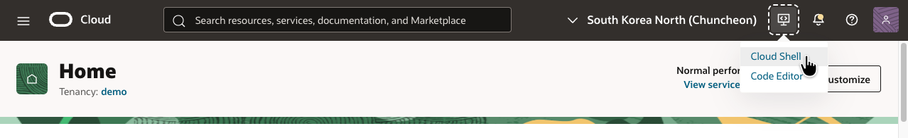
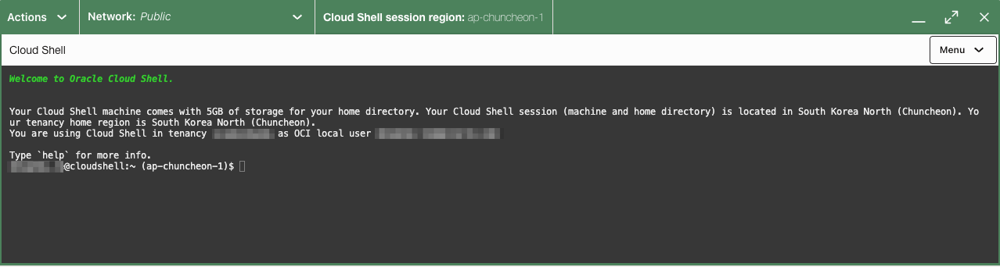
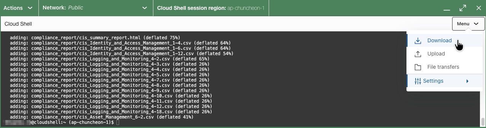
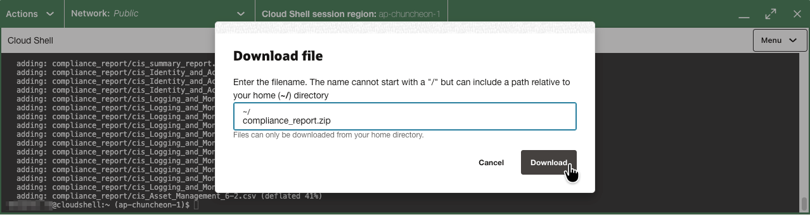
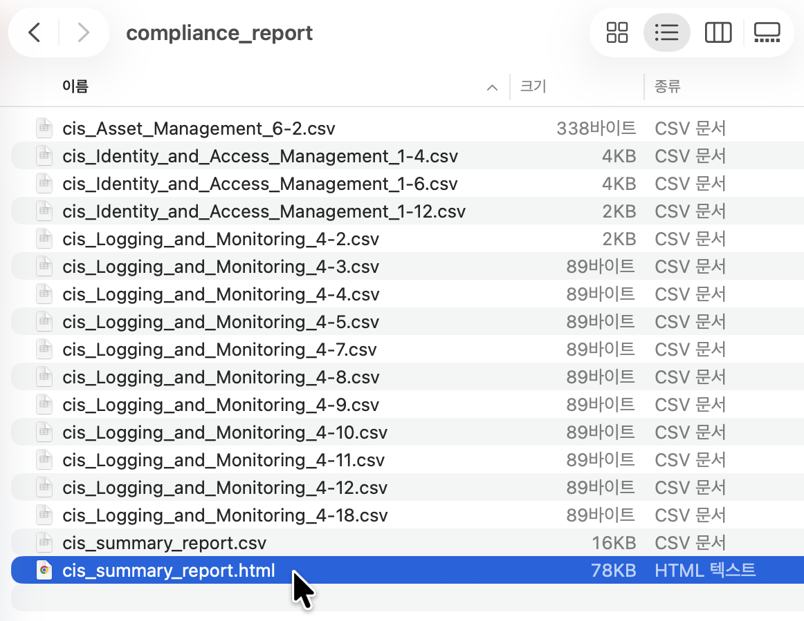
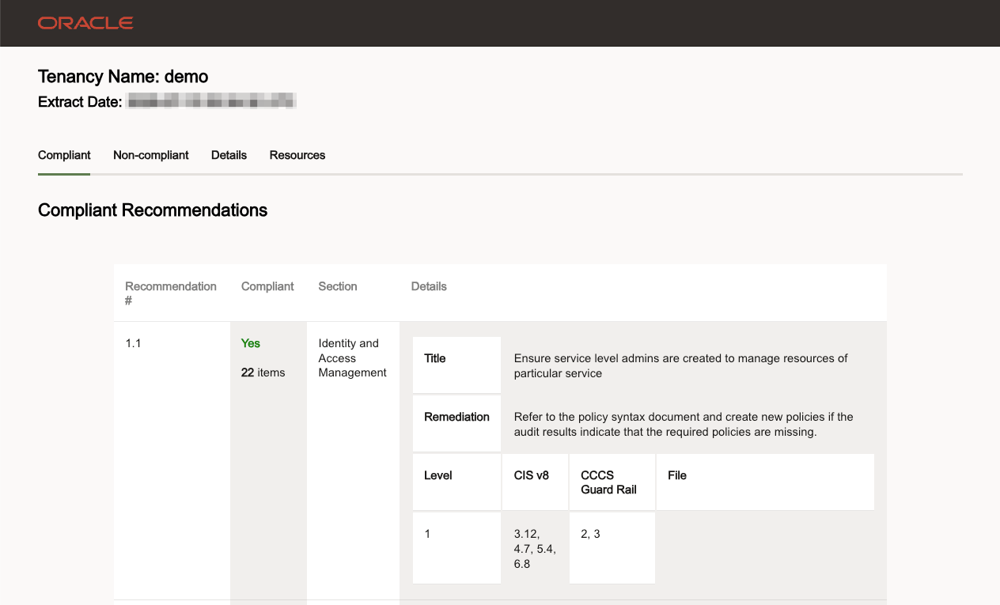
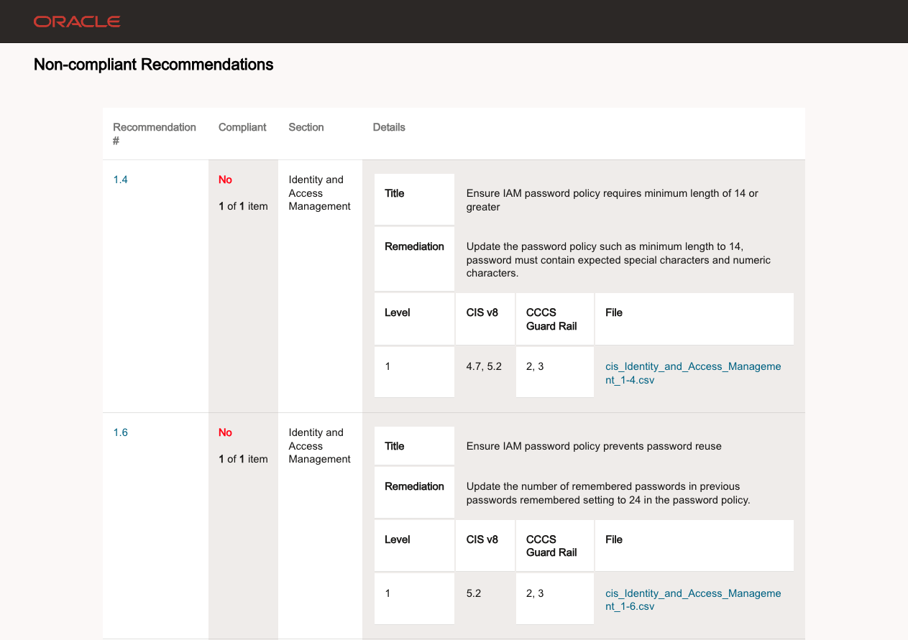

# CIS Compliance Checker 스크립트 실행

## 소개

이 실습에서는 Landing Zone이 성공적으로 배포되어 있어야 합니다. 시간이 지나 Landing Zone 환경에서 개발 또는 유지보수가 이루어진 뒤에도 CIS 제어 준수가 계속 유지되고 있는지 어떻게 확인할 수 있을까요? 한 가지 방법은 [CIS Compliance Script](https://github.com/oci-landing-zones/oci-cis-landingzone-quickstart/blob/main/README.md)를 실행하는 것입니다.

예상 실습 시간: 10분

### 목표

이 실습에서는 다음을 수행합니다.

- Cloud Shell을 사용하여 Compliance Checker 스크립트 실행
- 스크립트 출력을 로컬 머신으로 다운로드
- 보고서 결과 검사

### 사전 준비 사항

- OCI에서 _read all-resources_ 권한이 있는 계정
- [OCI Cloud Shell 접근 권한](https://docs.oracle.com/en-us/iaas/Content/API/Concepts/devcloudshellintro.htm#Required_IAM_Policy)

## 작업 1: 스크립트 실행

Compliance 스크립트는 올바른 권한과 옵션이 있으면 어디서든 실행할 수 있습니다. 이 실습에서는 간단하게 [Cloud Shell](https://docs.oracle.com/en-us/iaas/Content/API/Concepts/devcloudshellintro.htm#Cloud_Shell)에서 스크립트를 실행합니다.

1. OCI 콘솔에서 Cloud Shell을 엽니다. Cloud Shell을 처음 사용하는 경우 리소스가 프로비저닝되는 동안 잠시 대기해야 할 수 있습니다.

    

    

1. Cloud Shell에서 다음 명령을 복사하여 실행해 스크립트를 다운로드합니다.

    ```text
    <copy>
    wget https://raw.githubusercontent.com/oci-landing-zones/oci-cis-landingzone-quickstart/main/scripts/cis_reports.py
    </copy>
    ```

1. 현재 버전을 확인합니다.

    ```
    $ <copy>python cis_reports.py -v</copy>
    Version 3.3.0 Updated on July 13, 2026
    ```

1. 다음 명령을 입력하여 스크립트를 실행한 뒤, 스크립트가 데이터를 수집하는 동안 잠시 기다립니다.

    ```text
    <copy>
    python cis_reports.py --level 1 --report-directory compliance_report -dt
    </copy>
    ```

## 작업 2: 결과 다운로드

1. 완료되면 홈 디렉터리에 _compliance\_report_라는 디렉터리가 생성됩니다. Cloud Shell에서 다음 명령을 실행하여 이 디렉터리를 압축합니다.

    ```text
    <copy>
    zip compliance_report.zip -r compliance_report
    </copy>
    ```

1. Cloud Shell 오른쪽 위 모서리의 메뉴를 열고 _Download_를 선택하여 파일을 다운로드합니다. 

1. 입력 상자에 `compliance_report.zip`을 입력하고 _Download_를 클릭합니다. 

1. 압축을 풀고 편한 시간에 보고서를 살펴봅니다.

## 작업 3: 보고서 내용 검사

보고서 디렉터리에는 OCI 테넌시 상태에 따라 다양한 수의 파일이 포함됩니다. 요약 파일에는 검사 목록과 각 검사의 통과 또는 실패 여부가 포함됩니다. 웹 브라우저에서 내용을 보려면 _cis\_summary\_report.html_ 파일을 엽니다. 잠시 시간을 내어 내용을 살펴봅니다.





실패한 검사는 해당 검사를 실패한 특정 리소스에 대한 보고서 포함 파일로 연결되는 링크를 갖습니다. 보고서의 마지막 여러 페이지에는 실패한 검사에 대한 관찰 사항, 권장 사항, 조치 방법이 포함됩니다.



## 감사의 말 (Acknowledgements)

* **Author:** KC Flynn
* **Contributors:** Andre Correa, Johannes Murmann, Josh Hammer, Olaf Heimburger
* **Korean Translator & Contributors:** DongHee Lee, July 2026
* **Last Updated By/Date:** DongHee Lee, July 2026
