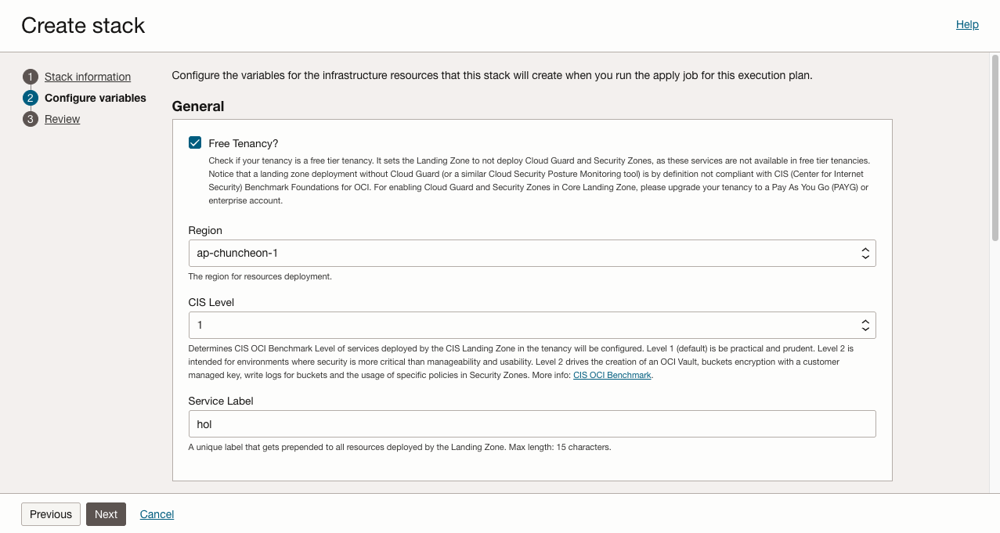
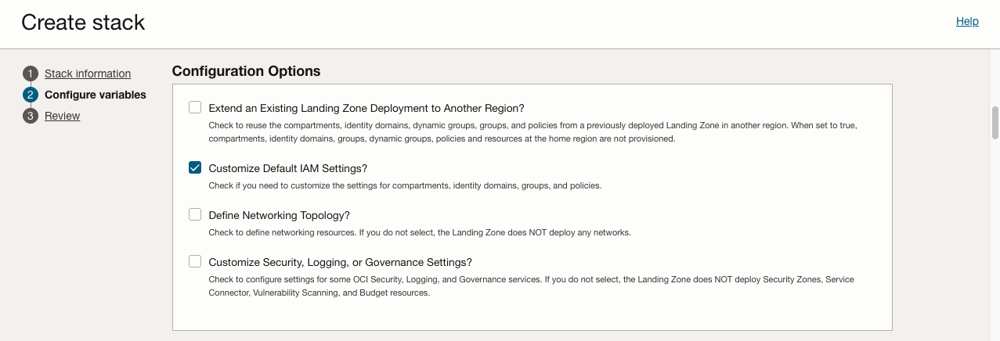
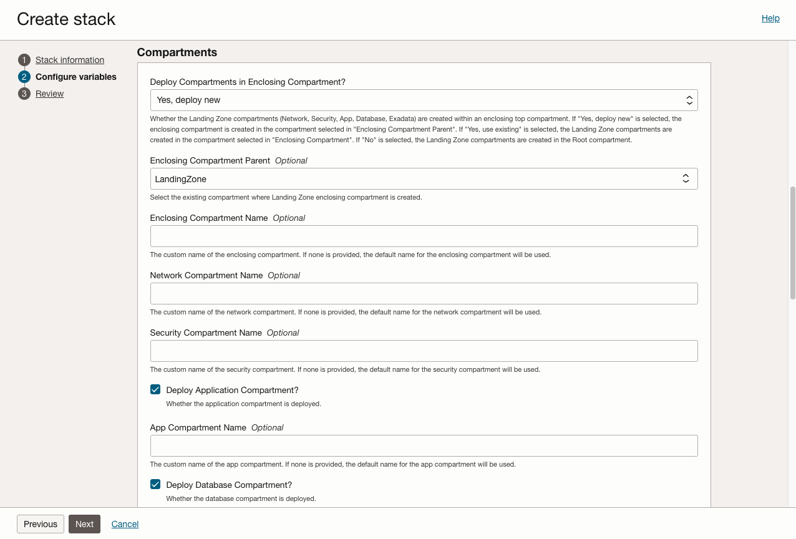
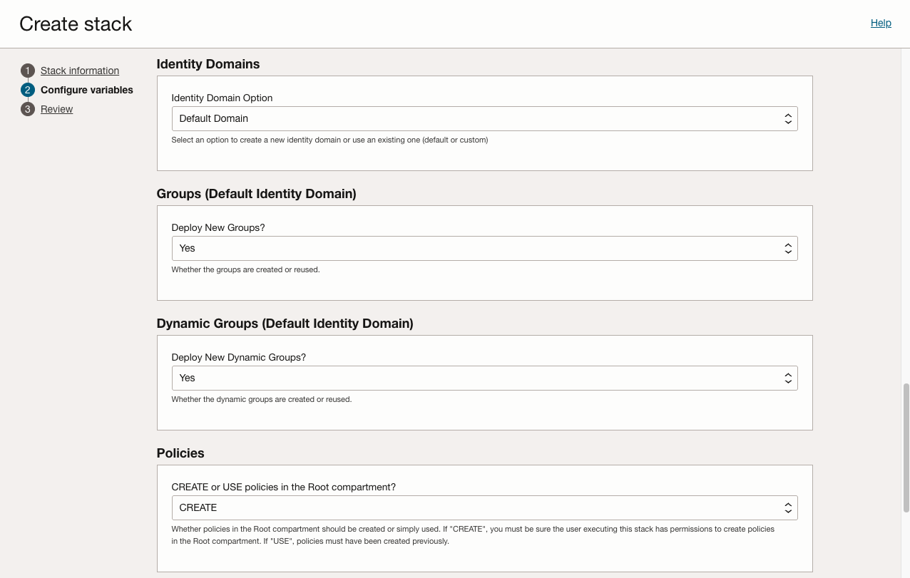
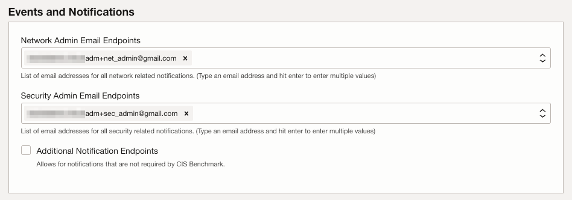
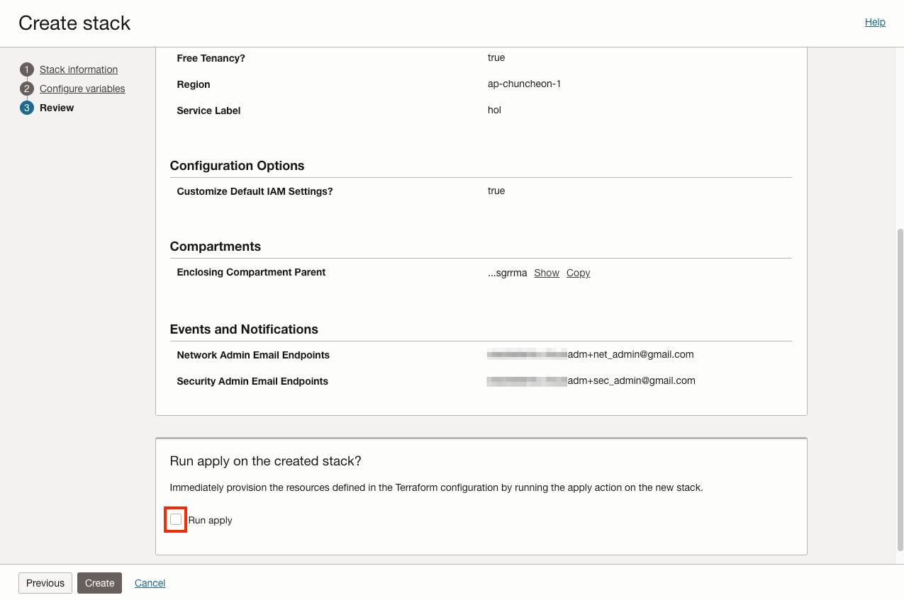

# 기본 배포를 위한 변수 구성

## 소개

왼쪽 사이드 메뉴 기준으로 __Configure Variables__ 페이지에 있어야 합니다. 이 페이지에서는 메인 프로젝트 템플릿의 [variables file](https://github.com/oci-landing-zones/terraform-oci-core-landingzone/blob/main/templates/cis-basic/main.tf.template)에 정의될 변수를 지정할 수 있습니다. Resource Manager는 구성 파일의 필드를 사용하기 쉬운 인터페이스로 변환해 표시합니다.

예상 실습 시간: 10분

### 목표

이 실습에서는 다음을 수행합니다.

- Resource Manager 인터페이스를 사용하여 변수 값 입력
- Core Landing Zone에서 사용할 수 있는 구성 옵션 확인

## 작업 1: 일반 변수 입력

이 섹션은 Landing Zone의 일반 환경 구성을 설정합니다. 이 섹션의 입력값은 Landing Zone의 기본 요소를 제어합니다. 이 실습에서는 이러한 옵션 중 몇 가지만 다루며, 아래에서 설명합니다.

1. 먼저 __Free Tenancy?__ 상자를 선택합니다. 선택하면 Landing Zone이 Cloud Guard와 Security Zones을 배포하지 않습니다. 이 서비스들은 Free Tier 테넌시에서 사용할 수 없습니다.

    Cloud Guard를 사용할 수 있는 테넌시인 경우, LandingCloud Guard를 활성화하고 구성하는 것을 권장합니다. 이 실습에서는 Cloud Guard를 사용하지 않습니다.

1. 다음으로 확인할 필드는 __Region__입니다. 현재 리전이 자동으로 입력되어 있을 것입니다. 다른 리전에 배포하려면 드롭다운 메뉴에서 적절한 값을 선택합니다. 배포 전에 해당 [리전에 구독](https://docs.oracle.com/en-us/iaas/Content/Identity/Tasks/managingregions.htm#uconsole)되어 있어야 합니다.
1. 다음으로 __CIS Level__ 변수를 설정합니다. 선택할 수 있는 CIS 준수 수준은 두 가지입니다. 이 수준은 [CIS OCI Foundations Benchmark v3.0](https://www.cisecurity.org/benchmark/oracle_cloud/)의 요구 사항에 대응됩니다. CIS Level 1과 2 사이의 전체 변경 목록은 벤치마크를 참조하십시오. CIS Level 2는 추가 암호화를 요구하므로 [OCI Vault](https://docs.oracle.com/en-us/iaas/Content/KeyManagement/Concepts/keyoverview.htm)와 암호화 키를 생성해야 합니다. __이 실습에서는 CIS Level 1을 사용합니다__.
1. 마지막 필드는 __Service Label__입니다. 이 서비스 레이블은 Landing Zone에서 생성하는 모든 항목 앞에 붙습니다. 따라서 입력할 값을 간결하게 선택해야 합니다. 서비스 레이블 요구 사항은 2~15자이며, 첫 글자는 문자여야 합니다. 이러한 규칙을 위반하면 Resource Manager가 해당 필드에 오류 메시지를 표시합니다.

    

## 작업 2: 포괄 컴파트먼트 구성

1. _Configuration Options_ 섹션 아래의 __Customize Default IAM Settings?__ 상자를 선택합니다.

    

1. _Compartments_ 섹션에서 드롭다운을 사용하여 __Enclosing Compartment Parent__ 컴파트먼트를 선택합니다. 다른 설정은 기본값으로 둡니다. _Compartments_ 섹션은 선택한 포괄 컴파트먼트를 제외하고 아래 그림과 일치해야 합니다.

    

## 작업 3: 그룹, 권한 구성

기본 컴파트먼트 구성과 함께, 권한 설정을 위해 Identity Domain에 필요한 IAM Group, Dynamic Group을 생성하고, 관련된 IAM Policy를 생성합니다.

실습에서는 Core Landing Zone에서 기본 생성하는 사항들을 확인하기 위해, 항목만 확인하고, 기본값으로 둡니다.

## 작업 4: 이벤트 및 알림 구성

CIS 제어에서 요구하는 필수 알림 연락처는 두 가지입니다. 네트워크 관리자 이메일 주소와 보안 관리자 이메일 주소입니다. 생성 후 이 주소들은 확인 이메일을 받으며, 알림이 전송되기 전에 확인을 수락해야 합니다. 알림 수신을 계속하겠다고 확인하면 네트워크 또는 보안(IAM) 객체가 생성, 수정, 삭제될 때 메시지를 받게 됩니다. 개인의 주소를 지정하는 경우 중복성을 위해 각 서비스에 여러 엔드포인트를 둘 수 있습니다.

다른 서비스 관리자용 추가 엔드포인트도 정의되어 있지만 CIS 벤치마크에서는 필수가 아닙니다. 이 실습에서는 사용하지 않습니다.

1. _Network Admin Email Endpoints_에 본인의 이메일을 입력합니다.

2. _Security Admin Email Endpoints_에 본인의 이메일을 입력합니다.

## 작업 5: 옵션 확인

Core Landing Zone의 _Configuration Options_ 섹션에서 구성으로 노출되는 고급 옵션을 잠시 살펴봅니다.

추가 구성을 활용하는 방법에 대한 자세한 내용은 [Deployment Guide](https://github.com/oci-landing-zones/terraform-oci-core-landingzone/blob/main/DEPLOYMENT-GUIDE.md)를 참조하십시오.

### 마무리

1. __Next__를 클릭하여 검토 페이지로 이동합니다. 입력한 변수를 빠르게 다시 확인합니다.

2. __Run apply 버튼을 선택 해제합니다__.

3. 완료되면 __Create__ 버튼을 클릭합니다.

Stack 구성이 저장되면 다음 실습으로 이동하여 계속합니다.

## 감사의 말 (Acknowledgements)

* **Author:** KC Flynn
* **Contributors:** Andre Correa, Johannes Murmann, Josh Hammer, Olaf Heimburger
* **Korean Translator & Contributors:** DongHee Lee, July 2026
* **Last Updated By/Date:** DongHee Lee, July 2026