# Workload Extension으로 IAM 및 Network 확장

## 소개

지금까지 Core Landing Zone을 사용하여 테넌시의 기본 구성을 위한 컴파트넌트, 그룹, 권한 설정, 네트워크 기반 등을 만들었습니다. 이를 기반으로 신규 워크로드를 환경이 필요하면, 확장이 필요합니다. 이번 실습에서는 [Core Landing Zone Extensions](https://github.com/oci-landing-zones/terraform-oci-core-landingzone/blob/main/extensions/README.md)를 사용하여 워크로드를 확장하는 방법을 알아봅니다.

Extensions는 Core Landing Zone 위에 추가 기능을 배포하는 Terraform 모듈입니다. Core Landing Zone Extensions으로는 현재 다음 2가지가 있습니다.

- [Generic IAM Extension](https://github.com/oci-landing-zones/terraform-oci-core-landingzone/tree/main/extensions/iam_generic): 워크로드를 위한 컴파트먼트, 그룹, 정책 생성
- [Generic Network Extension](https://github.com/oci-landing-zones/terraform-oci-core-landingzone/tree/main/extensions/network_generic): 워크로드를 위한 VCN, 서브넷, 보안 규칙 등 네트워크 구성 생성

예상 실습 시간: 30분

### 목표

이 실습에서는 다음을 수행합니다.

- Core Landing Zone Extensions의 IAM 및 Network 모듈 역할 이해
- workload 전용 컴파트먼트, 하위 컴파트먼트, 그룹, 정책 생성
- workload용 기본 VCN 및 서브넷 구성
- 생성된 IAM 및 Network 리소스 검사

### 사전 준비 사항

- 앞선 실습에서 Core Landing Zone Stack이 성공적으로 배포되어 있어야 합니다.
- 기존 VCN과 겹치지 않는 workload VCN CIDR을 하나 정합니다. 이 실습에서는 예시로 `10.10.0.0/16`을 사용합니다.

## 작업 1: Landing Zone을 Resource Manager에 업로드

1. GitHub의 OCI Core Landing Zone 저장소 [https://github.com/oci-landing-zones/terraform-oci-core-landingzone/](https://github.com/oci-landing-zones/terraform-oci-core-landingzone/blob/main/README.md)로 이동합니다.

2. __Deploy to Oracle Cloud__ 버튼을 찾아 클릭합니다.

3. OCI 테넌시에 아직 로그인하지 않은 경우 인증을 위한 로그인 화면으로 이동합니다. 인증이 완료되면 Resource Manager Stack을 생성하는 __Create Stack__ 메뉴가 표시됩니다.

4. _I have reviewed and accept the Oracle Terms of Use_ 체크박스를 선택합니다.

5. Workload IAM Extension을 위한 값으로 변경합니다.

    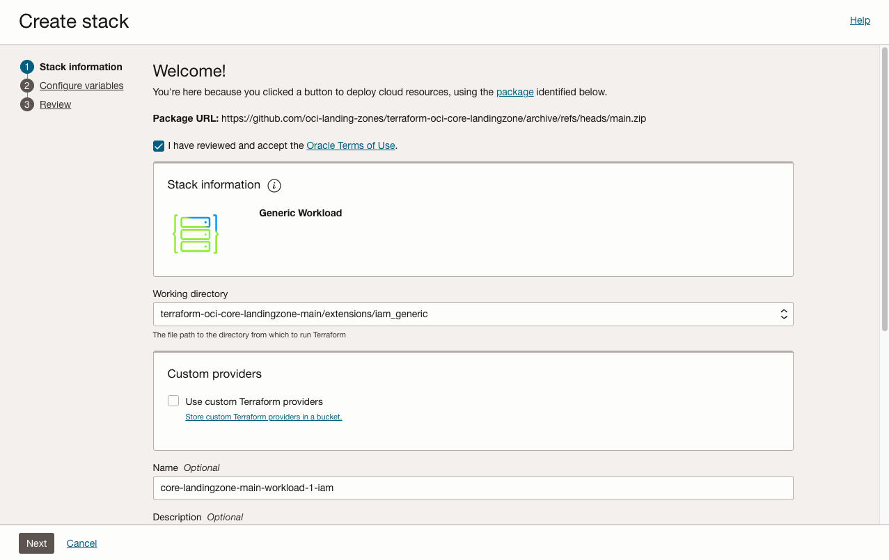

    - _Working directory_ : `extensions/iam_generic`으로 선택

    - _Name_ : 적절한 이름으로 변경. 예, `core-landing-zone-main-workload-1-iam`

    - _Create in Compartment_ : Stack 객체 자체가 포함될 컴파트먼트를 정의하며, 이전과 동일한 위치로 지정

5. __Next__ 버튼을 클릭합니다.

## 작업 2: Workload IAM Extension 변수 입력

IAM Extension은 workload용 컴파트먼트와 선택적 하위 컴파트먼트를 만들고, 워크로드 운영을 위한 그룹과 정책을 생성합니다. 이 실습에서는 워크로드를 랜딩존 공유 Network 컴파트먼트와 분리하는 구성으로 진행합니다. 워크로드 내부에 App, Network, Database 하위 컴파트먼트를 두지 않는 구성으로 진행합니다.

1. *General* 섹션에서 다음 값을 입력합니다.

    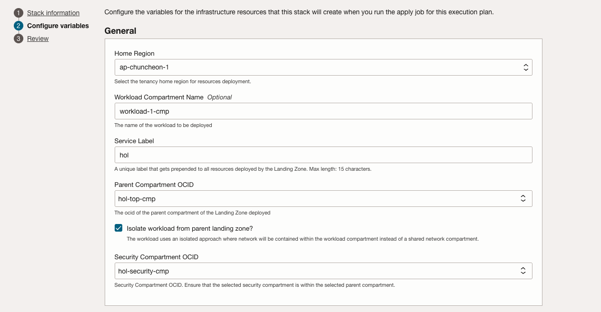

    - *Home Region*: 테넌시 Home Region
    - *Workload Compartment Name*: 추가 확장을 고려한 이름 지정, 예, `workload-1-cmp`
    - *Service Label*: 앞선 Landing Zone 실습에서 사용한 Service Label, 예, hol
    - *Parent Compartment OCID*: top-cmp 컴파트먼트 선택
    - *Isolate workload from parent landing zone?*: 랜딩존 공유 네트워크인 network-cmp 내에 VCN을 생성할지, Workload 내에 VCN을 따로 가져갈지 정하는 것으로 당장 VCN이 생성되진 않지만, 권한 설정과 관련됨. 여기서는 Isolate로 체크합니다.
    - *Security Compartment OCID*: Security 컴파트먼트

1. *Compartment* 섹션에서 기본값을 사용합니다. 실습에서는 Workload 컴파트먼트 내에, 하위 컴파트먼트를 두지 않습니다.

    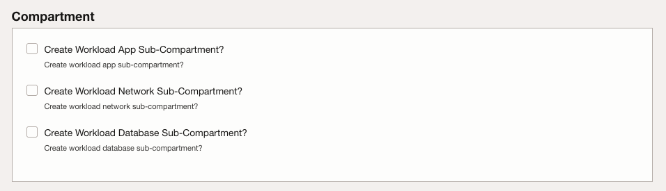

1. *Groups and Policies* 섹션에서 다음 값을 확인합니다. 그룹, 정책은 워크로드 컴파트먼트에 맞게 이름을 변경합니다.

    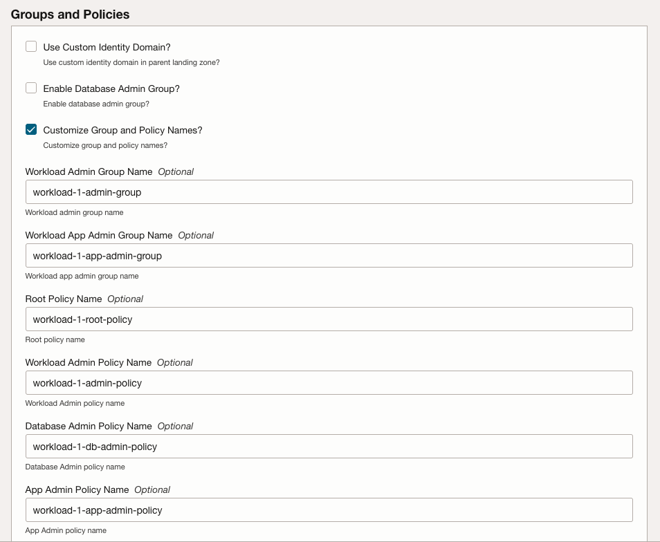

    - *Use Custom Identity Domain?*: 선택하지 않음
    - *Enable Database Admin Group?*: 선택하지 않음
    - *Customize Group and Policy Names?*: 선택. 위에서 변경한 Workload Compartment Name에 맞추고, 추가 워크로드 확장을 고려하여, 향후 Group, Policy 이름이 충돌되지 않도록 하기 위해 선택

1. __Next__를 클릭하여 검토 페이지로 이동합니다. 입력한 변수를 빠르게 다시 확인합니다.

1. __Run apply 버튼을 선택 해제합니다__.

    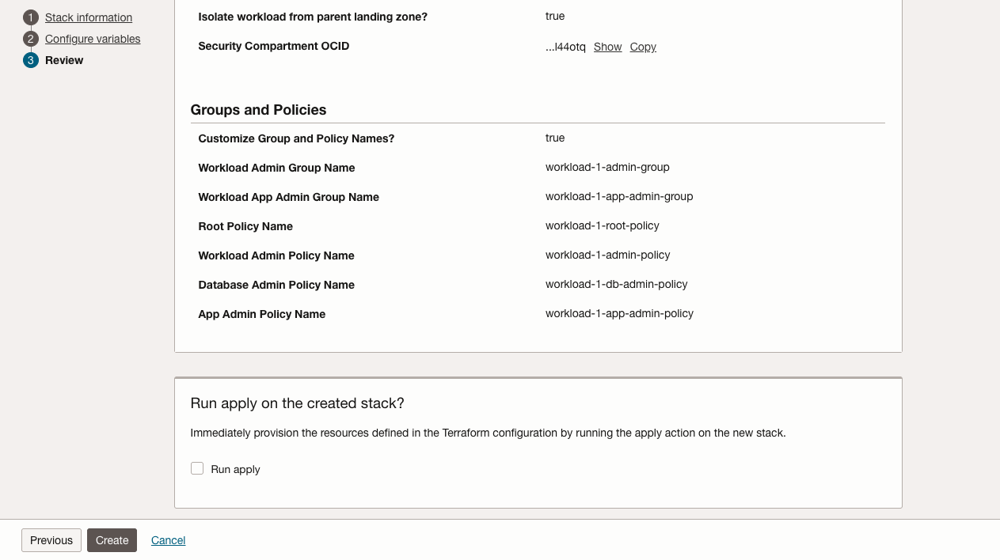

1. 완료되면 __Create__ 버튼을 클릭합니다.

## 작업 3: Workload IAM Extension Plan 및 Apply

1. Stack이 생성되면 *Stack details* 페이지에서 Actions의 __Plan__ 버튼을 클릭하고, Job 생성 화면에서 __Plan__을 다시 클릭합니다.
1. plan 로그에서 workload 컴파트먼트, 하위 컴파트먼트, 그룹, 정책이 추가되는지 확인합니다. 삭제되는 리소스가 없어야 합니다.
1. *Stack details* 페이지로 돌아가 Actions의 __Apply__ 버튼을 클릭합니다.
1. __Apply job plan resolution__ 드롭다운에서 방금 만든 Plan을 선택하고 __Apply__를 클릭합니다.
1. Apply가 완료되면 로그를 확인합니다.

## 작업 4: 생성된 자원 검사

1. _Stack details_ 페이지에서 stack이 생성한 리소스 목록을 볼 수 있습니다. 

    

1. 생성된 compartment를 클릭합니다.  top-cmp 컴파트먼트 아래에 workload 컴파트먼트가 생성되었는지 확인합니다. 

    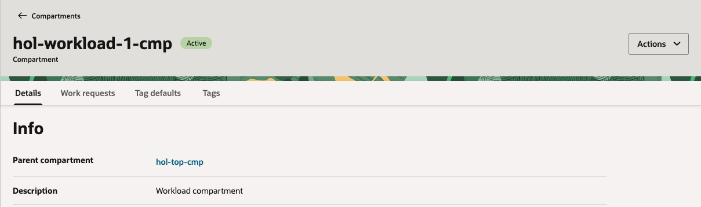

1. stack이 생성한 리소스 목록에서 워크로드 app-admin-policy, admin-policy를 각각 클릭해 봅니다. top-cmp 컴파트먼트에 만들어졌고, Workload 컴파트먼트 및 공용 컴파트먼트에 대한 권한을 설정되었습니다.

    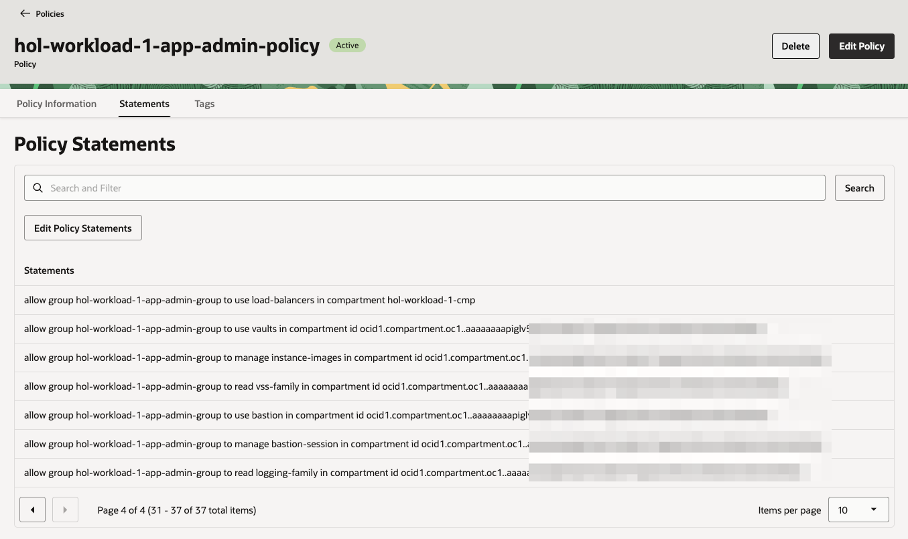

1. stack이 생성한 리소스 목록에서 워크로드 root-policy를 클릭해 봅니다. root 컴파트먼트에 만들어졌습니다. tenancy 레벨의 Policy로 워크로드 admin-group과 app-admin-group의 권한을 설정하였습니다.

    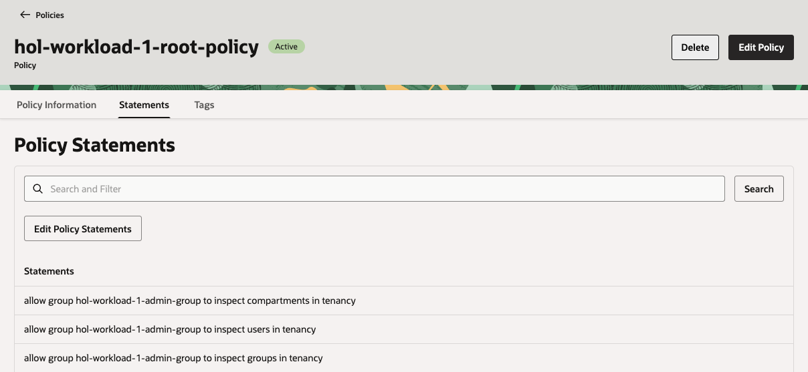

## 작업 5: Landing Zone을 Resource Manager에 업로드

1. 앞서와 동일하게 OCI Core Landing Zone 저장소 [https://github.com/oci-landing-zones/terraform-oci-core-landingzone/](https://github.com/oci-landing-zones/terraform-oci-core-landingzone/blob/main/README.md)로 이동하여 __Deploy to Oracle Cloud__ 버튼을 클릭합니다.

2. Workload Network Extension을 위한 값으로 변경합니다.

    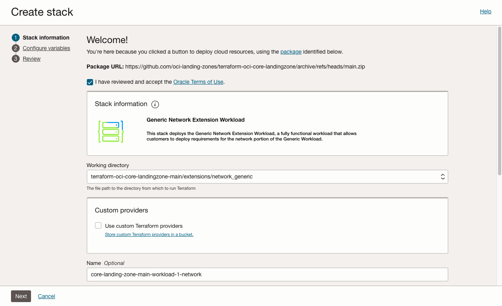

    - _Working directory_ : `extensions/network_generic`으로 선택

    - _Name_ : 적절한 이름으로 변경. 예, `core-landing-zone-main-workload-1-network`

3. __Next__ 버튼을 클릭합니다.

## 작업 6: Workload Network Extension 변수 입력

Network Extension은 workload용 Network 자원을 생성합니다. 이 실습에서는 워크로드를 랜딩존 공유 Network 컴파트먼트와 분리하는 구성으로 진행합니다. 워크로드 컴파트먼트 내부에 VCN을 생성하도록 구성합니다.

1. *General* 섹션에서 다음 값을 입력합니다.

    - *Network Architecture*:
    
        - `Hub and Spoke`: 생성될 Workload VCN은 Spoke로써 DRG로 연결된 DMZ VCN을 통해 외부로 연결되는 경우
        - `Standalone`: 생성될 Workload VCN은 인터넷 연결 등을 독립적으로 관리하는 경우

        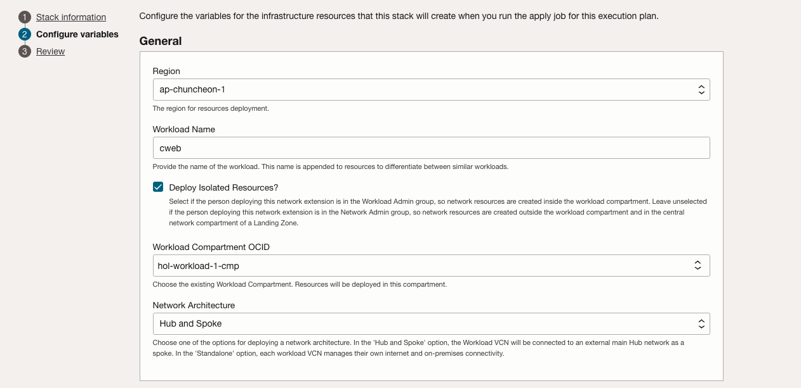

    - *Region*: 리소스를 배포할 리전
    - *Workload Name*: 예, `cweb`
    - *Deploy Isolated Resources?*: 선택. 워크로드 컴파트먼트 내부에 VCN을 생성하도록 구성, 앞서 IAM Extension에서 동일하게 선택해야 함. 그래야 관련 Policy가 이미 설정된 상태
    - *Workload Compartment OCID*: 앞선 작업에서 만든 워크로드 컴파트먼트 지정, `workload-1-cmp`

1. *Network* 섹션에서 다음 값을 입력합니다.

    - 네트워크 기본

        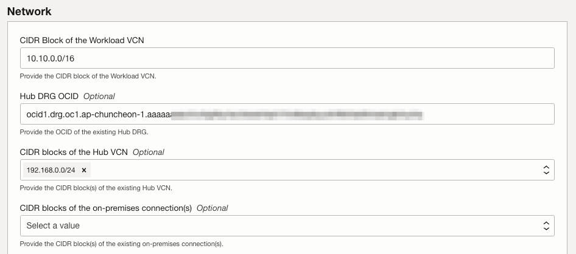

        - *CIDR Block of the Workload VCN*: 기존 VCN과 겹치지 않게 입력 필요, 여기서는 `10.10.0.0/16` 사용
        - *Hub DRG OCID*: 앞선 실습에서 생성한 DRG OCID
        - *CIDR blocks of the Hub VCN*: DMZ VCN을 생성한 경우 입력하는 부분으로, 여기서는 그냥 기본값 그대로

    - Gateway

        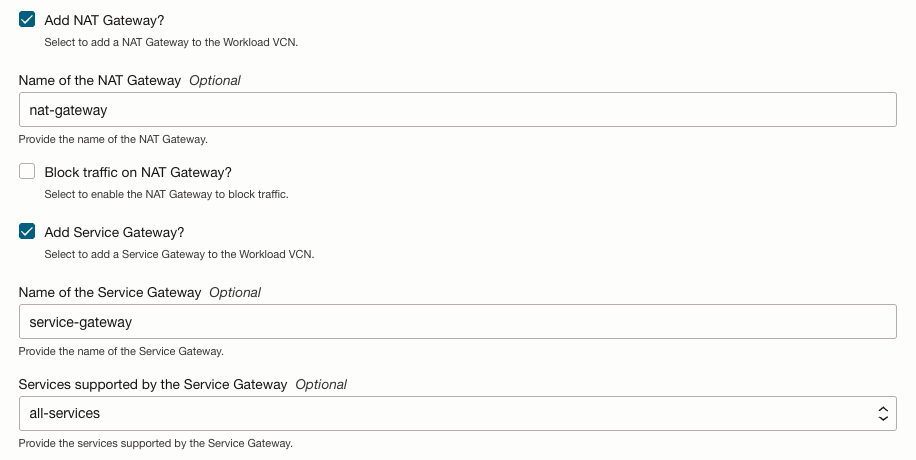

        - *Add NAT Gateway?*: 선택
        - *Add Service Gateway?*: 선택

    - 서브넷

        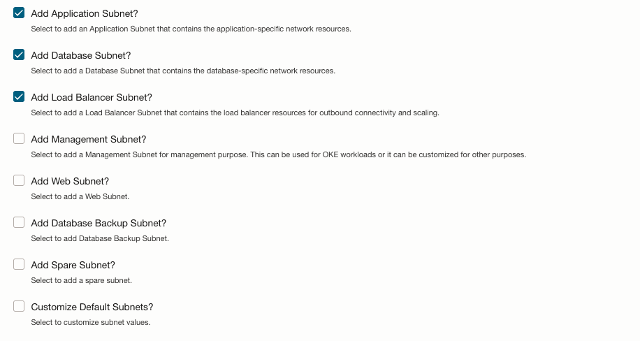

        - *Add Application Subnet?*: 선택
        - *Add Database Subnet?*: 선택
        - *Add Load Balancer Subnet?*: 선택

1. __Next__를 클릭하여 검토 페이지로 이동합니다. 입력한 변수를 빠르게 다시 확인합니다.

1. __Run apply 버튼을 선택 해제합니다__.

1. 완료되면 __Create__ 버튼을 클릭합니다.

## 작업 7: Workload Network Extension Plan 및 Apply

1. Stack이 생성되면 *Stack details* 페이지에서 Actions의 __Plan__ 버튼을 클릭하고, Job 생성 화면에서 __Plan__을 다시 클릭합니다.
1. plan 로그에서 workload 컴파트먼트, 하위 컴파트먼트, 그룹, 정책이 추가되는지 확인합니다. 삭제되는 리소스가 없어야 합니다.
1. *Stack details* 페이지로 돌아가 Actions의 __Apply__ 버튼을 클릭합니다.
1. __Apply job plan resolution__ 드롭다운에서 방금 만든 Plan을 선택하고 __Apply__를 클릭합니다.
1. Apply가 완료되면 로그를 확인합니다.

## 작업 8: 생성된 자원 검사

1. _Stack details_ 페이지에서 stack이 생성한 리소스 목록을 볼 수 있습니다. 

    

1. 생성된 VCN을 클릭합니다. workload 컴파트먼트에 생성되었는지 확인합니다. 

    

1. Subnets 탭으로 이동하여, 생성된 서브넷을 확인합니다.

1. Routing 탭으로 이동하여, 생성된 라우팅 테이블을 확인합니다.

1. lb-subnet-route-table을 클릭합니다. 설정된 라우팅 룰을 보면, DMZ VCN으로 지정한 CIDR에 대해 DRG로 라우팅되게 설정되어 있습니다.

## 작업 9: Workload Extension 결과 정리

이 실습을 완료하면 Core Landing Zone 위에 workload용 운영 단위가 추가됩니다.

- IAM Extension Stack은 workload 컴파트먼트, 하위 컴파트먼트, 그룹, 정책을 관리합니다.
- Network Extension Stack은 workload VCN, 서브넷, 라우팅, NSG를 관리합니다.
- 두 Stack은 Core Landing Zone Stack과 분리되어 있어, workload 단위로 변경 계획과 적용 이력을 독립적으로 관리할 수 있습니다.

그런데, Workload VCN에서 다른 Spoke, 예를 들어 앞서 만든 3티어 VCN 또는 OKE VCN과 통신을 하려면, 서로간의 VCN에 라우팅될 수 있도록 추가 설정이 필요합니다. 이런 요구사항은 워크로드마다 다를수 있을텐데, 그럼 다음 질문에 대해 생각해 볼까요.
- 매번 요구사항이 다를테니, 현재 만들어진 것을 기반으로 Workload 관리자가 직접 설정하게 하는 게 나을까요?
- 아니면, 워크로드 Compartment까지만 만들어주고, 나머지는 필요에 따라 직접 설정하게 하는 게 나을까요?
- Landing Zone이 기본 구성해야 하는 범위는 어디까지가 적당할까요?

## 감사의 말 (Acknowledgements)

* **Author:** KC Flynn
* **Contributors:** Andre Correa, Johannes Murmann, Josh Hammer, Olaf Heimburger
* **Korean Translator & Contributors:** DongHee Lee, July 2026
* **Last Updated By/Date:** DongHee Lee, July 2026
