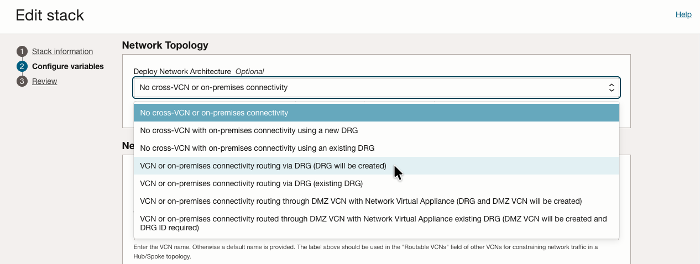
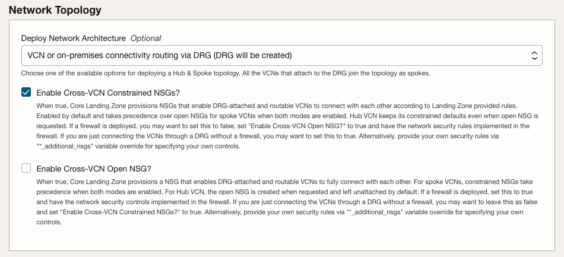
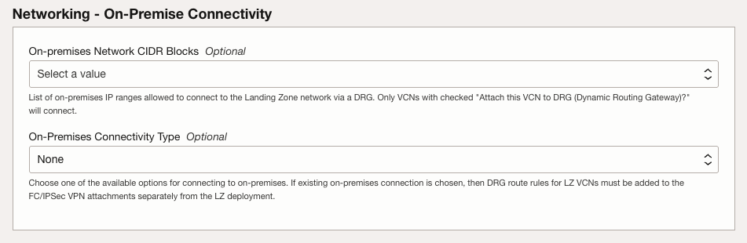
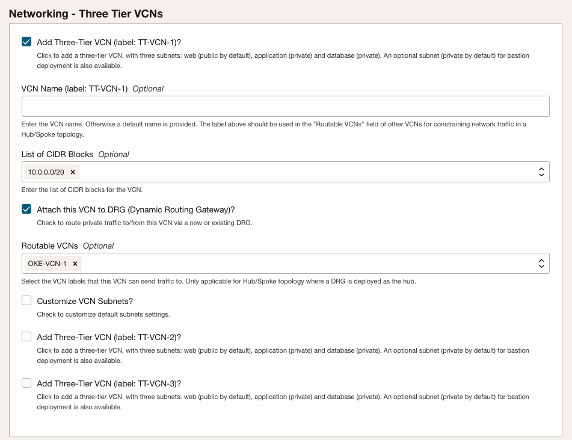
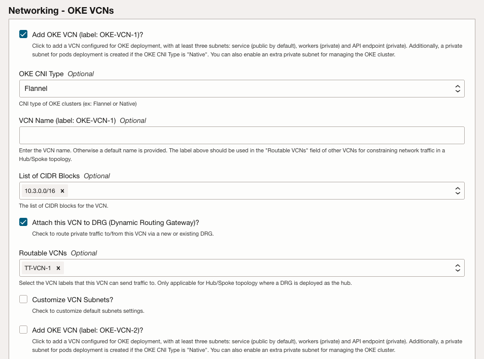
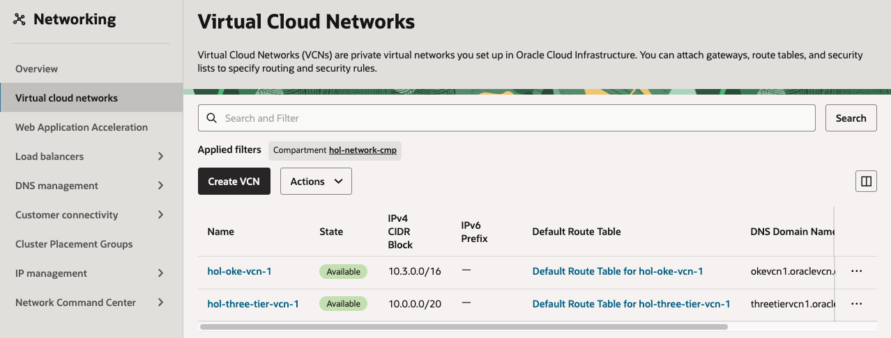
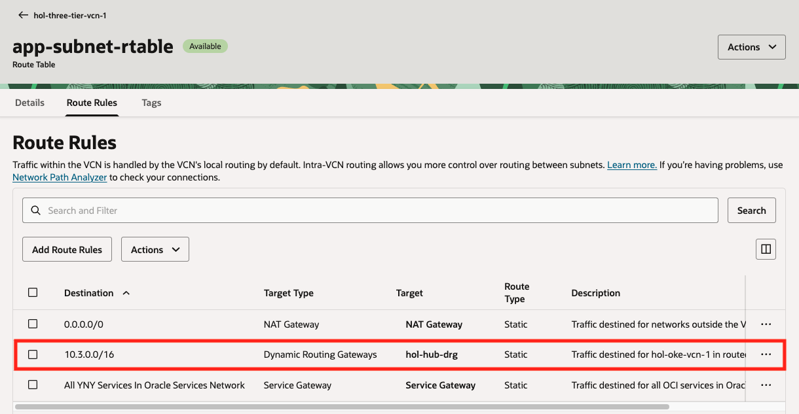
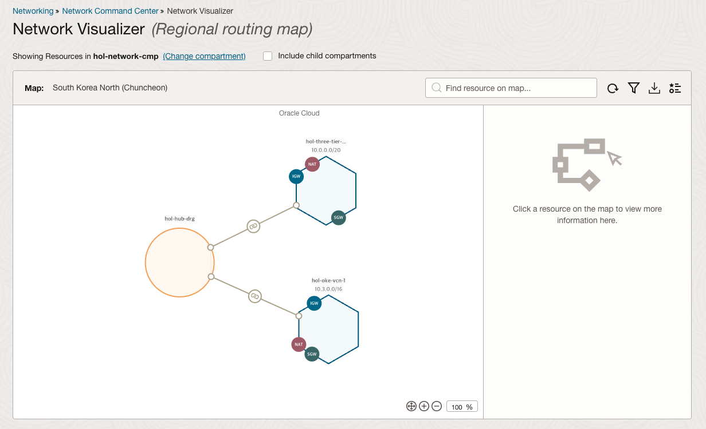
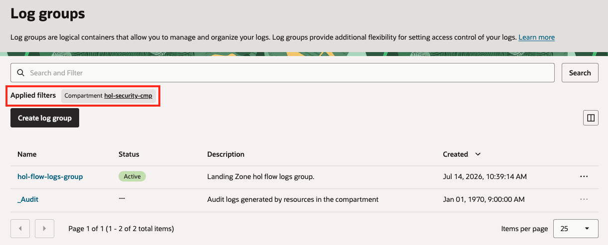
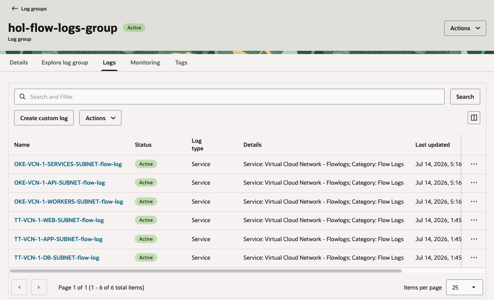

# Hub & Spoke 네트워크 배포

## 소개

네트워크 모범 사례 중 하나는 Hub & Spoke 네트워크 아키텍처를 사용하는 것입니다. 요구 사항이 확장됨에 따라 여러 spoke 네트워크를 추가할 수 있으므로 확장 가능한 네트워크를 구성할 수 있습니다.

OCI에서는 다른 네트워크로 가는 경로를 만드는 여러 작업을 수행하기 위해 Dynamic Routing Gateway(DRG)를 사용합니다. DRG는 다른 클라우드나 데이터 센터에서 들어오는 FastConnect 및 IPSec 터널 연결의 엔드포인트 역할을 합니다. 또한 OCI 내부 네트워크를 연결하여 hub 역할도 수행합니다.

Landing Zone을 사용하여 3티어 네트워크를 DRG를 통해 Oracle Kubernetes Engine(OKE)용 네트워크에 연결합니다. OKE 네트워크는 Kubernetes 워크로드를 지원하도록 미리 구성됩니다. 이를 통해 워크로드를 3티어 아키텍처에서 마이크로서비스 기반 아키텍처로 확장할 수 있습니다.

### 목표

- 구성 변수를 변경하여 Landing Zone을 수정하는 방법 학습
- 수정된 구성으로 plan 및 apply를 수행하여 Hub & Spoke 네트워크 생성
- 네트워크 리소스 검사

## 작업 1: Hub & Spoke 네트워크용 네트워크 변수 재구성

1. 이전 실습에서 배포한 *Resource Manager Stack*의 *Stacks* 화면에서 __Variables__탭을 선택합니다.
1. __Edit variables__ 버튼을 클릭합니다.
1. _Network Topology_ 아래에는 여러가지 선택사항이 있습니다.

    

    이중에서 실습에서는 DRG를 Hub로 사용하는 __VCN or on-premises connectivity routing via DRG (DRG will be created)__를 선택합니다.

    

1. _On-Premises Connectivity Type_은 __None__으로 둡니다.

    

1. _Networking - Three Tier VCNs_에서 __Attach this VCN to DRG (Dynamic Routing Gateway)?__ 체크박스를 선택합니다. 그러면 네트워크가 DRG에 연결됩니다. _Routable VCNs_에서 __OKE-VCN-1__을 선택합니다. 그러면 _OKE-VCN-1_로 트래픽이 전달되도록 라우트 테이블 항목이 생성됩니다.

    

1. _Networking - OKE VCNs_에서 __Add OKE VCN (label: OKE-VCN-1)?__ 체크박스를 선택합니다. 그런 다음 __Attach this VCN to DRG (Dynamic Routing Gateway)?__를 선택하고 _Routable VCNs_에서 __TT-VCN-1__을 선택합니다. 이렇게 하면 OKE 네트워크가 생성되고 DRG에 연결되며, 3티어 VCN으로 트래픽을 전달할 수 있습니다.

    

1. __Next__ 버튼을 선택하여 _Review_ 페이지로 이동합니다.
1. _Run apply_가 __선택되어 있지 않은지__ 확인하고 __Save changes__를 선택합니다.

## 작업 2: 업데이트된 구성 Plan 및 Apply

새 구성이 준비되었으므로 plan 및 apply 프로세스를 통해 네트워크를 배포합니다.

1. 구성을 저장한 후 *Stack details* 페이지에 있어야 합니다. Actions에서 __Plan__ 버튼을 클릭한 다음 Job 생성화면에서 __Plan__을 다시 클릭합니다.
1. plan 로그를 확인하여 리소스가 추가되는지, 변경되거나 삭제되는 리소스가 없는지 확인합니다. 이는 리소스가 종료되고 다시 생성되지 않고 현재 상태에서 배포가 이루어짐을 의미합니다.

1. *Stack details* 페이지로 다시 이동하여 Actions에서 __Apply__ 버튼을 클릭합니다.
1. __Apply job plan resolution__ 드롭다운에서 방금 만든 *Plan*을 선택한 다음 __Apply__를 다시 클릭합니다.

1. *Apply*가 완료되면 로그를 확인합니다.

## 작업 3: 변경 사항 검사

1. 콘솔 왼쪽 위 모서리의 기본 메뉴에서 *Networking* > *Virtual cloud networks*로 이동하여 새 3티어 VCN을 검사합니다. 네트워크 리소스를 보려면 network 컴파트먼트에 있는지 확인합니다.

    

1. 3티어 VCN의 서브넷을 클릭하여, Routing 탭으로 이동합니다.

1. App 서브넷의 라우팅 테이블을 클릭해 보면, Route Rules에 OKE VCN 라우팅 룰이 추가된 것을 볼수 있습니다.

    

1. (*선택 사항*) 기본 메뉴 또는 왼쪽 메뉴어세 *Networking* > *Network Command Center* > *Network Visualizer*로 이동하여 네트워크 시각화를 확인합니다. 네트워크 시각화가 보이지 않으면 network 컴파트먼트가 현재 선택되어 있는지 확인합니다.

    이제 여러 네트워크가 spoke로 표시되고 DRG에 연결되어 있는 것을 볼 수 있습니다. 이를 통해 VCN 간 통신을 지원하고, 더 많은 VCN이 온라인으로 추가될 때 확장도 가능해집니다.

    

1. 다음으로 _Observability & Management_ > _Logging_ > _Log Groups_로 이동하고 _Security_ 컴파트먼트를 선택합니다. Landing Zone의 _flow-logs-group_을 선택합니다.

    

1. 생성된 서브넷 플로우 로그를 보려면 resources 아래에서 _Logs_를 선택합니다. 이 로그는 Landing Zone VCN의 트래픽을 기록합니다.

    

다음 실습에서는 스크립트를 실행하여 Landing Zone이 OCI용 Center for Internet Security(CIS) Benchmark를 준수하는지 확인합니다.

## 감사의 말 (Acknowledgements)

* **Author:** KC Flynn
* **Contributors:** Andre Correa, Johannes Murmann, Josh Hammer, Olaf Heimburger
* **Korean Translator & Contributors:** DongHee Lee, July 2026
* **Last Updated By/Date:** DongHee Lee, July 2026