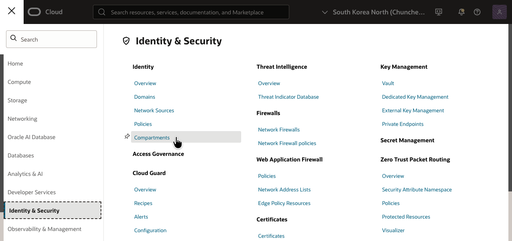
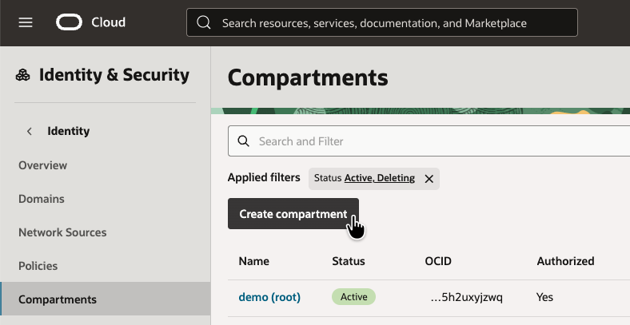
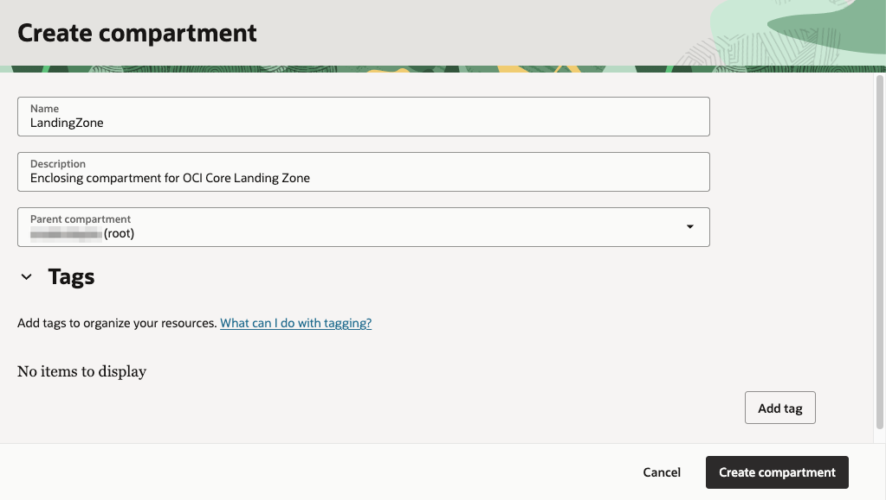
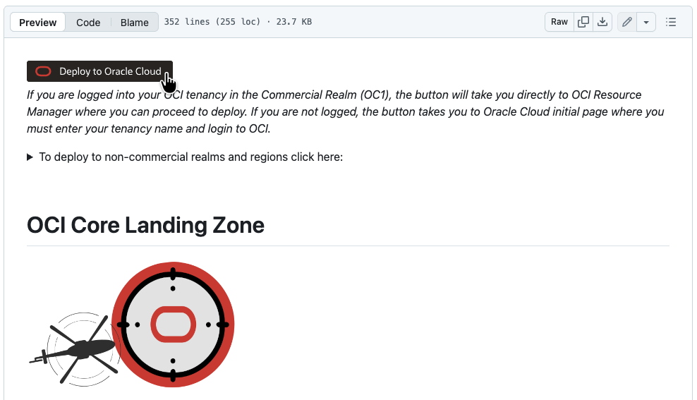
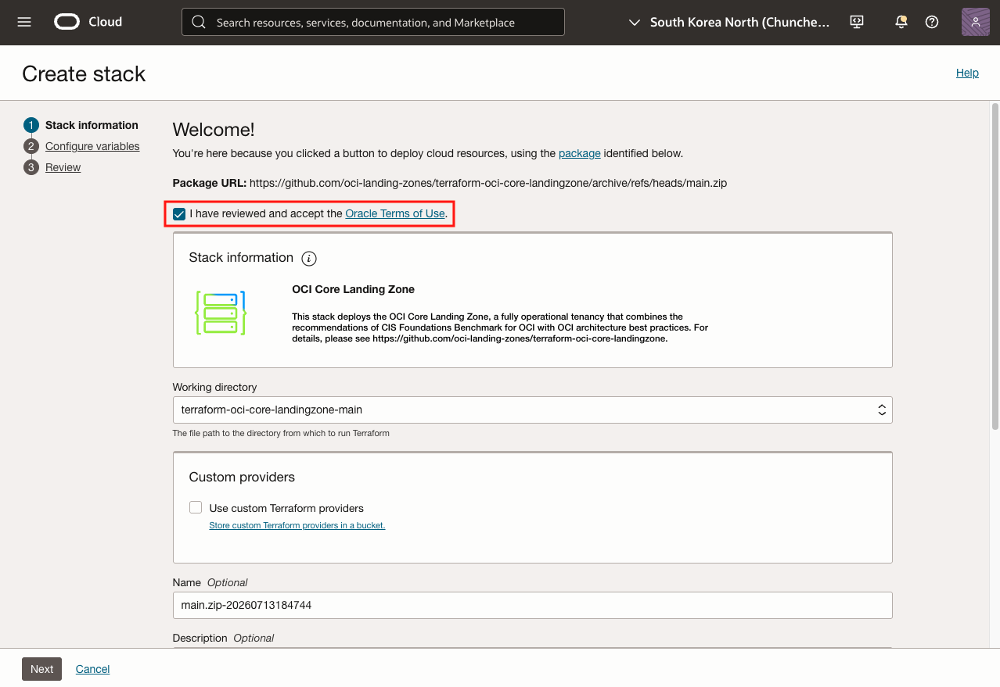

# Landing Zone Terraform 파일을 Resource Manager에 업로드

## 소개

이 실습에서는 공개 GitHub 저장소에 있는 OCI Core Landing Zone 파일을 Resource Manager로 업로드합니다. 과정은 간단합니다.

예상 실습 시간: 5분

### 목표

이 실습에서는 다음을 수행합니다.

- Landing Zone 컴파트먼트 생성
- OCI Core Landing Zone 파일을 OCI Resource Manager에 로드
- Resource Manager Stack 생성

## 작업 1: 포괄(Enclosing) 컴파트먼트 생성

1. 콘솔 홈 페이지에서 _Identity & Security_ > _Compartments_로 이동합니다.

    

2. __Create Compartment__ 버튼을 클릭합니다.

    

3. 포괄(Enclosing) 컴파트먼트의 이름과 적절한 상위 컴파트먼트를 선택합니다.

    

4. __Create Compartment__ 버튼을 클릭합니다.

## 작업 2: Landing Zone을 Resource Manager에 업로드

1. GitHub의 OCI Core Landing Zone 저장소 [https://github.com/oci-landing-zones/terraform-oci-core-landingzone/](https://github.com/oci-landing-zones/terraform-oci-core-landingzone/blob/main/README.md)로 이동합니다.

2. __Deploy to Oracle Cloud__ 버튼을 찾아 클릭합니다. 

3. OCI 테넌시에 아직 로그인하지 않은 경우 인증을 위한 로그인 화면으로 이동합니다. 인증이 완료되면 Resource Manager Stack을 생성하는 __Create Stack__ 메뉴가 표시됩니다.

4. _I have reviewed and accept the Oracle Terms of Use_ 체크박스를 선택합니다. 몇 초 후 화면은 다음과 비슷하게 표시됩니다. 

    - _Name_ 매개변수를 _Stack_에 적합한 이름으로 설정합니다. 이 이름은 앞으로 Terraform 파일, 구성, 상태를 포함하는 Resource Manager Stack의 표시 이름으로 OCI에서 사용됩니다.

    - 다음으로 이동하기 전에 _Create in Compartment_ 필드에 올바른 컴파트먼트가 선택되어 있는지 확인합니다. _참고: 이 항목은 Stack 객체 자체가 포함될 컴파트먼트를 정의하며, Landing Zone이 배포될 위치를 의미하지 않습니다._

5. 현재 Stack 설정에 만족하면 왼쪽 아래 모서리의 __Next__ 버튼을 클릭하고 _Lab 2: Configure Variables for Basic Deployment_로 이동합니다.

* **Author:** KC Flynn
* **Contributors:** Andre Correa, Johannes Murmann, Josh Hammer, Olaf Heimburger
* **Korean Translator & Contributors:** DongHee Lee, July 2026
* **Last Updated By/Date:** DongHee Lee, July 2026