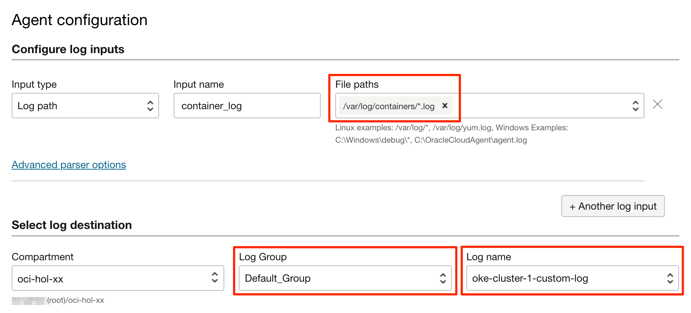
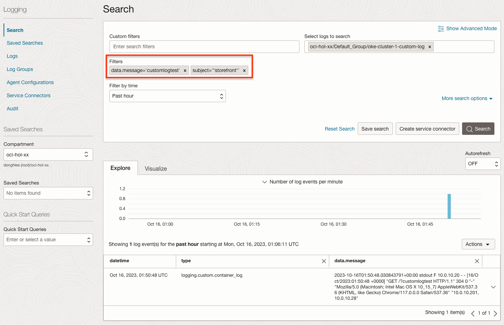
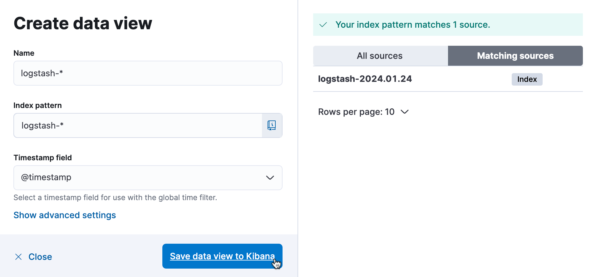
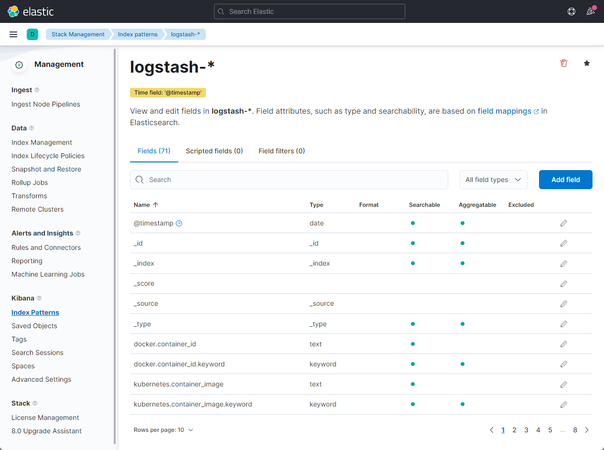
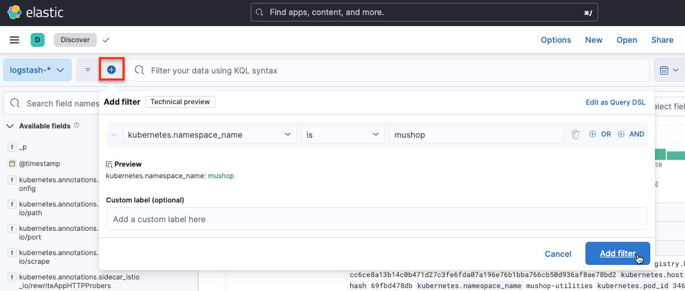

# Monitor the Log

## Introduction

Observability는 로그와 매트릭, 트레이스(추적)를 조합하여 현재 시스템의 상태를 이해하고 설명하는 데 도움을 줍니다. 시스템에 대한 가시성을 높이는데 도움을 줍니다.

예상 시간: Task 1 기준 10 분

### 목표

* OCI Logging 서비스를 사용하여 OKE 로그 모니터링 하는 법 익히기
* OSS ElasticSearch/Kibana로 OKE 로그 모니터링 하는 법 익히기

### 전제 조건

* **Lab 4: Deploy the MuShop Application** 완료하고 현재 앱이 실행 중일 것

### 실습 비디오

[](youtube:L3gRfDFpesk)

## Task 1: OCI Logging 서비스

### Worker Node에 대한 Dynamic Group 만들기

1. OCI 콘솔에 로그인합니다.

2. 좌측 상단 햄버거 메뉴에서 **Identity & Security** &gt; **Identity** &gt; **Compartments**로 이동합니다.

3. OKE 클러스터가 있는 Compartment의 OCID를 확인하고 복사해 둡니다.

4. 좌측 **Dynamic Group** 메뉴로 이동하여 아래 규칙을 가진 Dynamic Group을 만듭니다.

    - Name: 예) oke-instance-dynamic-group

    ````
    <copy>    
    All {instance.compartment.id = '<compartment-ocid>'}
    </copy>    
    ````

### Dynamic Group에 대한 OCI Logging 서비스 권한 부여하기

1. 좌측 **Policy** 메뉴로 이동하여 아래 규칙을 가진 Policy을 만듭니다. 방금 생성한 Dynamic Group에 대한 Policy를 만듭니다. 

    - Name: 예) oke-logging-policy

    ````
    <copy>
    allow dynamic-group <dynamic-group-name> to use log-content in compartment <compartment-name>
    </copy>    
    ````

### Log Group 만들기

Log Group은 로그들을 관리하는 말 그대로 로그의 묶음 단위 입니다. 커스텀 로그를 만들기 위해 먼저 만듭니다.

1. 좌측 상단 햄버거 메뉴에서 **Observability** **&** **Management** &gt; **Logging** &gt; **Log Groups**로 이동합니다.

2. Create Log Group을 클릭하여 로그 그룹을 만듭니다.

    - Name: 예) oke-cluster-1-log-group

### Custom Log 만들기

Custom Log는 커스텀 애플리케이션에서 수집하는 로그에 매핑되는 것입니다. Custom Log를 정의하고, 이에 대한 로그 수집기를 정의합니다.

1. **Resources** &gt; **Logs** 메뉴로 이동하여 **Create custom log**를 클릭합니다.

2. 로그 이름과 필요하면 고급옵션에 있는 보관 주기 등을 설정하여 custom log를 만듭니다.

    - Name: 예) oke-cluster-1-custom-log

3. 다음 단계에 있는 Agent는 이해를 돕고자 별도로 설정합니다. 여기서는 일단 **Add configuration later** 선택

### Agent Configuration 설정

Agent Configuration는 로그를 수집하는 agent를 설정하는 부분입니다.

1. **Logging** &gt; **Agent Configurations** 메뉴로 이동하여 **Create agent log**를 클릭합니다.

2. Name: 예) oke-cluster-1-agent-conf

3. 대상 Host Group을 앞서 만든 Dynamic Group으로 지정합니다.

4. Agent 설정 부분에서 로그가 위치한 경로 및 수집된 로그의 전달 위치를 지정합니다.

    - log input: 
        - input name: 예) container_log
        - File Paths: **/var/log/containers/*.log**
            - 앞서 지정한 Dynamic Group상에 있는 VM, 여기서는 OKE 클러스터 Worker Node VM 상에 수집할 로그의 위치를 지정합니다.**입력하고 엔터키를 꼭 칩니다.**

    - log destination: 수집한 로그를 전달한 앞서 생성한 custom log 이름을 지정합니다.

    


### 로깅 테스트

1. Cloud Shell로 이동합니다.

1. MuShop 앱 접속을 위해 Nginx Ingress Contoller의 Load Balancer IP를 다시 확인합니다.

    ````
    <copy>    
    kubectl get svc -n mushop-utilities
    </copy>    
    ````

    결과 예시
    ````
    NAME                                              TYPE           CLUSTER-IP      EXTERNAL-IP    PORT(S)                      AGE
    ...
    mushop-utils-ingress-nginx-controller             LoadBalancer   10.96.153.161   138.xxx.xxx.xxx   80:30636/TCP,443:30140/TCP   6d22h
    ...    
    ````

1. Mushop UI이 store-front Pod의 로그를 조회합니다. app: storefornt 레이블을 기준으로 로그를 조회합니다.

    ````
    <copy>
    kubectl logs -lapp=storefront -f --tail=10
    </copy>
    ````

1. 확인된 IP를 통해 이전에 배포된 MuShop 앱을 접속해 봅니다. 테스트를 위해 URL에 테스트용 값을 추가합니다. 예, ?customlogtest

    MuShop 앱 테스트 URL 한번만 접속할 경우 구간내에 Log Flush가 안될 수도 있으니 테스트를 위해 여러번 반복 접속합니다.

    

1. 발생한 POD 로그는 다음과 같습니다.

    ````
    $ kubectl logs -lapp=storefront -f --tail=10
    ...
    10.244.0.19 - - [07/Mar/2022:07:28:41 +0000] "GET /?customlogtest HTTP/1.1" 304 0 "-" "Mozilla/5.0 (Macintosh; Intel Mac OS X 10_15_7) AppleWebKit/537.36 (KHTML, like Gecko) Chrome/98.0.4758.80 Safari/537.36" "10.244.0.1, 10.244.0.3"
    ...
    ````

1. OCI 서비스 콘솔에서 **Logging** &gt; **Search** 화면으로 다시 돌아갑니다.

1. Custom filters 항목에서 POD 이름 또는 앞서 테스트 URL에 있는 customlogtest 같이 검색값으로 조회하면 됩니다. **Custom filters에 값을 입력하고 엔터키를 꼭 칩니다.**

   

1. 검색된 로그 데이터를 확인할 수 있습니다.

    - Log Agent를 통해 수집되는 주기가 있어 조회될때까지 5분 내외가 걸릴 수 있습니다.
    - 앞서 MuShop 앱 테스트 URL 한번만 접속한 경우 구간내에 Log Flush가 안되어 계속 기다려도 로그 조회가 안될 수 있으니, 테스트 URL 여러번 반복 접속합니다.   

    


## Task 2: OSS ElasticSearch/Kibana (Optional)

### 실습 비디오

[](youtube:HvxxkpJYvA4)


### Elastic Search + Kibana 설치

1. 설치용 namespace를 만듭니다.

    ```
    <copy>
    kubectl create ns logging
    </copy>    
    ```

2. Helm Chart를 통해 설치하기 위해 저장소를 등록합니다. 본 예제에서는 Bitnami Helm Chart 저장소를 사용합니다.

    ```
    <copy>    
    helm repo add bitnami https://charts.bitnami.com/bitnami
    </copy>       
    ```

3. 배포 설정값 정의
 
    ElasticSearch Helm Chart 배포시 사용할 values.yaml 파일을 만듭니다.
    - 다음 values.yaml은 kibana를 함께 설치하고, kibana 접근 URL을 이전 장에서 설치한 nginx ingress controller를 사용하는 예시입니다.
    - Lab 3에서 사용하던 values.yaml과 중복되지 않도록, 별도의 폴더에서 다음 명령을 실행합니다.
 
    ```yaml
    <copy>   
    cat <<EOF > values.yaml
    global:
      kibanaEnabled: true
    kibana:
      ingress:
        enabled: true
        pathType: Prefix
        hostname: "*"
        path: /kibana(/|$)(.*)
        annotations:
          kubernetes.io/ingress.class: nginx
        tls: false
      configuration:
        server:
          basePath: /kibana
          rewriteBasePath: true
    EOF
    </copy>      
    ```

    - 추가적인 사용자 설정이 필요한 경우, 대상 Chart에서 제공하는 파라미터를 참고하여 values.yaml을 작성할 수 있습니다.
        * https://github.com/bitnami/charts/tree/master/bitnami/elasticsearch/#parameters

4. elasticsearch helm chart 설치

    ```
    <copy>    
    helm install elasticsearch -f values.yaml bitnami/elasticsearch --version 17.5.0 -n logging
    </copy>
    ```

5. 설치

    아래와 같이 설치되며, 실제 컨테이너가 기동하는 데 까지 약간의 시간이 걸립니다.
 
    ```
    $ helm install elasticsearch -f values.yaml bitnami/elasticsearch --version 17.5.0 -n logging
    NAME: elasticsearch
    ...
    
      Elasticsearch can be accessed within the cluster on port 9200 at elasticsearch-coordinating-only.logging.svc.cluster.local
    
      To access from outside the cluster execute the following commands:
    
        kubectl port-forward --namespace logging svc/elasticsearch-coordinating-only 9200:9200 &
        curl http://127.0.0.1:9200/
    ```

6. 설치된 elastic search 내부 주소와 포트를 확인합니다. 이후 Fluentd에서 로그 전송을 위해 사용할 주소입니다.
    - 주소: elasticsearch-coordinating-only.logging.svc.cluster.local
    - 포트: 9200

7. Pod가 모두 기동할때 까지 기다립니다.

    ````
    <copy>
    kubectl get pod -n logging --watch
    </copy>    
    ````

8. 설정값이 잘못되어 재설치가 필요한 경우 다음 명령으로 먼저 삭제하고 재설치합니다.

    ```
    <copy>    
    helm delete elasticsearch -n logging
    </copy>
    ```

### Fluentd 구성

참고 문서

- [Kubernetes - Fluentd](https://docs.fluentd.org/container-deployment/kubernetes)
- https://gist.github.com/agapoff/77d746b4588ee37a9e8074904533f6bc


1. Fluentd 설치를 위한 Service Account를 생성하고 관련 권한을 정의합니다.

    ````
    <copy>
    cat <<EOF > fluentd-rbac.yaml
    ---
    apiVersion: v1
    kind: ServiceAccount
    metadata:
      name: fluentd
      namespace: kube-system
    ---
    apiVersion: rbac.authorization.k8s.io/v1
    kind: ClusterRole
    metadata:
      name: fluentd
    rules:
    - apiGroups:
      - ""
      resources:
      - pods
      - namespaces
      verbs:
      - get
      - list
      - watch
    ---
    kind: ClusterRoleBinding
    apiVersion: rbac.authorization.k8s.io/v1
    metadata:
      name: fluentd
    roleRef:
      kind: ClusterRole
      name: fluentd
      apiGroup: rbac.authorization.k8s.io
    subjects:
    - kind: ServiceAccount
      name: fluentd
      namespace: kube-system
    EOF
    </copy>
    ````

2. configmap 추가 설정정의

    - Fluentd 컨테이너 이미지에는 로그 파싱과 관련된 설정들이 컨테이너 이미지내에 /fluentd/etc/ 하위에 .conf 파일로 모두 정의 되어 있습니다. 이 파일들을 재정의 할 수 있습니다. 여기에서는 다른 설정들은 그대로 두고 Parser만 변경합니다.
    - 기본 Parser는 Docker Engine이 런타임인 경우 잘 동작하지만, 최근 OSS 쿠버네티스의 기본 런타임인 containerd와 OKE에서 사용하고 있는 cri-o에서는 파싱 에러가 발생합니다. 정상 파싱을 위해 파서 설정(`tail_container_parse.conf`)만 아래와 같이 cri Parser로 변경합니다.
    - https://github.com/fluent/fluentd-kubernetes-daemonset/issues/434#issuecomment-831801690

    ````
    <copy>    
    cat <<EOF > fluentd-configmap-elasticsearch.yaml
    ---
    apiVersion: v1
    kind: ConfigMap
    metadata:
      name: fluentd-config
      namespace: kube-system
    data:
      tail_container_parse.conf: |-
        <parse>
          @type cri
        </parse>
    EOF
    </copy>    
    ````

3. fluentd damonset 정의

    설정한 configmap 사용을 위해 Fluentd 문서상의 YAML을 일부 변경하셨습니다.

    ````
    <copy>
    cat <<EOF > fluentd-daemonset-elasticsearch.yaml
    apiVersion: apps/v1
    kind: DaemonSet
    metadata:
      name: fluentd
      namespace: kube-system
      labels:
        k8s-app: fluentd-logging
        version: v1
    spec:
      selector:
        matchLabels:
          k8s-app: fluentd-logging
          version: v1
      template:
        metadata:
          labels:
            k8s-app: fluentd-logging
            version: v1
        spec:
          serviceAccount: fluentd
          serviceAccountName: fluentd
          tolerations:
          - key: node-role.kubernetes.io/master
            effect: NoSchedule
          containers:
          - name: fluentd
            image: fluent/fluentd-kubernetes-daemonset:v1-debian-elasticsearch
            env:
              - name:  FLUENT_ELASTICSEARCH_HOST
                value: "elasticsearch-coordinating-only.logging.svc.cluster.local"
              - name:  FLUENT_ELASTICSEARCH_PORT
                value: "9200"
              - name: FLUENT_ELASTICSEARCH_SCHEME
                value: "http"
              - name: FLUENTD_SYSTEMD_CONF
                value: disable
            resources:
              limits:
                memory: 200Mi
              requests:
                cpu: 100m
                memory: 200Mi
            volumeMounts:
            - name: varlog
              mountPath: /var/log
            - name: varlibdockercontainers
              mountPath: /var/lib/docker/containers
              readOnly: true
            - name: config
              mountPath: /fluentd/etc/tail_container_parse.conf
              subPath: tail_container_parse.conf
          terminationGracePeriodSeconds: 30
          volumes:
          - name: varlog
            hostPath:
              path: /var/log
          - name: varlibdockercontainers
            hostPath:
              path: /var/lib/docker/containers
          - name: config
            configMap:
              name: fluentd-config
    EOF
    </copy>    
    ````

3. FluentD 설치

    ```bash
    <copy>
    kubectl apply -f fluentd-rbac.yaml
    kubectl apply -f fluentd-configmap-elasticsearch.yaml
    kubectl apply -f fluentd-daemonset-elasticsearch.yaml
    </copy>        
    ```

### Kibana 설정

1. 설치한 kibana을 웹 브라우저로 접속합니다. nginx ingress controller 로 지정한 주소로 접속합니다.

    - 예, http://138.xxx.xxx.xxx/kibana

2. 홈으로 이동합니다.

3. 왼쪽 상단 **내비게이션 메뉴**에서 **Analytics** &gt; **Discover** 를 클릭합니다.

    

4. Create index pattern을 클릭합니다.

5. 인덱스 패턴을 생성합니다.

    오른쪽에서 보듯이 FluentD에서 전송된 로그는 logstash-로 시작합니다.

    - Name: logstash-*
    - Timestamp field: @timestamp

    

6. 인덱스 패턴이 추가된 결과를 볼 수 있습니다.

    

7. 왼쪽 상단 **내비게이션 메뉴**에서 **Analytics** &gt; **Discover** 를 클릭합니다.

8. 생성한 인덱스 패턴을 통해 수집된 로그를 확인할 수 있습니다.

    - 테스트 앱의 로그를 확인하기 위해 **Add filter**를 클릭하여 **namespace_name=mushop** 로 지정합니다.

    

9. 테스트를 위해 MuShop을 접속합니다.

    - 예, http://138.xxx.xxx.xxx/?efk-test

10. 로그 확인

    ````
    $ kubectl logs -lapp=storefront -f --tail=10
    ...
    10.244.0.19 - - [07/Mar/2022:11:42:53 +0000] "GET /?efk-test HTTP/1.1" 304 0 "-" "Mozilla/5.0 (Macintosh; Intel Mac OS X 10_15_7) AppleWebKit/537.36 (KHTML, like Gecko) Chrome/98.0.4758.80 Safari/537.36" "10.244.1.0, 10.244.0.3"
    ...
    ````

    아래와 같이 kibana에서 테스트 앱의 로그를 확인할 수 있습니다.

    

11. EFK를 통해 OKE 상의 로그를 수집하는 예시였습니다. EKF에 대한 상세 내용은 제품 관련 홈페이지와 커뮤니티 사이트를 참고하기 바랍니다.


이제 **다음 실습을 진행**하시면 됩니다.

## Learn More

## Acknowledgements

* **Author** - DongHee Lee, February 2022
