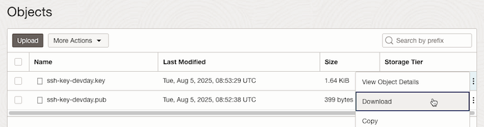
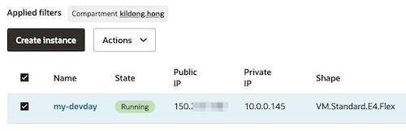
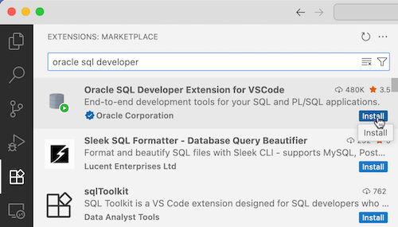
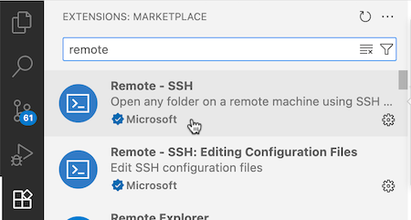
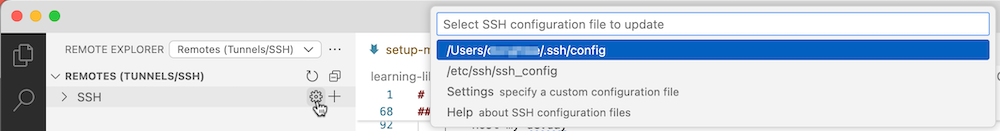
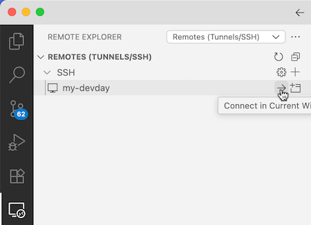
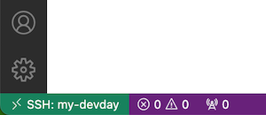
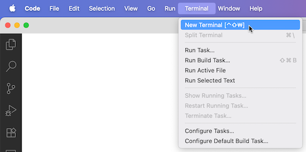
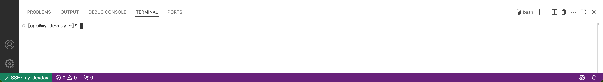

# 환경 준비 - OCI Base 이미지 기반 Compute VM 사용

## Introduction

본 실습에 필요한 도구들의 개인별 준비 및 각자 OS 환경의 차이가 있기 때문에, 이미 **설치되어 있는 Compute VM**을 생성하여 해당 서버에서 실습을 진행합니다.

베이스 이미지에 설치되어 있는 도구 목록
* Docker CLI (Docker Engine)
* Ollama
* Python
* Git

개인 PC에 설치되어 있어야 하는 도구
* *Visual Studio Code*

실습 예상 시간: 10분

## Task 1: OCI Console 로그인

1. 웹브라우저에서 OCI Console에 로그인합니다.

    - https://cloud.oracle.com/   
    - Cloud Account Name: ocidevxxxxxx
    - User Name & Password


2. 왼쪽 위 햄버거 메뉴에서 **Storage** > **Object Storage & Archive Storage** > **Buckets**로 이동합니다.

3. 왼쪽 Compartment에 **OCI-HOL**을 선택합니다.

4. **bucket-ssh-key** 버킷을 선택합니다.

5. 실습에서 사용할 public key(.key)와 private key(.pub)를 각각 다운로드 받습니다.

    


## Task 2: Compute VM 만들기

1. 왼쪽 위 햄버거 메뉴에서 **Compute** > **Instances**로 이동합니다.

2. Applied filters에서 root > **OCI-HOL** 아래 각자의 Compartment를 선택합니다.

3. 현재 생성된 인스턴스(예, my-devday)가 있으면, Public IP를 확인합니다.

    


## Task 3: Visual Studio Code

1. 사이트에 접속하여, 각 OS에 맞게 설치합니다.

    [Visual Studio Code](https://code.visualstudio.com/)

2. Extensions 탭에서 `Oracle SQL Developer`을 찾아 설치합니다.

    

3. Extensions 탭에서 `Remote - SSH`를 설치합니다.

    

4. ssh config를 설정합니다.

    * Mac / Linux

        1) 다운로드 받은 private key(.key)를 ~/.ssh/로 복사합니다.

        2) ~/.ssh/config 파일을 열어, config 파일에 앞서 생성한 Compute VM을 접속하기 위한 정보를 입력합니다.

        

        ```plain
        <copy>
        Host my-devday
            HostName 150.xx.xx.xx
            IdentityFile ~/.ssh/ssh-key-devday.key
            User opc  
        </copy> 
        ```

    * Windows

        1) 다운로드 받은 private key(.key)를 ~/.ssh/로 복사합니다. (예, `C:\Users\kildong\.ssh`)

        2) ~/.ssh/config 파일을 열어, config 파일에 앞서 생성한 Compute VM을 접속하기 위한 정보를 입력합니다.

        ```plain
        <copy>
        Host my-devday
            HostName 150.xx.xx.xx
            IdentityFile C:\Users\leedh\.ssh\ssh-key-devday.key
            User opc
        </copy>
        ```

5. Remote Explorer에서 등록된 Remote 서버를 연결합니다.

    

6. 첫 접속으로 팝업이 뜨면 Linux 선택 또는 Continue를 클릭합니다. 그러면 아래와 같이 서버에 연결되었습니다.

    

7. 메뉴에서 Terminal > New Terminal을 선택합니다.

    

8. Compute VM에 Visual Studio Code로 접속한 상태이며, 터미널 환경이 준비된 상황입니다.

    

*다음 실습을 진행합니다.*


## Acknowledgements

* **Author** - DongHee Lee, Principle Cloud Engineer, Oracle Korea
* **Last Updated By/Date** - DongHee Lee, August 5, 2025