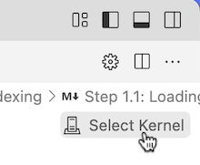
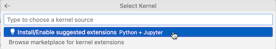
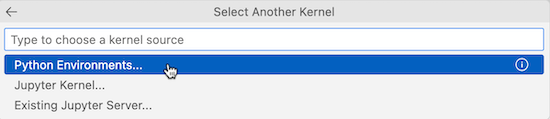
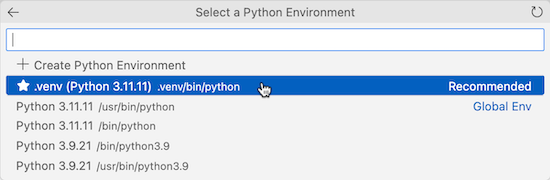
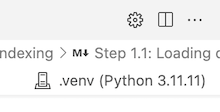
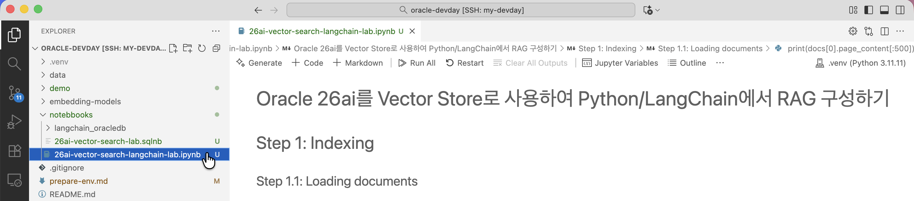

# LangChain에서 Oracle AI Database 26ai 연동하기

## Introduction

LangChain과 같은 개발 프레임워크를 통해 LLM 애플리케이션을 개발하는 개발자 관점에서 오픈소스 Vector Store를 개발용으로 많이 사용합니다.
안정적인 성능 및 안정성을 요구하는 운영 시스템이나, 기존 관계형 데이터 베이스에 있는 내부 데이터에 의미기반 검색으로 확장하는 경우,
LangChain과 같은 개발 프레임워크에서 Vector Store로 Oracle AI Database 26ai를 연동하는 것이 필요합니다. 이를 어떻게 하는 알아보는 과정입니다.

필요한 환경 구성작업을 먼저 진행합니다. Python으로 이루어 지기 때문에 실습은 함께 제공하는 Jupyter Notebook 파일을 통해 진행합니다.

실습 예상 시간: 10분

### Objectives

이 실습에서는 다음을 수행합니다:

* Python oracledb와 LangChain의 OracleVS를 이용한 Python 기반 개발 실습 로컬 환경에서 Oracle AI Database 26ai를 직접 Vector Store로 구성하고 사용하는 과정을 단계별로 실습

### 사전 준비 사항

* *Lab2를 반드시 완료할 것*

## Task 1: LangChain에서 Oracle AI Database 26ai 연동하기

1. 터미널에서 다음 폴더로 이동합니다.

    ```bash
    <copy>
    cd oracle-devday
    </copy>
    ```

2. Python 가상 환경을 만들고 활성화합니다.

    ```bash
    <copy>
    python3.11 -m venv .venv
    source .venv/bin/activate
    pip3.11 install --upgrade pip
    </copy>
    ```

3. 필요한 패키지를 설치합니다.

    ```bash
    <copy>
    pip3.11 install -r requirements.txt
    </copy>
    ```

4. 필요한 추가 패키지를 설치합니다.

    ```bash
    <copy>
    pip3.11 install ipykernel jupyter
    </copy>
    ```

5. notebooks 폴더 밑에 Jupyter Notebook(26ai-vector-search-langchain-lab.ipynb) 파일을 엽니다.

6. 오른쪽 위 Select Kernel을 선택합니다.

    

7. 추천된 VS Code Extension인 Python + Jupyter extension 설치를 선택합니다.

    

8. extension 설치가 다 끝나고, 선택 팝업이 뜨면, *Python Environments* 선택합니다.

    

9. 그리고 .venv을 선택합니다.

    

    

10. 이제 해당 *Notebook을 따라 순서대로 진행하면 됩니다.*

    

## Acknowledgements

* **Author** - DongHee Lee, Principal Cloud Engineer, Oracle Korea
* **Last Updated By/Date** - DongHee Lee, October 22, 2025