# 환경 준비 - OCI Base 이미지 기반 Compute VM 사용

## Introduction

본 실습에 필요한 도구들의 개인별 준비 및 각자 OS 환경의 차이가 있기 때문에, 이미 **설치되어 있는 Compute VM**을 생성하여 해당 서버에서 실습을 진행합니다.

베이스 이미지에 설치되어 있는 도구 목록

* Docker CLI (Docker Engine)
* Ollama
* Python
* Git

개인 PC에 설치되어 있어야 하는 도구

* [*Visual Studio Code*](https://code.visualstudio.com/)

실습 예상 시간: 20분

## Task 1: OCI Console 로그인

> What is Oracle Cloud Infrastructure?
[What is Oracle Cloud Infrastructure](youtube:I2oQuBRNiHs)

1. 웹브라우저에서 OCI Console에 접속합니다.

    - https://cloud.oracle.com/

2. 접속정보는 사전에 이메일로 전달된 정보 또는 보유한 환경을 사용합니다.

    - Cloud Account Name: 예, oradevday*xxx*
    - User Name & Password

## Task 2: VCN 및 서브넷 생성

> Oracle Cloud Infrastructure Networking: Overview
[VCN Overview](youtube:DIjGGhidUrI)

네트워크 자원을 만들기 위해 아래와 같이 새 VCN을 만듭니다.

1. 왼쪽 상단의 **Navigation Menu**(또는 햄버거 메뉴라고도 말함)를 클릭하고 **Networking**으로 이동한 다음 **Virtual Cloud Networks** 을 선택합니다.

    

    

2. Applied filters에서 각자의 Compartment를 선택합니다. (예, root > OCI-HOL 아래 )

3. **Actions**에서 **Start VCN Wizard**을 선택합니다.

    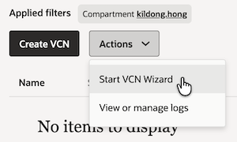

4. **Create VCN with Internet Connectivity**를 선택하고, **Start VCN Wizard**를 클릭합니다. 인터넷 연결이 되는 관련 자원들을 포함하여 VCN이 만들어지게 됩니다.

    

5. 새 VCN의 이름(예, oci-hol-vcn)하고 사용할 Compartment를 선택합니다. 나머지는 기본값을 사용합니다.

    |                  **Field**          |  **Value**  |
    |-------------------------------------|:-----------:|
    | VCN Name                            | oci-hol-vcn |
    | Compartment                         | 작업할 Compartment 선택 |
    | VCN CIDR Block                      | 10.0.0.0/16 |
    | Use DNS hostnames in this VCN       | Checked     |  
    | Public Subnet CIDR Block            | 10.0.0.0/24 |
    | Private Subnet CIDR Block           | 10.0.1.0/24 |

    - VCN CIDR 설정

        - /16 부터 /30 까지 설정할 수 있습니다.
        - [IP Addresses Reserved for Use by Oracle](https://docs.oracle.com/en-us/iaas/Content/Network/Concepts/overview.htm#Reserved)을 참고하여 해당 범위를 제외하고 설정합니다.
        - **Use DNS Hostnames In This VCN** 선택시 _`<hostname>.<subnet-DNS-label>.<VCN-DNS-label>.oraclevcn.com`_ 형식으로 인스턴스의 FQDN이 포맷이 정해집니다.

        - 참고 - [DNS in Your Virtual Cloud Network](https://docs.oracle.com/en-us/iaas/Content/Network/Concepts/dns.htm)

    - Subnet 설정

        > **노트**: *서브넷내의 주소 3개는 내부적으로 사용합니다*

        |                  **Field**          |  **Value**  |   **Comment**  |
        |-------------------------------------|:-----------:|:--------------:|
        | Subnet CIDR                         | 10.0.0.0/24 |                |
        | The first IP address                | 10.0.0.0    | 네트워크 주소     |
        | The last IP address                 | 10.0.0.255  | 브로드캐스트 주소  |
        | The first host address              | 10.0.0.1    | 서브넷 디폴트 게이트웨이 주소 |
        | The remaining addresses             | 10.0.0.2 to 10.0.0.254 | 유저 사용 가능 주소 |

        * 참고 문서 - [Three IP Addresses in Each Subnet](https://docs.oracle.com/en-us/iaas/Content/Network/Concepts/overview.htm#Reserved__reserved_subnet)

6. 설정후 **Next**을 클릭합니다.

7. 생성될 VCN과 관련 네트워크 자원들을 리뷰합니다. Gateway, Security List, Route Table이 추가적으로 만들어 지는 것을 볼 수 있습니다.

8. **Create**을 클릭합니다.

9. 인터넷 연결이 되는 관련 자원들을 포함하여 VCN이 만들어지게 됩니다.

    

10. 다 만들어지면, **View VCN** 클릭하여, 생성된 VCN의 상세페이지로 이동하며, 만들어진 VCN 및 관련 자원을 확인할 수 있습니다.

## Task 3: Compute VM 만들기

1. 왼쪽 상단의 **Navigation Menu**(또는 햄버거 메뉴라고도 말함)를 클릭하고 **Compute** > **Instances**로 이동합니다.

2. Applied filters에서 각자의 Compartment를 선택합니다. (예, root > OCI-HOL 아래 )

3. **Create instance**를 클릭합니다.

4. 원하는 이름으로 변경합니다.

    - Name: 예, `my-devday`

5. **Image**에서 **Change image**를 클릭합니다.

6. **My images**에서 **common-shared** Compartment를 선택하고 `devday-base-image` 이미지를 선택합니다.

    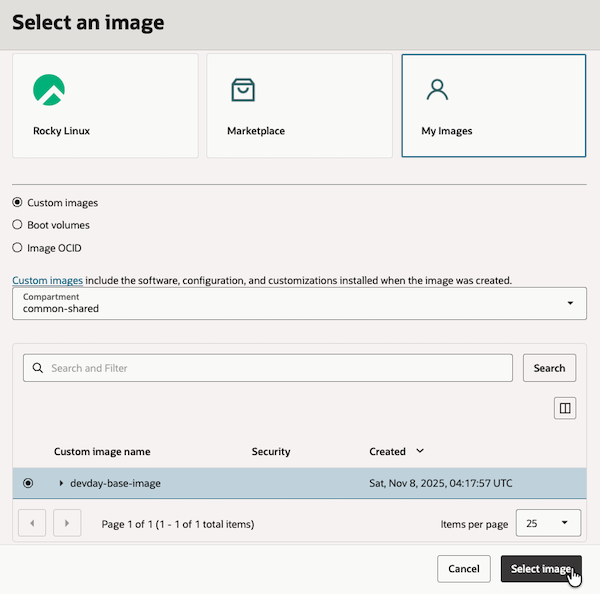

7. Change shape은 AMD 타입에서 `VM.Standard.E5.Flex`를 선택합니다. 기본값인 1 OCPU(2vCPU) / 12 GB를 그대로 사용합니다.

    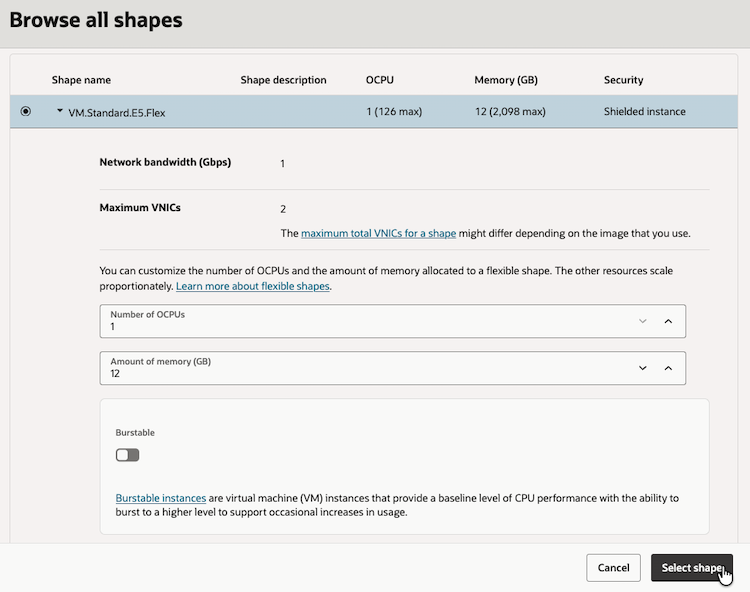

8. **Next**로 연속이동하여, **Networking** 항목으로 이동합니다.

9. **Primary network**에서 앞서 만든 oci-hol-vcn내 `public-subnet-oci-hol-vcn`을 선택합니다.

10. **Add SSH keys**에서 사용할 키를 등록할 수 있습니다. 여기서는 편의상 자동 생성되는 키를 사용하기 위해 `Download Private Key`, `Download Public Key`을 클릭하여, SSH 접속시 사용할 개인키와 공개키 2개를 각각 다운로드 받습니다.

    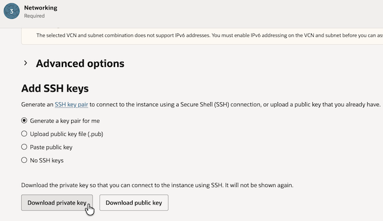

11. **Next**로 끝까지 이동하여, **Create**을 클릭합니다.

12. 인스턴스가 생성되고 **Running** 상태가 될 때까지 기다랍니다.

13. 인스턴스 목록에서 현재 생성된 인스턴스(예, my-devday)의 Public IP를 확인합니다.

    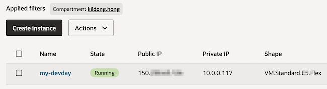

## Task 4: Visual Studio Code

1. 사이트에 접속하여, 각 OS에 맞게 설치합니다.

    [Visual Studio Code](https://code.visualstudio.com/)

2. Extensions 탭에서 `Remote - SSH`를 설치합니다.

    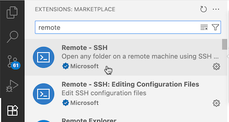

3. ssh config를 설정합니다.

    * Mac / Linux

        1) 다운로드 받은 private key(예, `ssh-key-2025-11-07.key`)와 public key(예, `ssh-key-2025-11-07.key.pub`)를 ~/.ssh/로 복사합니다.

        2) 권한을 변경합니다.

        ```shell
        chmod 400 ssh-key-2025-11-07.key*
        ```

        3) `~/.ssh/config` 파일을 직접 열거나, VS Code에서 열어, config 파일에 앞서 생성한 Compute VM을 접속하기 위한 정보를 입력합니다.

        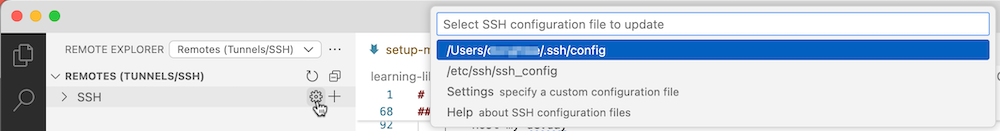

        ```shell
        <copy>
        Host my-devday
            HostName 160.xx.xx.xx
            IdentityFile ~/.ssh/ssh-key-2025-11-07.key
            User opc  
        </copy> 
        ```

    * Windows

        1) 다운로드 받은 private key(.key)를 ~/.ssh/로 복사합니다. (예, `C:\Users\kildong\.ssh`)

        2) ~/.ssh/config 파일을 열어, config 파일에 앞서 생성한 Compute VM을 접속하기 위한 정보를 입력합니다.

        ```shell
        <copy>
        Host my-devday
            HostName 150.xx.xx.xx
            IdentityFile C:\Users\leedh\.ssh\ssh-key-2025-11-07.key
            User opc
        </copy>
        ```

4. Remote Explorer에서 등록된 Remote 서버를 연결합니다.

    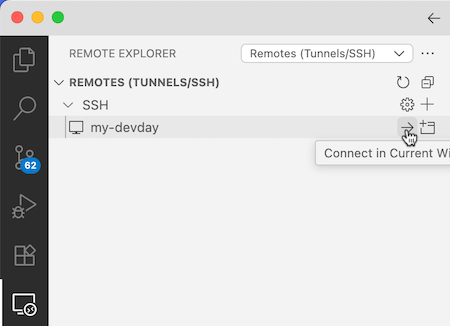

5. 첫 접속으로 팝업이 뜨면 Linux 선택 또는 Continue를 클릭합니다. 그러면 아래와 같이 서버에 연결되었습니다.

    

6. 메뉴에서 Terminal > New Terminal을 선택합니다.

    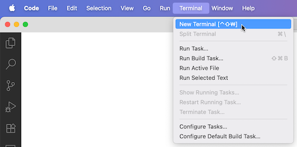

7. Compute VM에 Visual Studio Code로 접속한 상태이며, 터미널 환경이 준비된 상황입니다.

    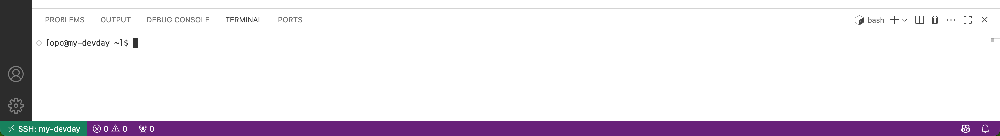

8. Extensions 탭에서 `Oracle SQL Developer`을 찾아 설치합니다.

    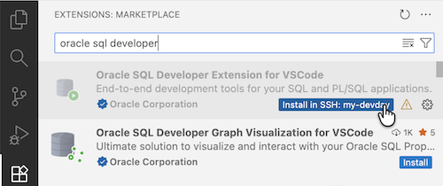

*다음 실습을 진행합니다.*

## Acknowledgements

* **Author** - DongHee Lee, Principal Cloud Engineer, Oracle Korea
* **Last Updated By/Date** - DongHee Lee, November 7, 2025