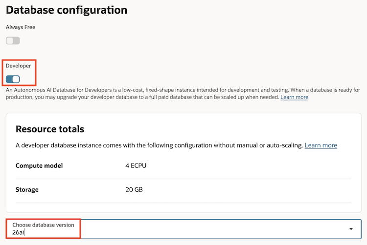
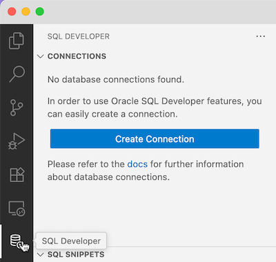

# Vector Store로서의 Oracle Database 26ai

## Introduction

RAG 구성의 핵심 요소인 Vector Store로 Oracle AI Database 26ai의 Vector Search 기능을 알아보고 실습하는 과정입니다.
Oracle AI Database 26ai을 직접 설치하거나, OCI에서 제공하는 서비스를 이용하는 등 개발환경을 구성할 수 있습니다.

필요한 환경 구성작업을 먼저 진행합니다. 데이터베이스에서 이루어 지는 주요 실습은 함께 제공하는 Oracle SQL Notebook 파일을 통해 진행합니다. 

실습 예상 시간: 10분

### Objectives

이 실습에서는 다음을 수행합니다:

* Oracle AI Database 26ai가 Vector Store로서 제공하는 주요 기능 소개

### 사전 준비 사항

* *Lab1을 반드시 완료할 것*

## Task 1: Oracle Autonomous AI Database 26ai 준비

1. [OCI Console](https://cloud.oracle.com/db/adbs)에 로그인하여, 데이터베이스를 생성합니다.

    - Display name: 예, oracle26aiatp
    - Database name: 예, oracle26aiatp
    - Workload type: Transaction Processing
    - Developer: **Enable**
    - database version: **26ai**

     

2. 생성된 인스턴스 정보에서 **Database connection**를 클릭후 wallet을 다운로드 받습니다.

## Task 2: Visual Studio Code - DB Connection 만들기

1. Visual Studio Code에서 실행합니다.

2. 왼쪽 Activity Bar에서 제일 위 Explorer 아이콘을 클릭합니다. Open Folder를 클릭하여, /home/opc/ 폴더를 선택합니다.

3. Wallet 파일을 /home/opc/ 폴더 밑에 드래그 앤 드랍해서 업로드합니다.

4. 왼쪽 Activity Bar에서 설치한 SQL Developer Extension 아이콘을 클릭합니다.

    

5. **Create Connection**을 클릭하여 새 Connection을 추가합니다.

    - Connection Name: `Oracle 26ai - ATP - ADMIN`
    - Role: `Default`
    - Username: `ADMIN`
    - Password: `<YOUR_PASSWORD>`
    - Save Password: *체크*
    - Connection Type: `Cloud Wallet`
    - Configuration File: 다운받은 Wallet 선택

6. 아래 **Test**를 클릭하여, 연결을 확인합니다.

7. **Save**를 클릭하여, 저장합니다.

## Task 3: To Be Continued...

## Acknowledgements

* **Author** - DongHee Lee, Principal Cloud Engineer, Oracle Korea
* **Last Updated By/Date** - DongHee Lee, November 6, 2025
