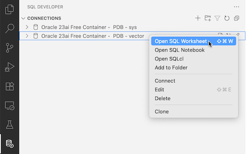

# Vector Store로서의 Oracle Database 26ai

## Introduction

RAG 구성의 핵심 요소인 Vector Store로 Oracle AI Database 26ai의 Vector Search 기능을 알아보고 실습하는 과정입니다.
Oracle AI Database 26ai을 직접 설치하거나, OCI에서 제공하는 서비스를 이용하는 등 개발환경을 구성할 수 있습니다.
여기서는 개인 PC에서 쉽게 개발 환경을 구성하여 사용할 수 있도록 Oracle AI Database 26ai 무료 컨테이너 이미지를 활용하여 진행합니다.

필요한 환경 구성작업을 먼저 진행합니다. 데이터베이스에서 이루어 지는 주요 실습은 함께 제공하는 Oracle SQL Notebook 파일을 통해 진행합니다. 

실습 예상 시간: 10분

### Objectives

이 실습에서는 다음을 수행합니다:

* Oracle AI Database 26ai가 Vector Store로서 제공하는 주요 기능 소개
* Free Container Image와 SQL Developer for VS Code를 활용한 로컬 개발 환경 구성

### 사전 준비 사항

* *Lab1을 반드시 완료할 것*

## Task 1: Oracle AI Database 26ai 준비

1. 준비된 환경(my-devday VM 또는 로컬환경)의 터미널 또는 명령창에서 진행합니다.

2. Oracle AI Database 26ai Free 컨테이너 이미지 다운로드

    - [Oracle Database Free](https://container-registry.oracle.com/ords/f?p=113:4:5584340787588:::4:P4_REPOSITORY,AI_REPOSITORY,AI_REPOSITORY_NAME,P4_REPOSITORY_NAME,P4_EULA_ID,P4_BUSINESS_AREA_ID:1863,1863,Oracle%20Database%20Free,Oracle%20Database%20Free,1,0&cs=33ik6GYF_z4Zq66Qe9NBkb8UT7E51RmD_gBF8B8Lsf2mjLMJme3LDj458VtCPQZTZ9LPaDwUIJgne4yHnVkvUBA)

        ```shell
        <copy>      
        docker pull container-registry.oracle.com/database/free:23.26.0.0
        </copy>    
        ```

3. Oracle AI Database 26ai Free 컨테이너 시작

    - Linux

        ```shell
        <copy>    
        docker run -d \
        --name oracle-free-26ai \
        --add-host=host.docker.internal:host-gateway \
        -p 1521:1521 \
        -e ENABLE_ARCHIVELOG=false \
        -e ENABLE_FORCE_LOGGING=false \
        -e ORACLE_PWD=OracleIsAwesome \
        container-registry.oracle.com/database/free:23.26.0.0
        </copy>
        ```

    - Mac/Windows

        ```shell
        <copy>
        docker run -d \
        --name oracle-free-26ai \
        -p 1521:1521 \
        -e ENABLE_ARCHIVELOG=false \
        -e ENABLE_FORCE_LOGGING=false \
        -e ORACLE_PWD=OracleIsAwesome \
        container-registry.oracle.com/database/free:23.26.0.0
        </copy>    
        ```

4. 컨테이너 로그에서 기동 완료 확인

    ```shell
    $ <copy>docker logs -f oracle-free-26ai</copy>
    ...
    Version 23.26.0.0.0
    The Oracle base remains unchanged with value /opt/oracle
    #########################
    DATABASE IS READY TO USE!
    #########################
    ...
    ```

## Task 2: DB 유저 생성 및 권한 부여

1. sys 유저로 컨테이너내 sqlplus로 접속

    ```shell
    <copy>
    docker exec -it oracle-free-26ai sqlplus sys/OracleIsAwesome@FREEPDB1 as sysdba
    </copy>
    ```

2. vector 유저 생성 및 권한 부여

    ```sql
    <copy>
    CREATE TABLESPACE USERS DATAFILE 'USERS' SIZE 64M AUTOEXTEND ON;
    CREATE USER vector IDENTIFIED BY vector DEFAULT TABLESPACE users TEMPORARY TABLESPACE temp QUOTA UNLIMITED ON users;
    GRANT CONNECT, RESOURCE TO vector;
    GRANT execute on sys.dbms_lock TO vector;
    
    -- dba_directories 테이블 접근 권한 부여
    GRANT SELECT_CATALOG_ROLE TO vector;
    
    -- ONNX 모델 업로드 권한 부여
    GRANT CREATE MINING MODEL TO vector;
    GRANT READ,WRITE ON DIRECTORY DATA_PUMP_DIR TO vector;
    
    -- Oracle Text - KOREAN_MORPH_LEXER 사용하기 위해 권한 부여
    GRANT EXECUTE ON CTXSYS.CTX_DDL TO vector;

    PROMPT executed;
    </copy>
    ```

3. 엔터키를 한번 더 칩니다.

4. DB내에서 외부 Embedding 모델을 API로 호출하기 위해서는 네트워크 접근 허용을 설정해야 합니다. 다음 명령으로 생성한 vector 유저에게 허용합니다.

    ```shell
    <copy>
    BEGIN
       DBMS_NETWORK_ACL_ADMIN.APPEND_HOST_ACE(
             host => '*',
             ace =>  xs$ace_type( privilege_list => xs$name_list('http'),
                                  principal_name => 'VECTOR',
                                  principal_type => xs_acl.ptype_db));
    END;
    /
    </copy>
    ```

5. vector 유저로 재접속합니다.

    ```sql
    SQL> <copy>CONN vector/vector@FREEPDB1</copy>
    Connected.
    ```

    ```sql
    SQL> <copy>show user</copy>
    USER is "VECTOR"
    ```

6. 외부 호출이 되는지 확인합니다.

    ```sql
    SQL> <copy>SELECT UTL_HTTP.REQUEST(url => 'https://www.oracle.com/') FROM dual;</copy>
    ```

7. Ollama API 호출이 되는지 확인합니다. 오류없이 호출되는지만 확인합니다.

    ```sql
    SQL> <copy>SELECT UTL_HTTP.REQUEST(url => 'http://host.docker.internal:11434/api/ps') FROM dual;</copy>
    ```

## Task 3: Visual Studio Code - DB Connection 만들기

1. Visual Studio Code에서 실행합니다.

2. 왼쪽 Activity Bar에서 설치한 SQL Developer 아이콘을 클릭합니다.

    

3. **Create Connection**을 클릭하여 새 Connection을 추가합니다.

    - Connection Name: `Oracle 26ai Free Container - PDB - sys`
    - Role: `SYSDBA`
    - Username: `sys`
    - Password: `OracleIsAwesome`
    - Save Password: *체크*
    - Host: `localhost`
    - Port: `1521`
    - Type: `Service Name`
    - Service Name: `FREEPDB1`

4. 아래 **Test**를 클릭하여, 연결을 확인합니다.

5. **Save**를 클릭하여, 저장합니다.

6. 만든 connection을 우클릭하고 **Clone**을 클릭하여, vector 유저를 위한 connection도 생성합니다.

    - *Connection Name*: `Oracle 26ai Free Container - PDB - vector`
    - *Role*: `Default`
    - *Username*: `vector`
    - *Password*: `vector`
    - Save Password: *체크*
    - Host: `localhost`
    - Port: `1521`
    - Type: `Service Name` 
    - Service Name: `FREEPDB1`

7. 아래 **Test**를 클릭하여, 연결을 확인하고, **Save**를 클릭하여, 저장합니다.

8. connection 우클릭하면, **SQL Worksheet** 또는 **SQLcl**을 실행할 수 있습니다. 이후 실습과정의 설명에 따라 *SQL Worksheet* 또는 *SQLcl*을 실행하여, 명령을 수행할 것입니다.

    

    

## Task 4: Oracle AI Database 26ai Vector Search 주요 기능 알아보기

1. 준비된 환경(my-devday VM 또는 로컬환경)의 터미널 또는 명령창에서 진행합니다. 실습 코드를 다운로드 받습니다.

    ```shell
    <copy>
    git clone https://github.com/TheKoguryo/oracle-devday.git
    </copy>
    ```

2. 실습을 위한 압축파일을 해제 합니다.

    ```shell
    <copy>
    cd oracle-devday
    unzip data/DATAGO_SEOUL_2022.RSTR_INFO_KOREAN.zip -d data/
    unzip embedding-models/multilingual-e5-small.onnx.zip -d embedding-models/
    </copy>
    ```

3. Visual Studio Code에서 다운받은 실습 코드 폴더를 엽니다.

    - **File** 탭 > **Open Folder...** > **oracle-devday** 선택

    - 경고 창이 뜨는 신뢰한다고 *체크*후 *Yes, I trust the authors*를 선택합니다.

4. notebooks 폴더 밑에 SQL Notebook(26ai-vector-search-lab.sqlnb) 파일을 엽니다.

    

5. 이제 오른쪽에 열린 *SQL Notebook을 따라 순서대로 진행하면 됩니다.*

    - SQL Notebook은 Jupyter Notebook과 비슷합니다. Python 대신 SQL, PL/SQL을 실행할 수 있습니다.

    - 노트북을 따라 진행하고 PL/SQL Code 부분은 왼쪽 화살표를 클릭하면, 현재 연결된 connection에서 실행하고 그 아래에 결과가 표시됩니다.

        

## Acknowledgements

* **Author** - DongHee Lee, Principal Cloud Engineer, Oracle Korea
* **Last Updated By/Date** - DongHee Lee, November 6, 2025
